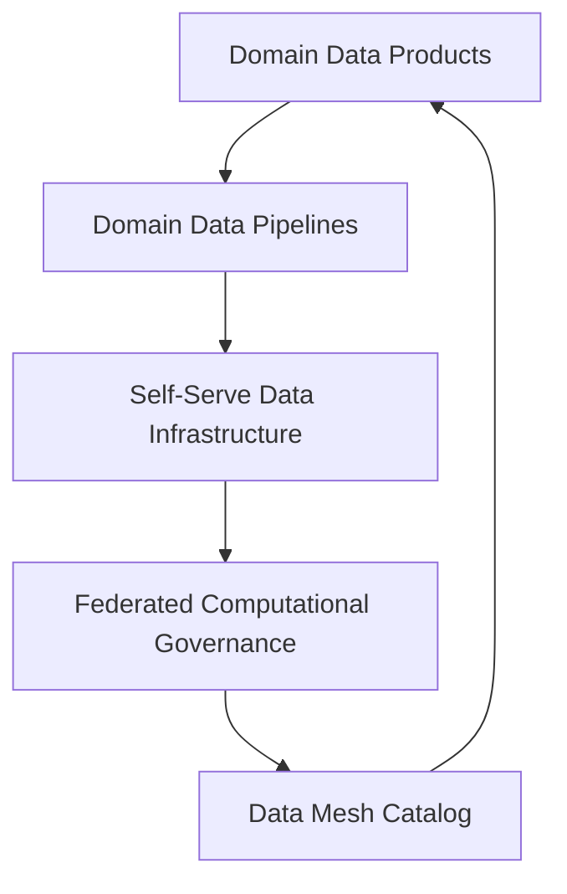

# Decentralizing Data with the Data Mesh Architecture

## Introduction

In the era of big data and digital transformation, organizations are grappling with the challenges of managing and extracting value from their ever-growing data assets. Traditional centralized data architectures, such as data warehouses and data lakes, have often struggled to keep up with the increasing volume, variety, and velocity of data. This has led to the emergence of a new architectural paradigm - the **data mesh**.

The data mesh, pioneered by Zhamak Dehghani, is a decentralized approach to data management that aims to address the limitations of traditional data architectures. By embracing the principles of domain-driven design, self-service, and federated governance, the data mesh empowers domain teams to own and manage their data as a product, while maintaining overall data consistency and quality.

## Key Principles of the Data Mesh

The data mesh is built upon four key principles:

1. **Domain Ownership**: In a data mesh, data is owned and managed by the individual domains or business units within an organization, rather than a centralized data team. This allows for greater agility, as domain teams can make decisions and iterate on their data products independently.

2. **Data as a Product**: Domain teams treat their data as a first-class product, complete with clear data schemas, metadata, documentation, and self-service capabilities. This ensures that data consumers can easily discover, understand, and utilize the available data assets.

3. **Self-Serve Data Infrastructure**: The data mesh provides a self-serve data infrastructure, where domain teams can independently provision and manage their own data pipelines, storage, and processing capabilities. This empowers teams to be more autonomous and responsive to their data needs.

4. **Federated Computational Governance**: While data ownership and management are decentralized, the data mesh maintains overall data consistency and quality through a federated governance model. This involves establishing common standards, policies, and practices that are adopted across the organization.

## Logical Architecture of the Data Mesh

The logical architecture of a data mesh typically consists of the following components:

1. **Domain Data Products**: Each domain team owns and manages its own data products, which include the data itself, metadata, documentation, and self-service capabilities.

2. **Domain Data Pipelines**: Domain teams are responsible for building and maintaining their own data pipelines, which extract, transform, and load data from various sources into the domain data products.

3. **Self-Serve Data Infrastructure**: The data mesh provides a self-serve data infrastructure, which allows domain teams to independently provision and manage their data storage, processing, and analytical capabilities.

4. **Federated Computational Governance**: A centralized governance team establishes common standards, policies, and practices that are adopted across the organization, ensuring data consistency and quality.

5. **Data Mesh Catalog**: A centralized data catalog serves as a discovery and access point for all the data products within the data mesh, enabling data consumers to easily find and utilize the available data.

Here's a mermaid diagram illustrating the logical architecture of a data mesh:

## Comparing the Data Mesh with Other Architectures

The data mesh can be contrasted with other data architecture approaches, such as the data warehouse and data lake:

1. **Data Warehouse**: A data warehouse is a centralized repository for structured, curated data, typically used for reporting and analytics. In contrast, the data mesh is a decentralized architecture where data is owned and managed by individual domains.

2. **Data Lake**: A data lake is a centralized repository for raw, unstructured data, which is then processed and transformed as needed. The data mesh, on the other hand, promotes the creation of domain-specific data products, with each domain responsible for managing its own data.

The data mesh can also be compared to the data fabric architecture, which aims to provide a unified, integrated view of data across an organization. While both approaches share the goal of improving data accessibility and usability, the data mesh emphasizes domain ownership and self-service, whereas the data fabric focuses more on data integration and centralized governance.

## Use Cases and Benefits of the Data Mesh

The data mesh approach can be beneficial for organizations facing challenges with traditional data architectures, such as:

1. **Agility and Responsiveness**: By empowering domain teams to own and manage their data, the data mesh enables faster iteration and more agile responses to changing business requirements.

2. **Scalability and Flexibility**: The decentralized nature of the data mesh allows for easier scaling and adaptation to new data sources and use cases, as domain teams can independently provision their own data infrastructure.

3. **Data Democratization**: The self-serve data infrastructure and data product approach of the data mesh promotes data democratization, making it easier for data consumers across the organization to discover and utilize relevant data.

4. **Improved Data Quality and Consistency**: The federated governance model of the data mesh ensures that data quality and consistency are maintained across the organization, while still allowing for domain-specific data management.

5. **Reduced Data Silos**: By breaking down traditional organizational silos, the data mesh encourages collaboration and knowledge sharing between domain teams, leading to a more holistic understanding of the organization's data landscape.

The data mesh has been successfully implemented in various industries, including financial services, healthcare, and e-commerce, where the need for agility, scalability, and data-driven decision-making is paramount.

## Conclusion

The data mesh represents a fundamental shift in how organizations approach data management and architecture. By embracing the principles of domain ownership, data as a product, self-serve data infrastructure, and federated governance, the data mesh empowers domain teams to take ownership of their data and provides a more scalable, flexible, and responsive approach to data management. As organizations continue to grapple with the challenges of big data and digital transformation, the data mesh offers a promising solution that can help unlock the full potential of their data assets.