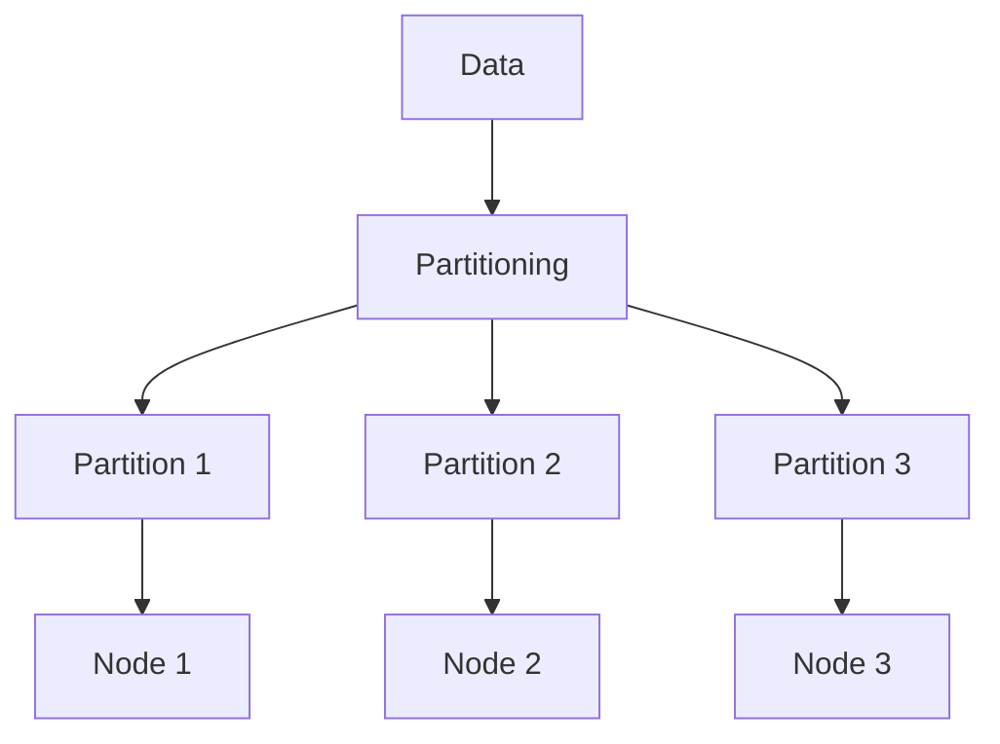
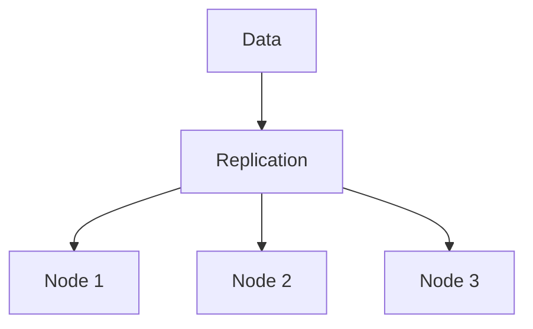
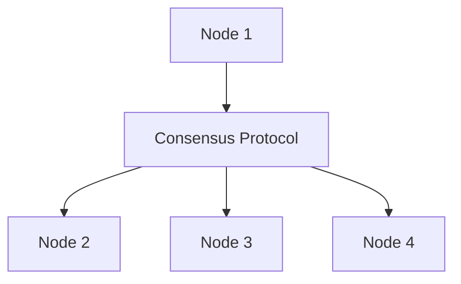
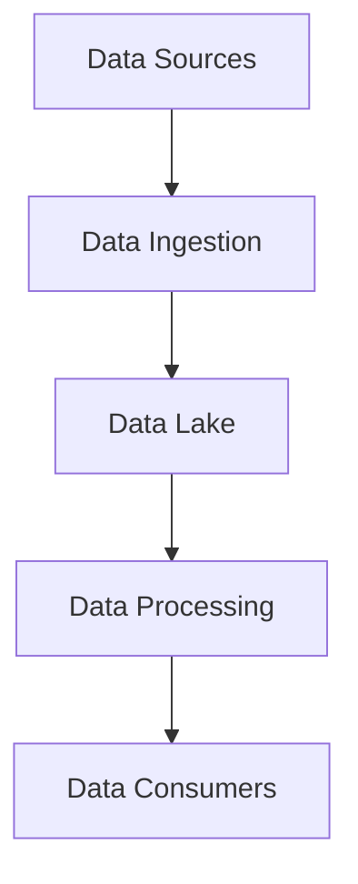
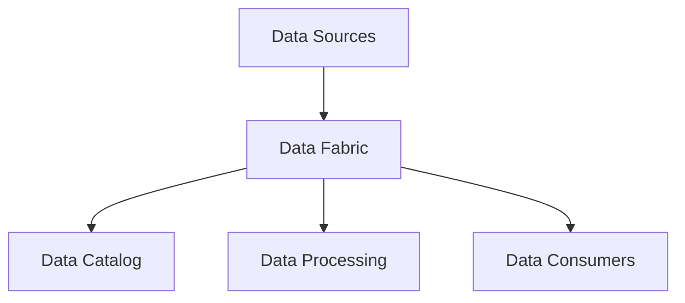
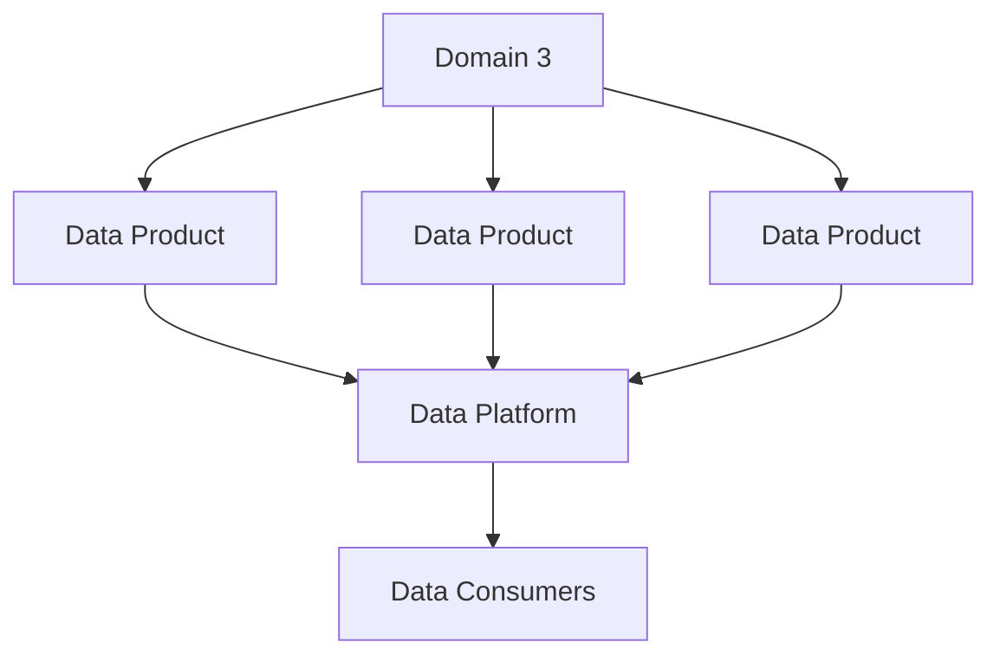

# Designing Scalable and Fault-Tolerant Data Architectures

## Introduction

In the world of data engineering, building resilient and scalable data systems is a critical requirement. As data volumes and processing demands continue to grow, traditional centralized data architectures often struggle to keep up. Designing scalable and fault-tolerant data architectures has become a key focus area for data engineers.

This article explores the key design principles and architectural patterns for building scalable and fault-tolerant data systems. We will dive into the concepts of distributed systems, partitioning, replication, and consensus protocols, and discuss how to architect for reliability, availability, and consistency in the face of various distributed system challenges.

## Distributed Systems and Scalability

At the core of scalable and fault-tolerant data architectures are distributed systems. Distributed systems are composed of multiple interconnected components that work together to achieve a common goal. By distributing the workload across multiple nodes, distributed systems can handle larger data volumes and higher processing demands.

However, building distributed systems comes with its own set of challenges. Distributed systems must deal with network failures, clock synchronization issues, and other distributed system complexities. Designing for these challenges is crucial to building scalable and fault-tolerant data architectures.

## Key Design Principles

### Partitioning and Sharding

Partitioning and sharding are fundamental techniques for scaling data systems. Partitioning involves dividing data into smaller, more manageable chunks based on certain criteria, such as time, geography, or user ID. This allows for parallel processing and reduces the load on individual nodes.

Sharding is a related concept where the data is horizontally partitioned across multiple databases or storage systems. This distribution of data across multiple nodes enables better scalability and performance.

### Replication and High Availability

Replication is a technique used to improve the availability and fault tolerance of data systems. By maintaining multiple copies of data across different nodes, replication ensures that the system can continue to operate even if one or more nodes fail.

There are different replication strategies, such as master-slave replication, where updates are made to a primary node and then propagated to secondary nodes, or multi-master replication, where updates can be made to any node and then synchronized across the cluster.

### Consensus Protocols

In distributed systems, maintaining consistency and coordination between nodes is crucial. Consensus protocols, such as Raft and Paxos, are used to ensure that all nodes in a distributed system agree on the state of the system, even in the face of node failures or network partitions.

These protocols rely on a quorum of nodes to reach agreement on updates, ensuring that the system remains consistent and available even when some nodes are unavailable.

### Reliability and Fault Tolerance

Designing for reliability and fault tolerance is crucial in building scalable and fault-tolerant data architectures. This includes implementing mechanisms for automatic failover, self-healing, and graceful degradation in the face of failures.

Techniques such as circuit breakers, retries, and exponential backoff can help mitigate the impact of transient failures and improve the overall resilience of the system.

### Consistency Models

Distributed systems must also address the trade-offs between consistency, availability, and partition tolerance, as described by the CAP theorem. Different consistency models, such as strong consistency, eventual consistency, and bounded consistency, can be employed depending on the requirements of the system.

Understanding these consistency models and their implications is essential for designing scalable and fault-tolerant data architectures.

## Architectural Patterns

### Data Lake Architecture

The data lake architecture is a common pattern for building scalable and fault-tolerant data systems. In a data lake, raw data is ingested from various sources and stored in a centralized, distributed storage system, such as Apache Hadoop or Amazon S3. This data can then be processed and transformed using distributed computing frameworks like Apache Spark or Apache Flink.

The data lake architecture leverages partitioning, replication, and distributed processing to achieve scalability and fault tolerance. Data is typically partitioned by time, geography, or other criteria, and replicated across multiple nodes to ensure high availability.

### Data Fabric Architecture

The data fabric architecture is a more recent approach to building scalable and fault-tolerant data systems. In a data fabric, data is distributed across multiple heterogeneous data sources and processing platforms, with a unified data management and governance layer that provides a cohesive view of the data.

The data fabric architecture leverages concepts like data virtualization, federated query processing, and distributed data catalogs to achieve scalability and fault tolerance. By abstracting away the underlying data storage and processing systems, the data fabric can provide a resilient and flexible data platform.

### Data Mesh Architecture

The data mesh architecture is a decentralized approach to building scalable and fault-tolerant data systems. In a data mesh, data is owned and managed by autonomous, domain-specific data teams, and a self-serve data platform provides the necessary tools and infrastructure for these teams to publish and consume data.

The data mesh architecture leverages concepts like domain-driven design, self-service data platforms, and decentralized data governance to achieve scalability and fault tolerance. By empowering domain teams to manage their own data, the data mesh can better adapt to changing business requirements and handle failures in individual domains without affecting the entire system.

## Conclusion

Designing scalable and fault-tolerant data architectures is a critical challenge in the world of data engineering. By leveraging distributed systems concepts, such as partitioning, replication, and consensus protocols, data engineers can build resilient data platforms that can handle growing data volumes and processing demands.

The key design principles and architectural patterns discussed in this article, including data lakes, data fabrics, and data meshes, provide a solid foundation for building scalable and fault-tolerant data systems. As data engineering continues to evolve, understanding these principles and patterns will be essential for data engineers to design and implement robust, reliable, and high-performing data architectures.