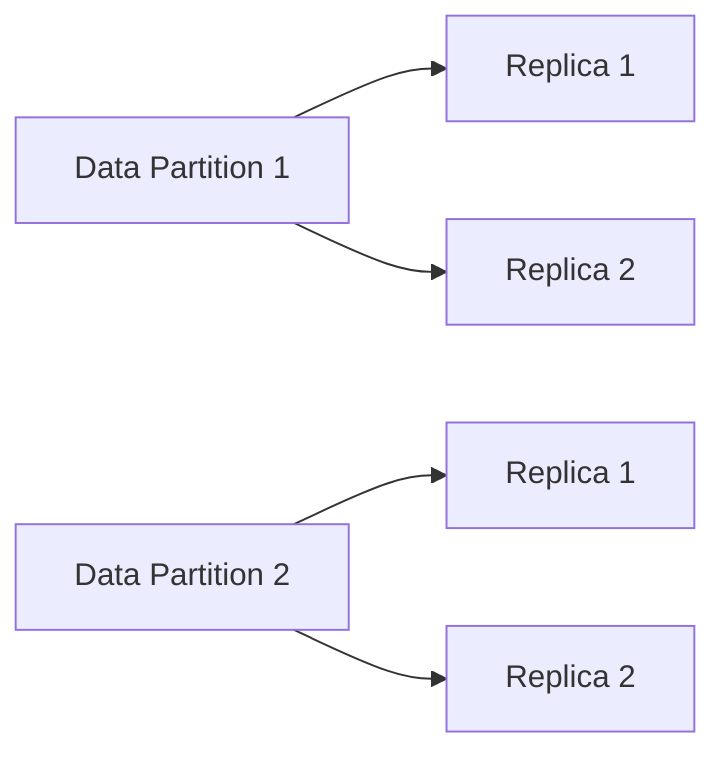
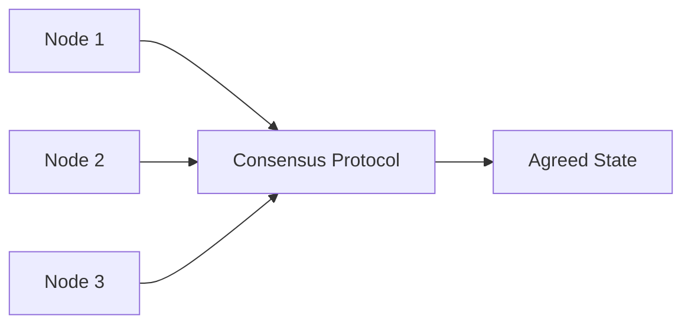
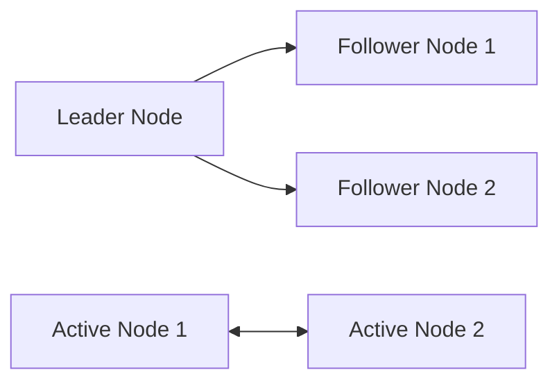
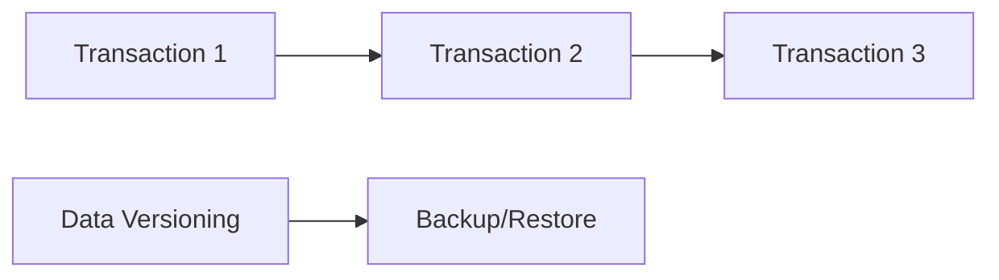

# Designing for Fault Tolerance and Reliability in Data Architectures

## Introduction

In the world of data engineering, where data is the lifeblood of modern businesses, the ability to design and build fault-tolerant and reliable data systems is of paramount importance. As data-driven applications become increasingly complex and distributed, the challenges of maintaining high availability, consistency, and recoverability in the face of various system failures and distributed system challenges have become more pronounced.

This article will explore the key design principles and architectural patterns that can be employed to build resilient data systems. We will delve into the concepts of distributed systems, partitioning, replication, and consensus protocols, and discuss how they can be leveraged to create highly available, consistent, and recoverable data architectures. Additionally, we will examine the trade-offs between different approaches and the impact on overall system reliability.

## Distributed Systems and Fault Tolerance

At the core of building fault-tolerant and reliable data systems is the understanding of distributed systems. In a distributed system, multiple components or nodes work together to achieve a common goal, but they are susceptible to various types of failures, such as network outages, hardware failures, and clock synchronization issues.

To address these challenges, the principles of fault tolerance must be applied to the design of data architectures. Fault tolerance refers to the ability of a system to continue operating correctly in the event of component failures or other disruptions. This is achieved through the use of redundancy, where multiple copies of data or components are maintained, and through the implementation of mechanisms that can detect and recover from failures.

## Architectural Patterns for Fault Tolerance

### Partitioning and Replication

One of the fundamental architectural patterns for building fault-tolerant data systems is partitioning and replication. Partitioning involves dividing data into smaller, manageable chunks, or partitions, which can be distributed across multiple nodes or servers. This approach helps to improve scalability and availability, as the system can handle increased data volumes and withstand the failure of individual nodes.

Replication, on the other hand, involves maintaining multiple copies of data across different nodes or servers. This redundancy ensures that if one node fails, the data can still be accessed from another replica, providing high availability and fault tolerance.

### Consensus Protocols

In a distributed system, maintaining consistency and coordination between multiple nodes is crucial for ensuring fault tolerance. Consensus protocols, such as Raft and Paxos, are used to achieve agreement among a group of nodes on the state of the system, even in the presence of failures or network partitions.

These protocols ensure that a majority of nodes agree on the current state of the system, allowing the system to continue operating correctly even if some nodes fail or become unavailable. This is particularly important for maintaining data consistency and durability in the face of failures.

### High Availability and Failover

To ensure high availability in data architectures, design patterns such as leader-follower replication and active-active replication can be employed. In a leader-follower setup, one node is designated as the leader, responsible for handling all write operations, while the followers replicate the data and can serve read requests. If the leader fails, a follower can be promoted to become the new leader, ensuring continuous service.

Active-active replication, on the other hand, involves multiple nodes actively processing both read and write operations. This approach provides even greater availability, as the system can withstand the failure of multiple nodes without interrupting service.

### Data Consistency and Recoverability

Maintaining data consistency and recoverability is crucial for building reliable data systems. Techniques such as transaction management, data versioning, and backup/restore mechanisms can be employed to ensure data integrity and the ability to recover from failures.

Transaction management ensures that a series of related data operations are either all completed successfully or rolled back, preserving data consistency. Data versioning allows the system to track changes to data over time, enabling point-in-time recovery and the ability to revert to previous states if necessary.

Backup and restore mechanisms, such as periodic snapshots or log-based recovery, provide a way to recover data in the event of catastrophic failures or data corruption.

## Applying Fault Tolerance Principles in Modern Data Architectures

The principles of fault tolerance and reliability can be applied to various modern data architectures, such as data lakes, data fabrics, and data meshes.

In a data lake architecture, partitioning and replication can be used to distribute data across multiple storage nodes, ensuring high availability and fault tolerance. Consensus protocols, such as those used in distributed file systems like HDFS or object stores like Amazon S3, can be leveraged to maintain data consistency and durability.

Data fabrics, which aim to provide a unified and integrated view of data across an organization, can be designed with fault-tolerant principles in mind. This may involve the use of distributed databases, message queues, and event-driven architectures to ensure high availability and recoverability.

Data meshes, a decentralized approach to data management, can also benefit from fault-tolerant design. By empowering domain-specific data teams to own and manage their data, data meshes can leverage partitioning, replication, and consensus protocols to create resilient and self-healing data systems.

## Trade-offs and Considerations

When designing fault-tolerant and reliable data architectures, there are often trade-offs to consider. For example, the choice between strong consistency (ensuring that all replicas have the same data) and high availability (allowing the system to continue operating even when some nodes are unavailable) is a classic trade-off known as the CAP theorem.

Additionally, the level of fault tolerance and the specific mechanisms employed can impact other system characteristics, such as performance, complexity, and cost. Architects must carefully evaluate the requirements of the system, the potential failure scenarios, and the available trade-offs to strike the right balance between reliability, availability, and other system attributes.

## Conclusion

Designing for fault tolerance and reliability is a critical aspect of building robust and resilient data systems. By understanding the principles of distributed systems, leveraging architectural patterns like partitioning, replication, and consensus protocols, and applying techniques for ensuring data consistency and recoverability, data engineers can create data architectures that can withstand failures and continue to deliver value to the organization.

As data-driven applications become increasingly complex and distributed, the ability to design for fault tolerance and reliability will only become more important. By mastering these concepts and applying them effectively, data engineers can contribute to the development of highly available, consistent, and recoverable data systems that power the digital transformation of businesses.