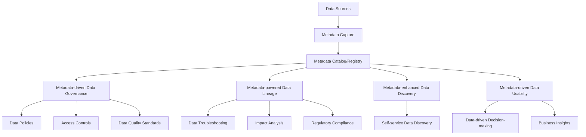

# Leveraging Metadata Management in Data Architectures

## Introduction

In the era of big data and complex data ecosystems, the role of metadata has become increasingly crucial in modern data architectures. Metadata, which is often referred to as "data about data," provides the necessary context and information to understand, manage, and derive value from the vast amounts of data organizations collect and process. Effective metadata management is a key enabler for data discovery, lineage, governance, and overall data usability, ultimately supporting data-driven decision-making and business outcomes.

## The Importance of Comprehensive Metadata Management

Metadata management is essential in modern data architectures for several reasons:

1. **Data Discovery**: Metadata helps users quickly locate and understand the data assets available within an organization. By providing detailed information about the data, such as its source, format, content, and relationships, metadata facilitates efficient data discovery and enables users to find the data they need.

2. **Data Lineage**: Metadata captures the journey of data through various systems and transformations, allowing organizations to understand the provenance and lineage of their data assets. This information is crucial for data governance, compliance, and troubleshooting.

3. **Data Governance**: Metadata supports data governance by providing the necessary information to define and enforce data policies, access controls, and data quality standards. It helps organizations ensure the reliability, security, and compliance of their data.

4. **Data Usability**: Comprehensive metadata enables users to better understand and interpret the data, reducing the risk of misinterpretation or misuse. This, in turn, improves the overall usability and value of the data for decision-making and business insights.

## Types of Metadata

There are three main types of metadata that are crucial in modern data architectures:

1. **Technical Metadata**: This type of metadata describes the technical aspects of data, such as data types, formats, schemas, data models, and the physical storage details of the data.

2. **Business Metadata**: Business metadata captures the business context of the data, including data definitions, business rules, data ownership, and the relationships between different business entities.

3. **Operational Metadata**: Operational metadata focuses on the processes and activities involved in managing and processing the data, such as data lineage, data transformations, data quality metrics, and performance metrics.

## Leveraging Metadata Management

Effective metadata management can significantly enhance the overall data architecture and enable various data-driven capabilities:

1. **Metadata Catalogs and Registries**: Implementing a centralized metadata catalog or registry allows organizations to store, manage, and provide access to all the metadata assets within the data ecosystem. This facilitates data discovery, lineage, and governance.

2. **Metadata Integration and Automation**: Integrating metadata management with various data sources, processing pipelines, and downstream applications enables automated metadata capture, curation, and synchronization. This reduces manual effort and ensures the metadata remains up-to-date and accurate.

3. **Metadata-driven Data Governance**: Leveraging metadata, organizations can define and enforce data policies, access controls, and data quality standards, ensuring the reliability, security, and compliance of their data assets.

4. **Metadata-powered Data Lineage**: Comprehensive metadata captures the complete data lineage, allowing organizations to understand the origin, transformation, and movement of data across their systems. This is crucial for data troubleshooting, impact analysis, and regulatory compliance.

5. **Metadata-enhanced Data Discovery**: By providing detailed information about data assets, metadata enables users to quickly locate and understand the data they need, improving data discovery and self-service capabilities.

6. **Metadata-driven Data Usability**: Enriching data with comprehensive metadata helps users better interpret and utilize the data, leading to improved data-driven decision-making and business insights.

## Implementing Metadata Management

Implementing effective metadata management in a data architecture involves several key steps:

1. **Identify Metadata Requirements**: Assess the organization's data landscape, business objectives, and user needs to determine the required metadata types, granularity, and use cases.

2. **Establish Metadata Governance**: Define clear roles, responsibilities, and processes for metadata management, including data stewardship, metadata curation, and metadata quality assurance.

3. **Implement Metadata Catalogs and Registries**: Deploy a centralized metadata management platform or tool that can ingest, store, and provide access to the various types of metadata across the data ecosystem.

4. **Automate Metadata Capture and Integration**: Integrate the metadata management system with data sources, processing pipelines, and downstream applications to enable automated metadata capture, curation, and synchronization.

5. **Leverage Metadata for Data Governance**: Utilize metadata to define and enforce data policies, access controls, and data quality standards, ensuring the reliability, security, and compliance of the data.

6. **Empower Data Discovery and Usability**: Expose the metadata through intuitive user interfaces and self-service capabilities to enable efficient data discovery, lineage, and interpretation.

7. **Continuously Improve Metadata Management**: Regularly review and refine the metadata management processes, tools, and governance to ensure they remain aligned with the evolving data architecture and business requirements.

By implementing a comprehensive metadata management strategy, organizations can unlock the full potential of their data assets, enhance data-driven decision-making, and drive greater business value.

