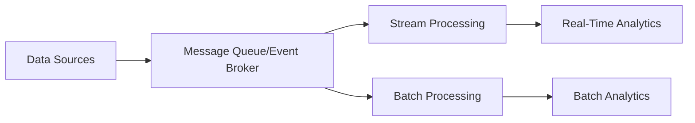
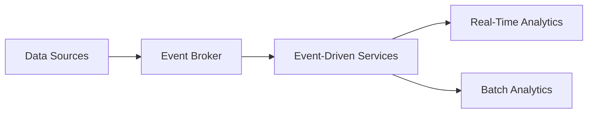
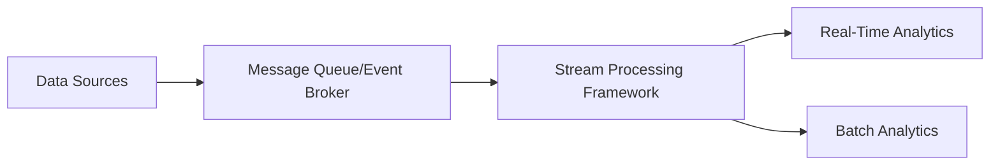
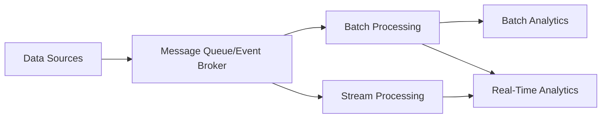

# Leveraging Streaming Data in Data Architectures

## Introduction

In the era of big data and digital transformation, the ability to process and analyze data in real-time has become increasingly crucial for organizations to gain a competitive edge. Traditional batch-oriented data processing approaches are often insufficient to keep up with the velocity, volume, and variety of data generated by modern applications, IoT devices, and other sources. This is where the power of streaming data and real-time processing comes into play, enabling organizations to unlock the value of their data more quickly and make timely, data-driven decisions.

This article examines the role of streaming data and real-time processing in modern data architectures, discussing the key considerations, design patterns, and strategies for integrating streaming data into your data infrastructure.

## The Importance of Streaming Data in Data Architectures

Streaming data refers to the continuous flow of data generated by various sources, such as sensors, social media, e-commerce platforms, and IoT devices. This data is generated and transmitted in real-time, often in small increments, rather than in large batches. Leveraging streaming data in your data architecture offers several benefits:

1. **Timely Insights**: By processing data as it is generated, you can gain insights and make decisions in near real-time, enabling you to respond to events and trends more quickly.
2. **Improved Responsiveness**: Streaming data allows you to detect and react to critical events or anomalies as they occur, enabling you to take immediate action and improve your overall responsiveness.
3. **Enhanced Customer Experience**: Real-time data processing can help you deliver personalized, contextual experiences to your customers, leading to increased customer satisfaction and loyalty.
4. **Competitive Advantage**: The ability to process and act on data in real-time can give you a significant competitive advantage, allowing you to make faster and more informed decisions than your competitors.

## Key Considerations for Integrating Streaming Data

When incorporating streaming data into your data architecture, there are several key considerations to keep in mind:

1. **Data Volume and Velocity**: Streaming data can be generated at extremely high rates, often requiring scalable and high-throughput processing capabilities to handle the volume and velocity of the data.
2. **Data Consistency and Reliability**: Ensuring the consistency and reliability of streaming data is crucial, as data may be lost or duplicated during the ingestion and processing stages.
3. **Latency and Responsiveness**: Real-time processing of streaming data requires low-latency solutions to enable timely decision-making and action.
4. **Event-Driven Architecture**: Streaming data often lends itself well to an event-driven architecture, where data processing is triggered by the occurrence of specific events.
5. **Fault Tolerance and Resilience**: Streaming data pipelines must be designed to be fault-tolerant and resilient, as they need to handle failures, network outages, and other disruptions without losing data or compromising the overall system.
6. **Integration with Batch Processing**: In many cases, streaming data needs to be integrated with batch processing pipelines to enable a comprehensive, end-to-end data processing solution.

## Design Patterns for Streaming Data Architectures

To address the challenges and leverage the benefits of streaming data, several design patterns have emerged:

### Message Queues and Event Brokers

Message queues and event brokers, such as Apache Kafka, Amazon Kinesis, and RabbitMQ, serve as the backbone of many streaming data architectures. These systems provide a reliable and scalable way to ingest, store, and distribute streaming data, allowing for decoupled and asynchronous processing of events.

### Event-Driven Architecture

In an event-driven architecture, data processing is triggered by the occurrence of specific events, rather than being driven by a predetermined schedule or workflow. This approach aligns well with the nature of streaming data, where events are continuously generated and need to be processed in a timely manner.

### Stream Processing Frameworks

Stream processing frameworks, such as Apache Spark Streaming, Apache Flink, and Google Cloud Dataflow, provide the necessary tools and abstractions to process and analyze streaming data in real-time. These frameworks offer features like fault tolerance, scalability, and support for complex event processing, making them well-suited for building robust streaming data pipelines.

### Lambda and Kappa Architectures

The lambda and kappa architectures are two popular patterns for integrating streaming data with batch processing and analytical workloads. The lambda architecture uses both batch and stream processing to provide a robust and fault-tolerant data processing solution, while the kappa architecture focuses solely on stream processing, simplifying the overall architecture.

## Selecting Streaming Technologies

When choosing the appropriate streaming technologies for your data architecture, consider the following factors:

- **Data Volume and Velocity**: Evaluate the expected volume and velocity of your streaming data to ensure the selected technologies can handle the load.
- **Latency Requirements**: Determine the acceptable latency for your use case and select technologies that can meet your responsiveness needs.
- **Scalability and Fault Tolerance**: Ensure the chosen technologies can scale up or down as needed and are resilient to failures.
- **Integration and Ecosystem**: Consider how the streaming technologies will integrate with your existing data infrastructure and the broader ecosystem of tools and services.
- **Cost and Operational Complexity**: Evaluate the cost and operational overhead associated with deploying and maintaining the streaming technologies.

## Designing Reliable and Scalable Streaming Data Pipelines

To build reliable and scalable streaming data pipelines, consider the following best practices:

1. **Ensure Data Consistency and Reliability**: Implement mechanisms like message acknowledgments, exactly-once processing, and data replication to guarantee the consistency and reliability of your streaming data.
2. **Implement Fault Tolerance and Resilience**: Design your streaming pipelines to be fault-tolerant, with features like automatic failover, load balancing, and self-healing capabilities.
3. **Leverage Scalable and Distributed Technologies**: Choose streaming technologies that can scale horizontally to handle increasing data volumes and processing demands.
4. **Optimize for Performance**: Tune your streaming pipelines for optimal performance by considering factors like message batching, compression, and parallel processing.
5. **Implement Monitoring and Observability**: Establish comprehensive monitoring and observability practices to detect and troubleshoot issues in your streaming data pipelines.
6. **Adopt Continuous Integration and Deployment**: Implement CI/CD practices to streamline the deployment and management of your streaming data infrastructure.

## Benefits and Trade-offs of Leveraging Streaming Data

Leveraging streaming data in your data architecture can provide significant benefits, but it also comes with trade-offs that you should consider:

**Benefits:**
- Timely insights and decision-making
- Improved customer experience and responsiveness
- Competitive advantage through real-time data processing
- Ability to detect and respond to critical events and anomalies

**Trade-offs:**
- Increased complexity in designing and managing streaming data pipelines
- Higher operational overhead and cost associated with streaming technologies
- Potential challenges in ensuring data consistency and reliability in a distributed, event-driven environment
- Potential for increased latency and performance issues if not designed and optimized properly

## Conclusion

Integrating streaming data and real-time processing into your data architecture is a powerful way to unlock the value of your data and gain a competitive edge. By understanding the key considerations, design patterns, and best practices for leveraging streaming data, you can build reliable, scalable, and performant data pipelines that deliver timely insights and enable data-driven decision-making. As you embark on your streaming data journey, be mindful of the trade-offs and continuously optimize your architecture to ensure it meets the evolving needs of your organization.