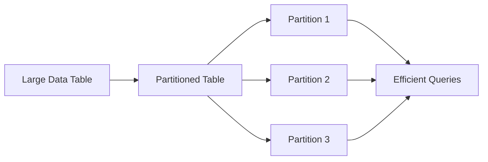

# Optimizing Performance in Data Architectures

## Introduction

As data systems grow in complexity and scale, ensuring optimal performance becomes a critical concern for data engineers. Effective performance optimization requires a deep understanding of the underlying data architecture, the workload characteristics, and the trade-offs involved in various design decisions. In this article, we will explore key techniques and strategies for improving the performance of data systems, covering topics such as indexing, partitioning, caching, materialized views, and architectural considerations.

## Indexing

Indexing is a fundamental technique for enhancing the performance of data retrieval operations. By creating an index, you can significantly reduce the time required to locate and retrieve specific data within a large dataset. Indexes work by creating a sorted data structure that points to the actual data, allowing for efficient lookups and range queries.

When designing indexes, consider the following best practices:

- **Index Columns**: Identify the columns that are frequently used in your queries' `WHERE`, `JOIN`, and `ORDER BY` clauses, and create indexes on those columns.
- **Composite Indexes**: For queries that filter on multiple columns, create a composite index that includes all the relevant columns.
- **Index Maintenance**: Regularly monitor and maintain your indexes to ensure they remain efficient as data volumes grow. This may involve rebuilding or reorganizing indexes to address issues like index fragmentation.

## Partitioning

Partitioning is a technique that divides a large table into smaller, more manageable pieces called partitions. By partitioning data based on specific criteria, such as date or location, you can improve query performance by reducing the amount of data that needs to be scanned.

Key considerations for partitioning:

- **Partition Key Selection**: Choose partition keys that align with your most common query patterns, such as date, geography, or product ID.
- **Partition Pruning**: Leverage partition pruning, where the database can quickly identify and access only the relevant partitions for a given query, rather than scanning the entire table.
- **Partition Maintenance**: Regularly monitor and maintain your partitions, such as by adding new partitions, dropping old partitions, or merging partitions to optimize storage and performance.

## Caching

Caching is a powerful technique for improving the performance of data systems by storing frequently accessed data in memory, reducing the need to retrieve it from slower storage systems. Caching can be implemented at various levels, such as at the database, application, or content delivery network (CDN) level.

Key caching strategies:

- **Query Caching**: Cache the results of frequently executed queries to avoid repeated computations.
- **Data Caching**: Cache frequently accessed data, such as dimension tables or lookup data, in memory for faster retrieval.
- **Cached Materialized Views**: Create materialized views, which are pre-computed and cached versions of complex queries, to speed up data access.

## Materialized Views

Materialized views are pre-computed and stored versions of complex queries, which can significantly improve query performance by eliminating the need to recompute the same data repeatedly. Materialized views are particularly useful for powering dashboards, reports, and other analytical workloads that require fast access to aggregated or joined data.

Considerations for materialized views:

- **Refresh Strategies**: Decide on the appropriate refresh strategy, such as periodic scheduled updates or incremental updates, based on the data freshness requirements.
- **Indexing**: Create indexes on materialized views to further optimize query performance.
- **Maintenance**: Regularly monitor and maintain materialized views to ensure they remain up-to-date and efficient as the underlying data changes.

## Architectural Considerations

The choice of data architecture can also have a significant impact on the performance of your data systems. Different architectural styles, such as data warehouses, data lakes, and data meshes, come with their own set of performance trade-offs and design considerations.

### Data Warehouses
Data warehouses are optimized for analytical workloads, with a focus on aggregating and transforming data from various sources into a centralized, structured repository. Key performance considerations for data warehouses include:

- **Dimensional Modeling**: Employ dimensional modeling techniques, such as star or snowflake schemas, to organize data in a way that enables efficient querying and reporting.
- **Indexing and Partitioning**: Leverage indexing and partitioning strategies to optimize data retrieval and reduce the need for full table scans.
- **Workload Management**: Implement workload management policies to prioritize and manage different types of queries, ensuring that critical analytical workloads are not impacted by resource-intensive tasks.

### Data Lakes
Data lakes are designed to store large volumes of raw, unstructured data from various sources. Performance optimization in data lakes focuses on efficient data processing and querying. Considerations include:

- **Data Partitioning and Bucketing**: Partition and bucket data based on relevant attributes to enable efficient data retrieval and processing.
- **Columnar Storage Formats**: Utilize columnar storage formats, such as Apache Parquet or Apache ORC, to improve query performance by reducing the amount of data that needs to be scanned.
- **Caching and Materialized Views**: Leverage caching and materialized views to accelerate common analytical queries on data lake data.

### Data Meshes
Data meshes are a decentralized approach to data architecture, where domain-specific data products are managed and served by autonomous teams. Performance optimization in data meshes involves:

- **Scalable Data Pipelines**: Ensure that data pipelines are designed to handle increasing data volumes and throughput requirements without compromising performance.
- **Distributed Query Processing**: Leverage distributed query processing frameworks, such as Apache Spark or Presto, to enable efficient querying across multiple data products.
- **Caching and Replication**: Implement caching and replication strategies to improve the availability and performance of data products.

## Benchmarking and Monitoring

Effective performance optimization requires continuous monitoring and benchmarking of your data systems. Implement a comprehensive monitoring and observability strategy to track key performance metrics, identify bottlenecks, and continuously improve your data architecture.

Key elements of a performance monitoring and benchmarking strategy:

- **Benchmark Tests**: Conduct regular benchmark tests to measure the performance of your data systems under various workloads and configurations.
- **Monitoring Dashboards**: Create detailed monitoring dashboards that provide visibility into the performance of your data pipelines, databases, and other components.
- **Alerting and Anomaly Detection**: Set up alerts and anomaly detection mechanisms to quickly identify and address performance issues.
- **Capacity Planning**: Continuously monitor resource utilization and plan for future growth to ensure your data systems can scale to meet increasing demands.

By implementing these performance optimization techniques and considering the architectural trade-offs, you can design and maintain highly performant data systems that are capable of supporting your organization's evolving data needs.