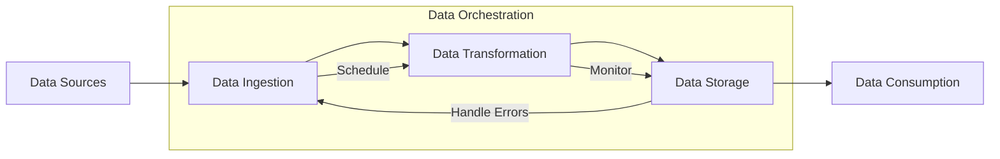

# Orchestrating Data Pipelines in Data Architectures

## Introduction

In the modern data landscape, the volume, velocity, and variety of data have grown exponentially, leading to the rise of complex data architectures. As organizations strive to extract valuable insights from their data, the need for efficient and reliable data pipelines has become paramount. Data orchestration plays a crucial role in managing and automating these data workflows, ensuring that data is seamlessly processed, transformed, and delivered to the right stakeholders at the right time.

## Data Orchestration in Modern Data Architectures

Data orchestration is the process of coordinating and managing the various components of a data pipeline, including data ingestion, transformation, enrichment, and delivery. It involves scheduling, monitoring, error handling, and dependency management to ensure the smooth execution of data workflows.

In modern data architectures, data orchestration is a key component that enables the integration and coordination of different data sources, processing engines, and downstream applications. It helps to create a cohesive and scalable data ecosystem, where data can flow seamlessly through various stages of the data engineering lifecycle.

### Key Components of Data Orchestration Platforms

Data orchestration platforms typically include the following key components:

1. **Scheduling**: The ability to schedule and execute data pipelines at specific intervals or in response to events, ensuring that data is processed in a timely manner.

2. **Monitoring and Alerting**: Comprehensive monitoring capabilities that track the status of data pipelines, detect errors or anomalies, and trigger alerts to enable proactive issue resolution.

3. **Error Handling**: Robust error handling mechanisms that can automatically retry failed tasks, handle exceptions, and provide detailed logs for troubleshooting.

4. **Dependency Management**: The capability to manage the dependencies between different data pipeline components, ensuring that data flows are executed in the correct order and that any downstream impacts are properly accounted for.

5. **Workflow Orchestration**: The ability to define and manage complex data workflows, including branching, merging, and conditional logic, to support diverse data processing requirements.

6. **Scalability and Fault Tolerance**: The platform should be designed to handle increasing data volumes and processing demands, with the ability to scale up or down as needed, and to gracefully handle failures or interruptions in the data pipeline.

7. **Extensibility and Integrations**: The platform should provide a flexible and extensible architecture, allowing for integration with a wide range of data sources, processing engines, and downstream applications.

### Orchestration in Batch Processing Pipelines

In a batch processing architecture, such as a data lake, data orchestration plays a crucial role in managing the end-to-end data pipeline. For example, a typical batch processing pipeline might involve the following steps:

1. Data ingestion: Extracting data from various sources (e.g., databases, files, APIs) and loading it into a data lake or data warehouse.
2. Data transformation: Applying data transformation and enrichment logic to the raw data, such as cleaning, filtering, and aggregating.
3. Data storage: Storing the transformed data in a format suitable for analytical processing, such as Parquet or Delta Lake.
4. Data consumption: Making the processed data available to downstream applications, such as business intelligence tools or machine learning models.

Data orchestration platforms can help manage this batch processing pipeline by scheduling the execution of each step, monitoring the progress and status of the pipeline, handling errors and retries, and ensuring that dependencies between the various components are properly managed.

### Orchestration in Streaming Pipelines

In a streaming data architecture, such as a data fabric, data orchestration is essential for managing the continuous flow of data. Streaming pipelines typically involve the following steps:

1. Data ingestion: Capturing real-time data from various sources, such as event streams, IoT devices, or web applications.
2. Data transformation: Applying real-time data processing and transformation logic, such as filtering, aggregating, or enriching the data.
3. Data storage: Storing the transformed data in a format suitable for real-time analytics or serving.
4. Data consumption: Providing the processed data to downstream applications, such as dashboards, alerts, or machine learning models.

Data orchestration platforms can help manage streaming pipelines by scheduling the execution of each step, monitoring the health and performance of the pipeline, handling errors and retries, and ensuring that dependencies between the various components are properly managed.

### Best Practices for Designing Scalable and Fault-Tolerant Data Orchestration Systems

To ensure that data orchestration systems are scalable, fault-tolerant, and maintainable, it's important to follow these best practices:

1. **Modular and Loosely Coupled Design**: Architect the data orchestration system with a modular and loosely coupled design, where individual components can be scaled, updated, or replaced independently without affecting the entire system.

2. **Declarative Configuration**: Use a declarative approach to define data pipelines and their dependencies, making the system more readable, maintainable, and less prone to errors.

3. **Automated Deployment and Versioning**: Implement automated deployment and versioning mechanisms to ensure that changes to the data orchestration system can be easily rolled out and rolled back.

4. **Monitoring and Observability**: Implement comprehensive monitoring and observability capabilities to track the health and performance of the data orchestration system, enabling proactive issue detection and resolution.

5. **Error Handling and Retries**: Implement robust error handling mechanisms, including automatic retries and dead-letter queues, to ensure that data pipelines can recover from transient failures and continue processing data.

6. **Scalable and Fault-Tolerant Infrastructure**: Ensure that the underlying infrastructure (e.g., compute, storage, networking) is designed to be scalable and fault-tolerant, with features like auto-scaling, high availability, and disaster recovery.

7. **Continuous Improvement**: Continuously monitor the performance and reliability of the data orchestration system, and make iterative improvements to address bottlenecks, optimize resource utilization, and enhance overall system resilience.

By following these best practices, organizations can design and implement data orchestration systems that are scalable, fault-tolerant, and maintainable, supporting the overall data architecture and enabling the efficient and reliable processing of data.

## Conclusion

Data orchestration is a critical component of modern data architectures, enabling the seamless integration and coordination of various data processing components. By leveraging data orchestration platforms, organizations can automate and manage their data workflows, ensuring that data is processed, transformed, and delivered to the right stakeholders in a timely and reliable manner. By adopting best practices for designing scalable and fault-tolerant data orchestration systems, organizations can build a robust and resilient data ecosystem that supports their data-driven decision-making and innovation initiatives.