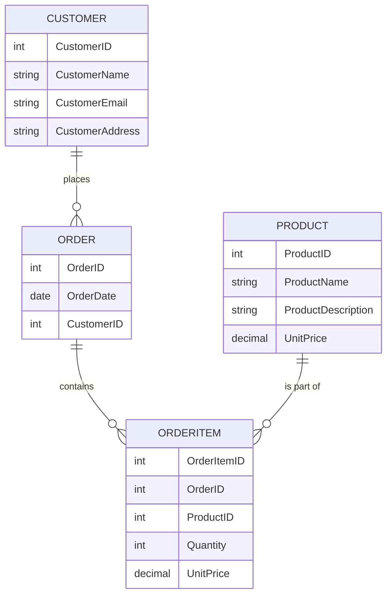
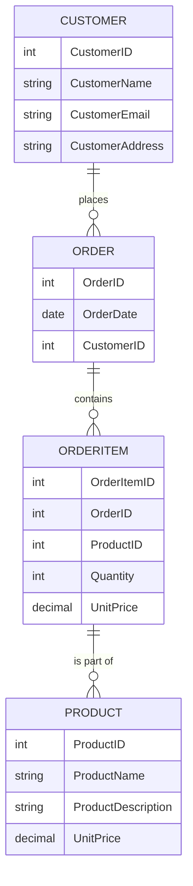

# Effective Data Modeling Techniques for Data Engineers

## Introduction

Data modeling is a crucial aspect of data engineering, as it lays the foundation for building robust and scalable data systems. Effective data modeling techniques enable data engineers to design data structures that can efficiently store, manage, and retrieve data to meet the requirements of various business applications. In this article, we will explore the key principles and techniques of effective data modeling that data engineers should follow, covering conceptual, logical, and physical data modeling, as well as topics like normalization, denormalization, dimensional modeling, and schema design patterns.

## Conceptual Data Modeling

Conceptual data modeling is the process of identifying the high-level entities, their relationships, and the key attributes that represent the core business requirements. This phase focuses on understanding the problem domain and creating a conceptual model that captures the essential elements of the system.

One of the widely used techniques for conceptual data modeling is the Entity-Relationship (ER) diagram. ER diagrams consist of entities (represented as rectangles), attributes (represented as ovals), and relationships (represented as diamonds) that connect the entities. These diagrams help data engineers visualize the overall structure of the data and identify the key entities and their relationships.

Here's an example of a conceptual data model for an e-commerce application:



This conceptual data model captures the key entities (Customer, Order, OrderItem, and Product) and their relationships, providing a high-level understanding of the data structure.

## Logical Data Modeling

Logical data modeling involves translating the conceptual model into a more detailed and implementation-specific data structure. This phase focuses on defining the data types, relationships, and constraints that will be used in the actual database design.

One of the common techniques for logical data modeling is normalization. Normalization is the process of organizing data in a database to reduce redundancy and improve data integrity. It involves breaking down the data into smaller tables and defining relationships between them. The main goals of normalization are to eliminate repeating groups, partial dependencies, and transitive dependencies.

Here's an example of a normalized logical data model for the e-commerce application:



In this logical data model, the data has been normalized by breaking down the entities into smaller tables and defining the relationships between them. This design helps to eliminate data redundancy and improve data integrity.

## Physical Data Modeling

Physical data modeling involves translating the logical data model into a database-specific implementation. This phase focuses on defining the physical storage structures, indexing strategies, and other database-specific configurations to optimize the performance and scalability of the data system.

One of the common techniques for physical data modeling is denormalization. Denormalization is the process of intentionally introducing controlled redundancy in the data model to improve query performance. This is often done by denormalizing certain data elements and storing them in the same table, even though they might have been separated in the logical data model.

Another technique for physical data modeling is dimensional modeling, which is commonly used in data warehousing and business intelligence applications. Dimensional modeling involves organizing data into fact tables (which contain the primary business metrics) and dimension tables (which contain the contextual information about the facts).

Here's an example of a dimensional data model for the e-commerce application:

```mermaid
schema
    table "Fact Table" {
        column OrderID
        column ProductID
        column Quantity
        column UnitPrice
    }
    table "Dimension Table" {
        column CustomerID
        column CustomerName
        column CustomerEmail
        column CustomerAddress
    }
    table "Dimension Table" {
        column ProductID
        column ProductName
        column ProductDescription
        column UnitPrice
    }
    table "Dimension Table" {
        column OrderID
        column OrderDate
    }
```

In this dimensional data model, the data is organized into a fact table (which contains the order details) and several dimension tables (which contain the customer, product, and order information). This design optimizes the performance of analytical queries and supports the requirements of business intelligence applications.

## Schema Design Patterns

In addition to the techniques mentioned above, data engineers can also leverage various schema design patterns to create effective data models. Some common schema design patterns include:

1. **Star Schema**: A star schema is a dimensional modeling pattern that consists of a central fact table surrounded by dimension tables. This design is commonly used in data warehousing and business intelligence applications.

2. **Snowflake Schema**: A snowflake schema is a variation of the star schema, where the dimension tables are further normalized, resulting in a more complex, multi-level dimensional model.

3. **Bridge Table**: A bridge table is a design pattern used to represent many-to-many relationships between entities. It helps to eliminate the need for complex join operations and improves query performance.

4. **Slowly Changing Dimensions (SCD)**: Slowly Changing Dimensions is a design pattern used to handle changes in dimension data over time. It allows data engineers to track and manage historical changes in the dimension data.

5. **Data Vault Modeling**: Data Vault Modeling is a schema design pattern that focuses on creating a highly flexible and scalable data model. It consists of three main components: hubs (representing the core business entities), links (representing the relationships between entities), and satellites (representing the attributes of the entities).

By understanding and applying these schema design patterns, data engineers can create effective and efficient data models that meet the specific requirements of their data systems.

## Conclusion

Effective data modeling is a critical skill for data engineers, as it lays the foundation for building robust and scalable data systems. By understanding and applying the key principles and techniques of conceptual, logical, and physical data modeling, as well as leveraging various schema design patterns, data engineers can create data models that optimize performance, scalability, and data integrity. By mastering these data modeling techniques, data engineers can better prepare themselves for data engineering interviews and successfully design and implement effective data solutions.