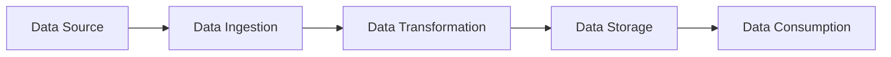

# Effective Documentation and Knowledge Sharing in Data Engineering

## Introduction

In the dynamic and ever-evolving field of data engineering, effective documentation and knowledge sharing are crucial for the success of data engineering teams and organizations. As data pipelines, data models, and architectural decisions become increasingly complex, it is essential to establish robust documentation practices to ensure that knowledge is captured, preserved, and readily accessible to all stakeholders. This article will explore the best practices data engineers should follow to maintain comprehensive documentation and facilitate seamless knowledge sharing within their teams and organizations.

## Documenting Data Pipelines

Data pipelines are the backbone of any data engineering ecosystem, and their documentation is paramount. Data engineers should strive to document the following key aspects of their data pipelines:

1. **Pipeline Architecture**: Provide a clear and concise overview of the pipeline architecture, including the various components, their interactions, and the flow of data through the system. This can be effectively communicated using diagrams, such as the one below, created using Mermaid markdown:

2. **Data Lineage**: Document the lineage of data, tracing the path of data from its origin to its final destination. This information is crucial for understanding the provenance of data and troubleshooting any issues that may arise.

3. **Data Transformation Logic**: Provide detailed documentation on the transformation logic applied to the data, including the algorithms, business rules, and any assumptions or constraints.

4. **Monitoring and Alerting**: Document the monitoring and alerting mechanisms in place, including the key metrics being tracked, the thresholds for triggering alerts, and the escalation procedures.

5. **Deployment and Maintenance**: Describe the deployment process, including any infrastructure-as-code (IaC) configurations, and the maintenance procedures for the data pipelines.

By maintaining comprehensive documentation for data pipelines, data engineers can ensure that their work is easily understood, maintained, and scaled by their team members and future contributors.

## Documenting Data Models

Effective data modeling is a critical aspect of data engineering, and documenting data models is essential for maintaining data integrity and enabling seamless data consumption. Data engineers should focus on the following areas when documenting data models:

1. **Conceptual Data Model**: Provide a high-level, business-oriented view of the data model, highlighting the key entities, their relationships, and the overall data landscape.

2. **Logical Data Model**: Document the detailed logical structure of the data model, including the entities, attributes, and relationships, as well as any data constraints or business rules.

3. **Physical Data Model**: Describe the physical implementation of the data model, including the database schema, table definitions, and any optimization techniques applied.

4. **Data Dictionary**: Maintain a comprehensive data dictionary that provides detailed information about each data element, including its definition, data type, source, and any relevant business context.

5. **Data Lineage and Transformations**: Document the lineage of data, tracing the transformations and calculations applied to the data as it moves through the system.

By documenting data models thoroughly, data engineers can ensure that their team members and stakeholders have a clear understanding of the data landscape, enabling more effective data consumption and analysis.

## Documenting Architectural Decisions

Architectural decisions are the foundation of any data engineering solution, and documenting these decisions is crucial for maintaining the integrity and scalability of the system. Data engineers should consider the following best practices when documenting architectural decisions:

1. **Decision Log**: Maintain a decision log that captures the key architectural decisions made, the rationale behind them, and any trade-offs or alternatives considered.

2. **Technology Selection**: Document the selection process for the various technologies and tools used in the data engineering ecosystem, including the evaluation criteria, the pros and cons of each option, and the final justification for the chosen solutions.

3. **System Design**: Provide detailed documentation on the overall system design, including the high-level architecture, the integration points between various components, and the scalability and resilience considerations.

4. **Deployment and Infrastructure**: Document the deployment process, including any infrastructure-as-code (IaC) configurations, and the maintenance procedures for the underlying infrastructure.

5. **Monitoring and Observability**: Describe the monitoring and observability mechanisms in place, including the key metrics being tracked, the alerting thresholds, and the troubleshooting procedures.

By documenting architectural decisions, data engineers can ensure that their team members and future contributors have a clear understanding of the design choices made, the reasoning behind them, and the overall system architecture. This knowledge can be invaluable for maintaining, evolving, and scaling the data engineering solution over time.

## Establishing Knowledge Repositories

In addition to documenting individual components, data engineers should also focus on establishing centralized knowledge repositories to facilitate effective knowledge sharing within their teams and organizations. These repositories can take various forms, such as:

1. **Wiki or Documentation Portal**: Maintain a centralized wiki or documentation portal where all the relevant documentation, including data pipelines, data models, and architectural decisions, can be stored and accessed by team members.

2. **Code Repositories**: Leverage code repositories, such as Git, to store and version-control the code and configuration files related to the data engineering ecosystem, making it easier for team members to collaborate and stay up-to-date.

3. **Training Materials**: Develop and curate a library of training materials, including tutorials, presentations, and hands-on exercises, to help team members upskill and stay informed about the latest developments in the data engineering domain.

4. **Collaboration Tools**: Utilize collaboration tools, such as chat applications or project management platforms, to facilitate real-time discussions, share knowledge, and address questions or issues that arise.

By establishing these knowledge repositories, data engineers can ensure that the collective knowledge of the team is captured, organized, and readily accessible to all stakeholders, promoting a culture of continuous learning and knowledge sharing.

## Fostering a Culture of Continuous Learning

Effective documentation and knowledge sharing are not just about creating and maintaining static content; they are also about fostering a culture of continuous learning within the data engineering team and the organization as a whole. Data engineers should consider the following strategies to promote a culture of continuous learning:

1. **Regular Training Sessions**: Organize regular training sessions, workshops, or lunch-and-learn events to share knowledge, discuss best practices, and explore new technologies or techniques.

2. **Peer-to-Peer Mentoring**: Encourage a mentorship program where experienced data engineers can share their knowledge and provide guidance to junior team members, facilitating the transfer of institutional knowledge.

3. **Hackathons and Experimentation**: Create opportunities for team members to experiment with new technologies, explore innovative solutions, and share their learnings with the rest of the team.

4. **Participation in Industry Events**: Encourage team members to attend industry conferences, meetups, or webinars to stay informed about the latest trends and developments in the data engineering field.

5. **Knowledge Sharing Incentives**: Consider implementing incentives or recognition programs that reward team members for their contributions to the team's knowledge base, fostering a culture of continuous learning and knowledge sharing.

By fostering a culture of continuous learning, data engineering teams can ensure that their knowledge and skills remain relevant and up-to-date, enabling them to adapt to the ever-changing landscape of data engineering and deliver high-quality solutions to their stakeholders.

## Balancing Documentation with Agile Development

Data engineering teams often operate in an agile environment, where the pace of change can be rapid and the need for flexibility is paramount. Balancing the documentation efforts with agile development practices can be a challenging task, but data engineers can employ the following strategies to strike the right balance:

1. **Prioritize Documentation**: Identify the most critical documentation requirements, such as documenting data pipelines, data models, and architectural decisions, and focus on maintaining these as the team's top priority.

2. **Adopt a Just-in-Time Approach**: Rather than creating comprehensive documentation upfront, adopt a just-in-time approach, where documentation is created and updated as the project progresses, ensuring that it remains relevant and up-to-date.

3. **Leverage Automation**: Explore opportunities to automate the documentation process, such as generating documentation from code comments, configuration files, or metadata repositories, reducing the manual effort required.

4. **Integrate Documentation into the Development Workflow**: Embed documentation tasks into the team's agile development process, ensuring that documentation is considered an integral part of the development lifecycle.

5. **Encourage Collaboration and Feedback**: Foster a culture of collaboration where team members actively contribute to and provide feedback on the documentation, ensuring that it remains accurate and useful.

By striking the right balance between documentation and agile development, data engineering teams can maintain the necessary level of documentation while still preserving the flexibility and responsiveness required in a dynamic environment.

## Conclusion

Effective documentation and knowledge sharing are essential for the success of data engineering teams and organizations. By following the best practices outlined in this article, data engineers can ensure that their work is well-documented, their knowledge is effectively shared, and their teams are equipped to adapt to the ever-changing landscape of data engineering. By fostering a culture of continuous learning and striking the right balance between documentation and agile development, data engineers can contribute to the long-term success and sustainability of their data engineering solutions.