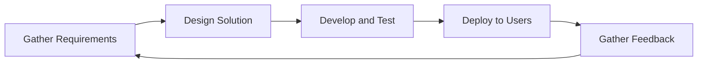
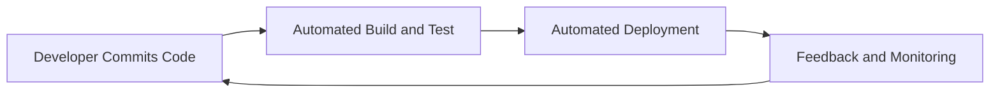
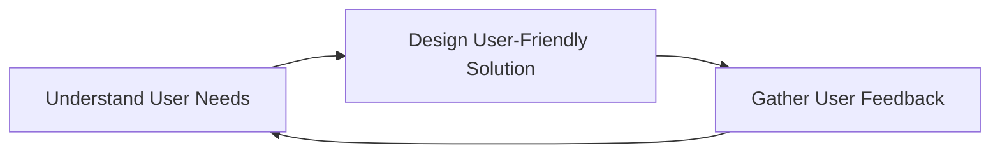
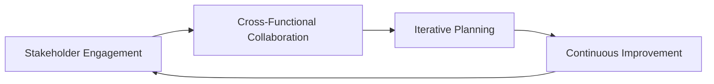

# Embracing Agile Methodologies in Data Engineering Projects

## Introduction

In the dynamic and ever-evolving world of data engineering, the traditional waterfall approach to project management often falls short in addressing the rapidly changing requirements and the need for rapid iteration. Agile methodologies, on the other hand, offer a more flexible and responsive approach that aligns well with the iterative nature of data engineering projects. By embracing agile principles, data engineering teams can enhance their ability to deliver high-quality, user-centric solutions that meet the evolving needs of the business.

## Applying Agile Principles in Data Engineering

### Iterative Development

The core tenet of agile methodologies is the embrace of iterative development, where the project is broken down into smaller, manageable increments. This approach allows data engineering teams to quickly deliver working components, gather feedback, and incorporate changes in subsequent iterations. This iterative cycle enables teams to adapt to changing requirements, prioritize the most valuable features, and ensure that the final solution aligns with the users' needs.

### Continuous Integration and Deployment

Agile methodologies emphasize the importance of continuous integration and deployment, where code changes are regularly integrated, tested, and deployed to the production environment. This approach helps data engineering teams to identify and address issues early in the development process, reducing the risk of costly and time-consuming rework. By automating the build, test, and deployment processes, data engineering teams can ensure that their solutions are consistently reliable and up-to-date.

### User-Centric Design

Agile methodologies emphasize the importance of user-centric design, where the needs and expectations of the end-users are at the forefront of the development process. Data engineering teams should work closely with stakeholders and end-users to understand their pain points, requirements, and desired outcomes. This user-centric approach ensures that the final data engineering solution addresses the real-world problems faced by the users, enhancing its overall value and adoption.

### Collaborative Planning

Agile methodologies promote a collaborative approach to planning and decision-making, where cross-functional teams work together to prioritize tasks, allocate resources, and manage project risks. Data engineering teams should involve stakeholders, subject matter experts, and end-users in the planning process to ensure that the project aligns with the overall business objectives and user requirements. This collaborative approach fosters a shared understanding of the project's goals and helps to identify and address potential challenges early on.

## Benefits of Adopting Agile Practices in Data Engineering

1. **Improved Responsiveness to Change**: Agile methodologies enable data engineering teams to quickly adapt to changing requirements, priorities, and market conditions, ensuring that the final solution remains relevant and valuable.

2. **Enhanced User Satisfaction**: By focusing on user-centric design and incorporating continuous feedback, agile practices help data engineering teams deliver solutions that better meet the needs and expectations of end-users.

3. **Increased Productivity and Efficiency**: Agile practices, such as continuous integration and deployment, help to identify and address issues early in the development process, reducing the time and resources required to deliver the final solution.

4. **Better Alignment with Business Objectives**: The collaborative planning and decision-making inherent in agile methodologies help to ensure that data engineering projects are closely aligned with the overall business strategy and priorities.

5. **Improved Team Collaboration and Morale**: Agile practices foster a culture of open communication, shared responsibility, and continuous learning, which can lead to increased team cohesion, job satisfaction, and overall morale.

## Overcoming Challenges in Transitioning to Agile

Transitioning to an agile approach in data engineering can present several challenges, including:

1. **Resistance to Change**: Organizational culture and existing processes can create resistance to the adoption of agile practices. Data engineering teams should work closely with leadership to communicate the benefits of agile and provide training and support to help team members adapt to the new way of working.

2. **Lack of Agile Expertise**: Data engineering teams may lack the necessary skills and experience to effectively implement agile practices. Providing training, mentorship, and access to agile coaches can help to build the required expertise within the team.

3. **Integrating Agile with Existing Processes**: Data engineering teams may need to find ways to integrate agile practices with existing project management, data governance, and infrastructure management processes. Careful planning and collaboration with other teams can help to ensure a smooth transition.

4. **Measuring and Communicating Progress**: Agile methodologies require different approaches to measuring and communicating project progress. Data engineering teams should work to establish meaningful metrics and reporting mechanisms that align with the agile mindset.

5. **Balancing Agility and Governance**: Data engineering projects often require a certain level of governance and compliance, which can sometimes conflict with the agile principle of rapid iteration. Data engineering teams should work to find a balance between agility and governance, leveraging agile practices where possible while ensuring that necessary controls and processes are in place.

By addressing these challenges and embracing the principles of agile methodologies, data engineering teams can unlock the full potential of their projects, delivering high-quality, user-centric solutions that drive business value and success.