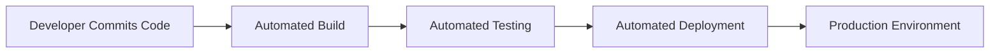

# Embracing Agility and Adaptability in Data Engineering

## Introduction

In the rapidly evolving world of data engineering, the ability to embrace agility and adaptability has become increasingly crucial. As data systems grow in complexity and business requirements continue to shift, data engineers must be equipped with the right mindset and practices to navigate change effectively. This article delves into the best practices data engineers should follow to foster a culture of agility and responsiveness within their work.

## Iterative Development

One of the core principles of agile methodology is the concept of iterative development. Rather than attempting to build the entire data pipeline or system upfront, data engineers should adopt an iterative approach, breaking down the work into smaller, manageable chunks. This allows for faster feedback loops, the ability to quickly incorporate changes, and the opportunity to validate assumptions and hypotheses throughout the development process.

By embracing iterative development, data engineers can:
- Deliver value to stakeholders in a more incremental and frequent manner
- Identify and address issues or bottlenecks early on, reducing the risk of larger-scale failures
- Adapt to evolving business requirements and technological advancements more seamlessly
- Foster a culture of continuous learning and improvement

## Continuous Integration and Deployment

Closely tied to iterative development, the practice of continuous integration and deployment (CI/CD) is a crucial enabler of agility in data engineering. By automating the build, test, and deployment processes, data engineers can ensure that changes are integrated and deployed to production environments quickly and reliably.

Implementing a robust CI/CD pipeline allows data engineers to:
- Reduce the time and effort required to push updates and new features to production
- Catch and address issues early in the development lifecycle, minimizing the impact of bugs or errors
- Facilitate the rapid rollout of bug fixes and enhancements, responding to changing business needs in a timely manner
- Establish a reliable and repeatable deployment process, reducing the risk of manual errors or inconsistencies

## User-Centric Design

Embracing agility in data engineering also requires a strong focus on user-centric design. By deeply understanding the needs, pain points, and expectations of the end-users (e.g., data analysts, data scientists, business stakeholders), data engineers can design and build data systems that truly address their requirements.

Adopting a user-centric approach involves:
- Engaging with end-users throughout the development lifecycle to gather feedback and insights
- Prioritizing user-facing features and functionalities based on their importance and impact
- Continuously soliciting user feedback and incorporating it into the development process
- Designing intuitive and user-friendly data interfaces, dashboards, and self-service capabilities

By placing the user at the center of the design process, data engineers can ensure that their data systems are not only technically sound but also aligned with the needs of the business and its stakeholders.

## Responsive Decision-Making

In an agile environment, data engineers must be equipped to make decisions quickly and respond to changing circumstances. This requires a mindset of continuous learning, a willingness to experiment, and the ability to leverage data-driven insights to inform decision-making.

Fostering responsive decision-making involves:
- Establishing clear and transparent decision-making processes
- Empowering data engineers to make autonomous decisions within their areas of responsibility
- Encouraging a culture of experimentation, where data engineers can test hypotheses and learn from the results
- Leveraging real-time data and feedback loops to monitor the performance and impact of data systems
- Quickly adapting to new business requirements, technological advancements, or market changes

By embracing responsive decision-making, data engineers can ensure that their data systems remain relevant, efficient, and aligned with the evolving needs of the organization.

## Fostering a Culture of Experimentation

Agility and adaptability in data engineering are not just about the technical practices; they also require a cultural shift within the organization. Data engineers should strive to foster a culture of experimentation, where failure is seen as an opportunity to learn and improve, rather than a source of fear or blame.

Cultivating a culture of experimentation involves:
- Encouraging a mindset of continuous learning and improvement
- Establishing safe spaces for data engineers to try new approaches, test hypotheses, and learn from the results
- Celebrating small wins and acknowledging the value of incremental progress
- Providing the necessary resources, time, and support for data engineers to experiment and innovate
- Embracing a "fail-fast, fail-forward" mentality, where mistakes are viewed as valuable learning experiences

By nurturing a culture of experimentation, data engineers can unlock the true potential of agility and adaptability, driving innovation and delivering greater value to the organization.

## Leveraging Feedback Loops

Agile data engineering is not a one-time event; it is an ongoing process of continuous improvement. Data engineers should leverage feedback loops to gather insights, validate assumptions, and quickly adapt to changing requirements.

Effective feedback loops in data engineering involve:
- Regularly soliciting feedback from end-users, stakeholders, and cross-functional teams
- Establishing clear communication channels and feedback mechanisms
- Analyzing user behavior, performance metrics, and other data-driven insights to identify areas for improvement
- Quickly incorporating feedback and insights into the development and deployment processes
- Closing the loop by communicating the actions taken in response to the feedback

By embracing feedback loops, data engineers can ensure that their data systems remain relevant, efficient, and aligned with the evolving needs of the organization.

## Conclusion

In the dynamic world of data engineering, embracing agility and adaptability is no longer a luxury, but a necessity. By adopting best practices such as iterative development, continuous integration and deployment, user-centric design, responsive decision-making, and fostering a culture of experimentation, data engineers can navigate change effectively and deliver greater value to their organizations.

Remember, agility is not just a technical practice; it's a mindset. By empowering data engineers to be responsive, innovative, and user-focused, organizations can unlock the true potential of their data and stay ahead of the curve in an ever-changing landscape.