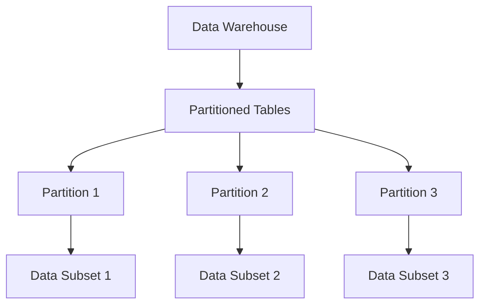
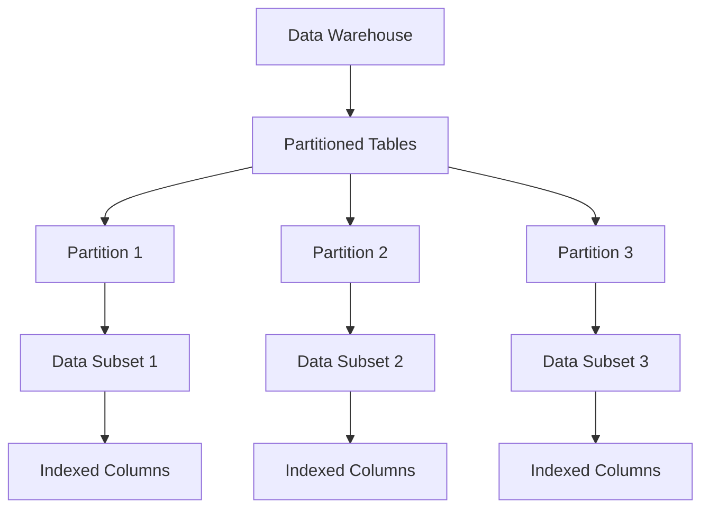
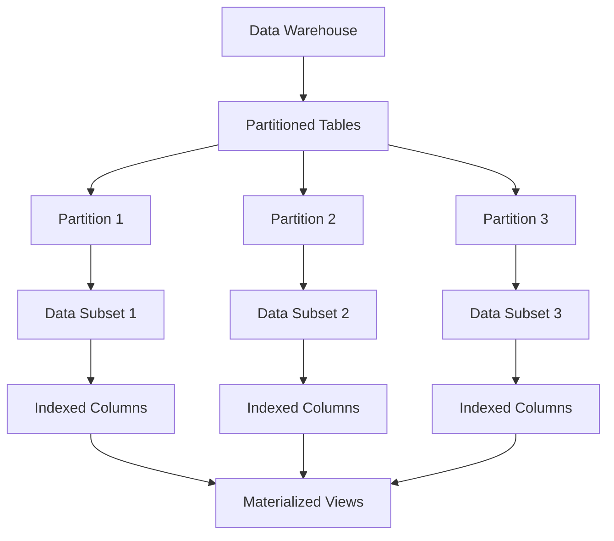
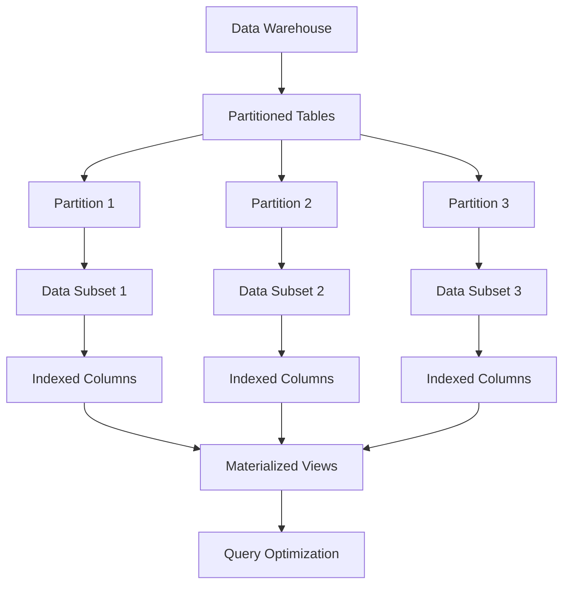
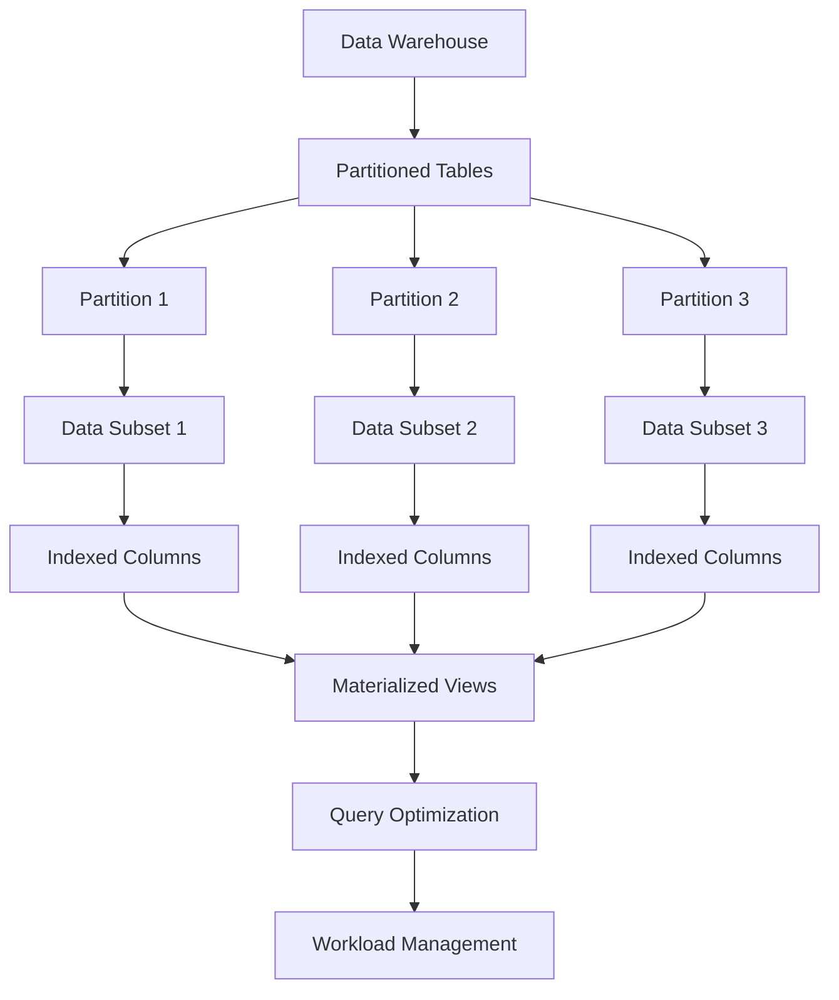
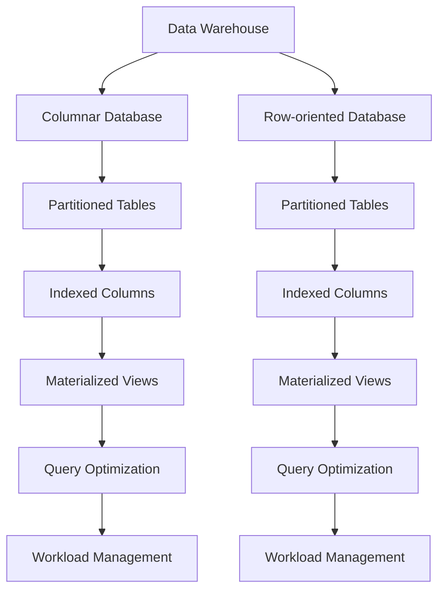

# Optimizing Data Warehouse Performance - Best Practices for Data Engineers

## Introduction

Data warehouses are the backbone of modern business intelligence and analytics. They serve as centralized repositories for historical data, enabling organizations to gain valuable insights and make data-driven decisions. However, as data volumes and complexity continue to grow, ensuring the performance and efficiency of data warehouses becomes increasingly crucial. Data engineers play a pivotal role in designing and tuning high-performing data warehouses that can handle the demands of today's business landscape.

In this article, we will explore the best practices that data engineers should follow to optimize the performance of data warehouses. We will cover topics such as data partitioning, indexing, materialized views, query optimization, and workload management. Additionally, we will discuss the trade-offs between different data warehouse architectures (e.g., columnar vs. row-oriented) and provide guidance on how to leverage advanced techniques like in-memory processing and query acceleration to improve overall performance.

## Data Partitioning

Data partitioning is a fundamental technique for optimizing data warehouse performance. By dividing a table into smaller, more manageable partitions, data engineers can improve query performance, reduce storage requirements, and enhance the overall efficiency of the data warehouse.

When partitioning data, it is essential to choose the right partitioning keys based on the most common query patterns and access requirements. Typical partitioning keys include date, geographical location, product category, or any other attribute that aligns with the business use cases. By partitioning data along these keys, data engineers can ensure that queries only access the relevant partitions, reducing the amount of data that needs to be scanned.

In addition to partitioning, data engineers should also consider the use of partition pruning, which allows the database to automatically eliminate irrelevant partitions from query execution, further improving performance.

## Indexing

Indexing is another crucial technique for optimizing data warehouse performance. Indexes are data structures that allow the database to quickly locate and retrieve specific data within a table. By creating appropriate indexes, data engineers can significantly reduce query execution times, especially for frequently executed queries.

When designing indexes, it is important to consider the most common query patterns and the attributes that are frequently used in `WHERE`, `JOIN`, and `ORDER BY` clauses. Additionally, data engineers should be mindful of the trade-offs between the benefits of indexing and the overhead it can introduce, such as increased storage requirements and slower write operations.

Advanced indexing techniques, such as bitmap indexes, function-based indexes, and multi-column indexes, can further enhance the performance of specific query patterns.

## Materialized Views

Materialized views are pre-computed and stored query results that can significantly improve query performance. By pre-computing the results of complex or frequently executed queries, data engineers can eliminate the need for the database to perform the same computations repeatedly, reducing query execution times.

Materialized views are particularly useful for queries that involve aggregations, joins, or other computationally intensive operations. By maintaining these pre-computed results, the database can quickly retrieve the data without having to perform the entire query from scratch.

Data engineers should carefully design and maintain materialized views to ensure they remain up-to-date and aligned with the evolving data and business requirements.

## Query Optimization

Query optimization is a critical aspect of data warehouse performance tuning. Data engineers should work closely with database administrators and query developers to analyze and optimize complex queries, ensuring they are executed efficiently.

Techniques for query optimization include:
- **Query Rewriting**: Restructuring queries to take advantage of indexes, partitions, and materialized views.
- **Query Hints**: Providing the database with specific instructions on how to execute a query, such as using a particular index or join strategy.
- **Query Parallelization**: Leveraging the database's ability to execute queries in parallel, distributing the workload across multiple processors or nodes.
- **Query Caching**: Storing the results of frequently executed queries in memory to avoid repeated computations.

By continuously monitoring and optimizing queries, data engineers can ensure that the data warehouse delivers optimal performance, even as data volumes and complexity grow.

## Workload Management

Effective workload management is essential for maintaining the performance and stability of a data warehouse. Data engineers should implement strategies to prioritize and manage the execution of different types of queries and workloads, ensuring that critical business-critical tasks are not impacted by less important or resource-intensive queries.

Techniques for workload management include:
- **Resource Allocation**: Allocating appropriate CPU, memory, and storage resources to different workloads based on their priority and resource requirements.
- **Workload Prioritization**: Implementing policies to prioritize the execution of mission-critical queries or workloads over less important ones.
- **Workload Isolation**: Separating different workloads (e.g., reporting, ad-hoc analysis, batch processing) into dedicated resource pools to prevent interference.
- **Workload Scheduling**: Scheduling the execution of batch or long-running tasks during off-peak hours or periods of low activity to minimize the impact on interactive queries.

By implementing effective workload management strategies, data engineers can ensure that the data warehouse can handle a diverse range of workloads and maintain high performance, even during periods of high demand or resource-intensive tasks.

## Data Warehouse Architectures

The choice of data warehouse architecture can have a significant impact on performance. Data engineers should carefully consider the trade-offs between different architectural approaches, such as columnar vs. row-oriented databases, to determine the most suitable solution for their specific use cases and requirements.

Columnar databases, for example, are often more efficient for analytical workloads that involve aggregations and column-based operations, as they can leverage the inherent advantages of storing data in a column-oriented format. On the other hand, row-oriented databases may be more suitable for transactional workloads or scenarios where the data access patterns are more row-centric.

In addition to the traditional columnar and row-oriented architectures, data engineers should also consider emerging technologies like in-memory databases and query acceleration platforms, which can provide significant performance improvements for specific use cases.

## Conclusion

Optimizing the performance of data warehouses is a critical responsibility for data engineers. By following the best practices outlined in this article, including data partitioning, indexing, materialized views, query optimization, and workload management, data engineers can design and tune high-performing data warehouses that can handle the growing demands of modern business intelligence and analytics.

Additionally, data engineers should carefully evaluate the trade-offs between different data warehouse architectures and leverage advanced techniques like in-memory processing and query acceleration to further enhance the performance and efficiency of the data warehouse. By adopting these strategies, data engineers can ensure that their data warehouses deliver the performance, scalability, and reliability required to support the organization's data-driven decision-making processes.