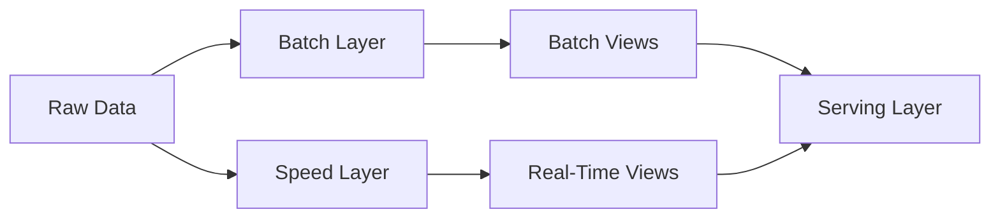
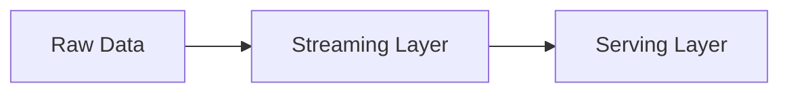

# Batch and Stream Processing Patterns - Choosing the Right Approach

## Introduction

In the world of data engineering, the choice between batch processing and stream processing is a fundamental decision that can significantly impact the performance, scalability, and responsiveness of your data pipeline. Both approaches have their own strengths and weaknesses, and the selection of the right processing pattern depends on the specific requirements of your data use case.

In this article, we will explore the key differences between batch and stream processing design patterns, discuss their respective strengths and weaknesses, and provide guidance on how to choose the appropriate processing pattern based on your data requirements.

## Batch Processing

Batch processing is a traditional approach to data processing, where data is collected, aggregated, and processed in discrete, periodic intervals. This approach is well-suited for scenarios where data is generated and accumulated over time, and the analysis or transformation of this data is not time-critical.

### Characteristics of Batch Processing

1. **Periodic Processing**: In batch processing, data is processed in batches, typically on a scheduled basis (e.g., daily, weekly, or monthly).
2. **Accumulation of Data**: Data is collected and stored over time, and then processed in a single, comprehensive operation.
3. **Offline Processing**: Batch processing is typically performed offline, without the need for real-time or near-real-time data access.
4. **Batch Size Optimization**: The size of the data batch can be optimized to balance processing time, resource utilization, and data freshness.

### Strengths of Batch Processing

1. **Simplicity**: Batch processing is generally simpler to implement and manage than stream processing, as it does not require the same level of real-time data handling and coordination.
2. **Fault Tolerance**: Batch processing is more resilient to failures, as errors can be easily identified and corrected during the batch processing cycle.
3. **Historical Analysis**: Batch processing is well-suited for historical data analysis, data warehousing, and other use cases where the timeliness of data is not a critical factor.
4. **Cost-Effectiveness**: Batch processing can be more cost-effective, as it often requires fewer computational resources than continuous stream processing.

### Weaknesses of Batch Processing

1. **Latency**: Batch processing inherently introduces latency, as data is not processed until the next scheduled batch run.
2. **Limited Responsiveness**: Batch processing is not well-suited for real-time or near-real-time applications, where immediate data processing and decision-making is required.
3. **Potential Data Loss**: In the event of a failure during the batch processing cycle, data may be lost or corrupted, as there is no continuous monitoring and recovery mechanism.

## Stream Processing

Stream processing, on the other hand, is a paradigm where data is continuously processed as it is generated, without the need for batch-based accumulation and processing. This approach is well-suited for scenarios where data needs to be processed and acted upon in near-real-time, such as in real-time analytics, event-driven architectures, and IoT applications.

### Characteristics of Stream Processing

1. **Continuous Data Processing**: In stream processing, data is processed as it arrives, without the need for batch-based accumulation.
2. **Real-Time or Near-Real-Time Processing**: Stream processing enables immediate data processing and decision-making, reducing latency.
3. **Event-Driven Architecture**: Stream processing is often implemented using event-driven architectures, where data events trigger the processing pipeline.
4. **Scalability and Parallelism**: Stream processing systems are designed to be highly scalable and can leverage parallel processing to handle high-volume data streams.

### Strengths of Stream Processing

1. **Low Latency**: Stream processing can provide near-real-time data processing and decision-making, making it well-suited for time-sensitive applications.
2. **Responsiveness**: Stream processing enables immediate reaction to data events, allowing for more responsive and adaptive systems.
3. **Fault Tolerance**: Stream processing systems are designed to be fault-tolerant, with mechanisms for data recovery and continuous processing in the event of failures.
4. **Scalability**: Stream processing architectures can be easily scaled to handle increasing data volumes and throughput requirements.

### Weaknesses of Stream Processing

1. **Complexity**: Stream processing systems are generally more complex to design, implement, and maintain than batch processing systems.
2. **Resource Utilization**: Stream processing can be more resource-intensive, as it requires continuous data processing and monitoring.
3. **Limited Historical Analysis**: Stream processing is not as well-suited for historical data analysis and data warehousing use cases, as it focuses on real-time or near-real-time data processing.

## Combining Batch and Stream Processing

While batch processing and stream processing have their own strengths and weaknesses, they can be combined to create more robust and flexible data processing architectures. Two common patterns for combining these approaches are the Lambda architecture and the Kappa architecture.

### The Lambda Architecture

The Lambda architecture is a data processing design pattern that combines batch processing and stream processing to provide a robust and fault-tolerant system. The key idea is to have two parallel processing pipelines: a batch processing pipeline for historical data analysis and a stream processing pipeline for real-time data processing. The results from both pipelines are then combined to provide a comprehensive view of the data.

The Lambda architecture offers the benefits of both batch processing and stream processing, providing low-latency real-time processing as well as reliable and comprehensive historical data analysis.

### The Kappa Architecture

The Kappa architecture is a simplified version of the Lambda architecture, where the batch processing layer is eliminated, and the entire data processing pipeline is based on stream processing. In the Kappa architecture, the same stream processing pipeline is used for both real-time and historical data processing.

The Kappa architecture is often preferred when the data volume and velocity are manageable, and the emphasis is on real-time data processing and responsiveness, rather than comprehensive historical analysis.

## Choosing the Right Processing Pattern

The choice between batch processing and stream processing, or a combination of the two, depends on several factors, including the volume and velocity of your data, the required level of data freshness, and the specific use case and requirements of your application.

Here are some guidelines to help you choose the appropriate processing pattern:

1. **Data Volume and Velocity**:
   - If your data volume is relatively low and the velocity is moderate, batch processing may be a simpler and more cost-effective solution.
   - If your data volume is high and the velocity is also high, stream processing may be a better fit to handle the real-time requirements.

2. **Data Freshness and Latency Requirements**:
   - If your use case requires immediate or near-real-time data processing and decision-making, stream processing is the better choice.
   - If your use case can tolerate some latency, and the focus is on historical data analysis and reporting, batch processing may be more suitable.

3. **Fault Tolerance and Reliability**:
   - Batch processing is generally more fault-tolerant and reliable, as errors can be easily identified and corrected during the batch processing cycle.
   - Stream processing systems are designed to be fault-tolerant, but may require more complex error handling and recovery mechanisms.

4. **Use Case and Application Requirements**:
   - Batch processing is well-suited for historical data analysis, data warehousing, and other use cases where data freshness is not a critical factor.
   - Stream processing is ideal for real-time analytics, event-driven architectures, and IoT applications where immediate data processing and decision-making is required.

5. **Combining Batch and Stream Processing**:
   - If your use case requires both real-time processing and comprehensive historical analysis, consider using a combined approach like the Lambda or Kappa architecture.
   - The Lambda architecture provides the benefits of both batch processing and stream processing, while the Kappa architecture simplifies the architecture by focusing solely on stream processing.

Remember, the choice between batch processing and stream processing is not a one-size-fits-all decision. It's essential to carefully evaluate your specific data requirements, use case, and the trade-offs between the two approaches to determine the most appropriate processing pattern for your data engineering project.

## Conclusion

In the world of data engineering, the choice between batch processing and stream processing is a fundamental decision that can significantly impact the performance, scalability, and responsiveness of your data pipeline. By understanding the key characteristics, strengths, and weaknesses of each approach, as well as the patterns for combining them, you can make an informed decision that aligns with your data requirements and application needs.

Ultimately, the right processing pattern will depend on factors such as data volume, velocity, latency requirements, fault tolerance, and the specific use case of your application. By carefully evaluating these factors and the trade-offs between batch and stream processing, you can choose the most appropriate approach to build a robust and efficient data processing system.