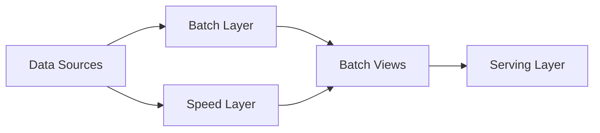
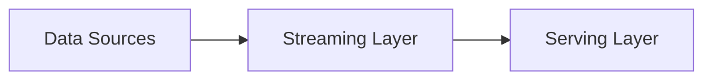
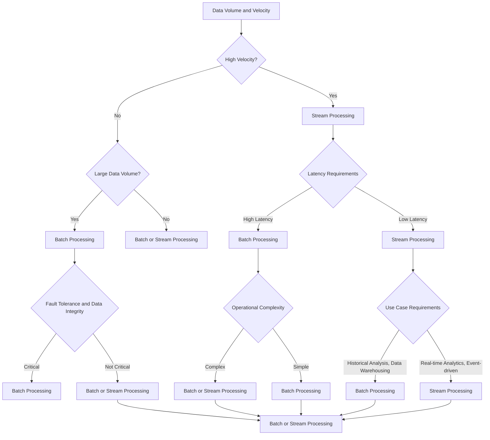

# Batch and Stream Processing Patterns: Choosing the Right Approach for Your Data Engineering Needs

## Introduction

In the world of data engineering, the choice between batch processing and stream processing is a fundamental decision that can significantly impact the performance, scalability, and responsiveness of your data pipelines. Both batch and stream processing have their own unique strengths and weaknesses, and the appropriate choice depends on the specific requirements of your data engineering use case.

In this article, we will explore the key differences between batch and stream processing design patterns, and provide guidance on how to choose the right approach based on your data engineering needs. We'll discuss the trade-offs between latency, throughput, and fault tolerance, and examine common use cases for each pattern. Additionally, we'll explore hybrid architectures like the Lambda and Kappa patterns, which combine batch and stream processing to leverage the strengths of both approaches. Finally, we'll provide a decision framework to help data engineers evaluate the factors that should influence their choice between batch and stream processing.

## Batch Processing

Batch processing is a data processing approach where data is collected, aggregated, and processed in discrete, non-overlapping batches or chunks. In this pattern, data is typically ingested, transformed, and loaded into a data store (e.g., data warehouse, data lake) in periodic intervals, such as hourly, daily, or weekly.

### Characteristics of Batch Processing

1. **Latency**: Batch processing generally has higher latency, as data is not processed immediately but rather in scheduled intervals. This makes batch processing suitable for use cases where data freshness is not a critical requirement, such as historical analysis and data warehousing.

2. **Throughput**: Batch processing can handle large volumes of data efficiently, as it can leverage the benefits of parallel processing and optimize resource utilization.

3. **Fault Tolerance**: Batch processing is generally more fault-tolerant, as errors or failures can be easily identified and addressed within the batch processing pipeline. This makes it suitable for mission-critical applications where data integrity is paramount.

4. **Use Cases**: Common use cases for batch processing include:
   - Historical data analysis
   - Data warehousing and business intelligence
   - Periodic reporting and dashboarding
   - Batch-oriented data transformations and ETL (Extract, Transform, Load) processes

### Batch Processing Patterns

1. **Batch Ingestion**: Data is collected and stored in batches, typically in a data lake or data warehouse, and then processed in scheduled intervals.
2. **Batch Transformation**: Data is transformed in batches, often using tools like Apache Spark or Apache Flink, and the transformed data is then loaded into a data store.
3. **Batch Loading**: Transformed data is loaded into a data warehouse or other data store in scheduled batches.

## Stream Processing

Stream processing is a data processing approach where data is continuously ingested, processed, and acted upon in real-time or near-real-time. In this pattern, data is processed as soon as it becomes available, rather than being collected and processed in batches.

### Characteristics of Stream Processing

1. **Latency**: Stream processing has lower latency, as data is processed immediately upon arrival. This makes stream processing suitable for use cases where data freshness and real-time responsiveness are critical, such as real-time analytics and event-driven architectures.

2. **Throughput**: Stream processing can handle high-velocity data streams, but may have lower throughput compared to batch processing for large data volumes.

3. **Fault Tolerance**: Stream processing can be more challenging to make fault-tolerant, as errors or failures can occur at any point in the data stream. Techniques like checkpointing and state management are often used to ensure fault tolerance in stream processing pipelines.

4. **Use Cases**: Common use cases for stream processing include:
   - Real-time analytics and monitoring
   - Fraud detection and anomaly identification
   - Internet of Things (IoT) data processing
   - Event-driven architectures and microservices

### Stream Processing Patterns

1. **Event-Driven Ingestion**: Data is continuously ingested from various sources, such as message queues, event streams, or real-time APIs, and then processed in a stream-oriented manner.
2. **Stateful Stream Processing**: Data is processed in a stateful manner, where the current state of the data is maintained and used to make decisions or perform transformations.
3. **Windowed Stream Processing**: Data is processed in logical windows, such as time-based windows or count-based windows, to enable aggregations, joins, and other complex transformations.

## Hybrid Architectures: Lambda and Kappa

While batch and stream processing have distinct characteristics, there are hybrid architectures that combine the strengths of both approaches to create more robust and flexible data engineering solutions.

### The Lambda Architecture

The Lambda architecture is a hybrid approach that combines batch processing and stream processing to provide a comprehensive data processing solution. The key idea behind the Lambda architecture is to have two parallel data processing pipelines: a batch processing pipeline for historical data and a stream processing pipeline for real-time data.

The Lambda architecture offers the following benefits:
- **Handles both batch and real-time data**: The batch layer processes historical data, while the speed layer processes real-time data, providing a comprehensive solution.
- **Fault tolerance**: If the speed layer fails, the batch layer can still provide the necessary data. Conversely, if the batch layer fails, the speed layer can still provide real-time data.
- **Flexibility**: The architecture allows for the independent scaling and optimization of the batch and speed layers based on the specific requirements of the use case.

### The Kappa Architecture

The Kappa architecture is a simplified version of the Lambda architecture, where a single stream processing pipeline is used to handle both real-time and historical data. In this approach, the batch processing layer is eliminated, and all data is processed in a continuous stream.

The Kappa architecture offers the following benefits:
- **Simplicity**: By eliminating the batch processing layer, the Kappa architecture is simpler to implement and maintain.
- **Reduced complexity**: The Kappa architecture has a smaller operational footprint, as it only requires a single stream processing pipeline.
- **Improved latency**: With the elimination of the batch processing layer, the Kappa architecture can provide lower latency for real-time data processing.

## Choosing the Right Approach

When deciding between batch processing and stream processing, data engineers should consider the following factors:

1. **Data Volume and Velocity**: If your data volume is large and the velocity is low, batch processing may be more appropriate. Conversely, if your data volume is smaller but the velocity is high, stream processing may be the better choice.

2. **Latency Requirements**: If your use case requires low latency and real-time responsiveness, stream processing is the better option. If your use case can tolerate higher latency, batch processing may be more suitable.

3. **Fault Tolerance and Data Integrity**: If data integrity and fault tolerance are critical, batch processing may be the preferred choice, as it is generally more robust and easier to manage errors. Stream processing can be more challenging to make fault-tolerant.

4. **Operational Complexity**: Batch processing is often simpler to implement and maintain, as it involves fewer moving parts. Stream processing can be more complex, with the need to manage state, handle out-of-order data, and ensure fault tolerance.

5. **Use Case Requirements**: Certain use cases are better suited to batch processing (e.g., historical analysis, data warehousing) or stream processing (e.g., real-time analytics, event-driven architectures). Understanding the specific requirements of your use case is crucial in making the right choice.

To help data engineers make an informed decision, we can use the following decision framework:

By considering these factors and using the decision framework, data engineers can make an informed choice between batch processing and stream processing, or even explore hybrid architectures like the Lambda or Kappa patterns, to best meet the requirements of their data engineering use case.

## Conclusion

In the world of data engineering, the choice between batch processing and stream processing is a critical decision that can significantly impact the performance, scalability, and responsiveness of your data pipelines. By understanding the key characteristics, strengths, and weaknesses of each approach, as well as the factors that should influence the decision, data engineers can make an informed choice that aligns with the specific requirements of their use case.

Whether you choose batch processing, stream processing, or a hybrid architecture, the goal is to build a robust and flexible data engineering solution that can effectively handle your data processing needs, from historical analysis to real-time analytics. By mastering these design patterns, data engineers can position themselves as valuable assets in the ever-evolving field of data engineering.