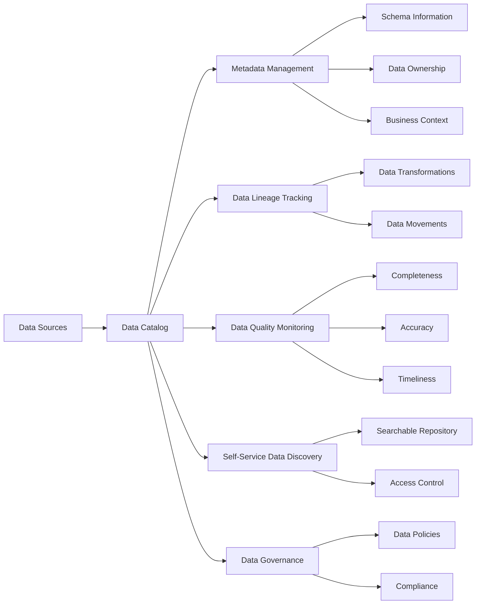

# Data Catalog: Enabling Self-Service Data Discovery and Governance

## Introduction

In the era of big data and data-driven decision making, organizations are grappling with the challenge of managing and governing their ever-growing data assets. As data volumes, sources, and complexity continue to increase, it becomes increasingly difficult for data consumers to discover, understand, and trust the data they need to make informed decisions. This is where the data catalog design pattern plays a crucial role in enabling self-service data discovery and improving overall data governance.

## The Data Catalog Design Pattern

A data catalog is a centralized, searchable repository that provides a comprehensive view of an organization's data assets. It serves as a metadata management system, capturing and organizing information about the data, such as its origin, structure, lineage, quality, and business context. By maintaining this metadata, a data catalog empowers data consumers to quickly find, understand, and assess the relevance and trustworthiness of the data they need.

The key features and capabilities of a data catalog include:

1. **Metadata Management**: A data catalog collects and stores metadata from various data sources, including databases, data warehouses, data lakes, and other enterprise applications. This metadata can include information about the data schema, data types, data owners, data stewards, and business glossary terms.

2. **Data Lineage Tracking**: A data catalog tracks the lineage of data, capturing the transformation and movement of data across different systems and processes. This helps data consumers understand the provenance of the data, identify the source of any issues, and assess the reliability of the data.

3. **Data Quality Monitoring**: A data catalog can integrate with data quality tools to monitor the quality of data assets, such as completeness, accuracy, and timeliness. This information is surfaced in the catalog, enabling data consumers to make informed decisions about the suitability of the data for their use cases.

4. **Self-Service Data Discovery**: By providing a centralized, searchable repository of an organization's data assets, a data catalog empowers data consumers to easily discover and access the data they need, without relying on IT or data engineering teams to locate and provision the data.

5. **Data Governance**: A data catalog supports data governance initiatives by providing a single point of control and visibility over an organization's data assets. This helps enforce data policies, manage data access and usage, and ensure compliance with regulatory requirements.

## Implementing a Data Catalog

Implementing a data catalog involves several technical considerations and challenges, including:

1. **Data Source Integration**: A data catalog must be able to ingest metadata from a wide range of data sources, such as databases, data warehouses, data lakes, and various enterprise applications. This requires the development of connectors or adapters to extract and transform the metadata into a standardized format.

2. **Metadata Extraction**: The data catalog must be able to automatically extract and parse the relevant metadata from the various data sources, including schema information, data lineage, and business context.

3. **User Access Control**: The data catalog must provide granular access control mechanisms to ensure that data consumers can only access the data they are authorized to view, based on their roles and permissions.

4. **Scalability and Performance**: As the volume and complexity of data assets grow, the data catalog must be able to scale to handle the increasing load and provide fast, responsive search and discovery capabilities.

## Examples of Data Catalog Tools

Several tools and platforms are available for building and implementing data catalogs, including:

1. **Apache Atlas**: An open-source data governance and metadata management framework that provides a comprehensive data catalog solution.

2. **Collibra**: A leading enterprise data catalog and governance platform that offers features such as metadata management, data lineage, and data quality monitoring.

3. **Alation**: A data catalog solution that leverages machine learning and natural language processing to automate the discovery and curation of metadata.

These tools can be integrated into broader data architecture patterns, such as the data fabric, to provide a seamless and comprehensive data management solution.

## Conclusion

In the face of growing data complexity and the need for self-service data discovery, the data catalog design pattern plays a crucial role in enabling data-driven decision making. By providing a centralized, searchable repository of an organization's data assets, a data catalog empowers data consumers to quickly find, understand, and trust the data they need, while also supporting data governance initiatives. As organizations continue to invest in data-driven strategies, the implementation of a robust data catalog will be a key enabler of success.

