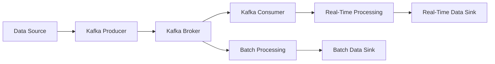

# Event-Driven Architecture in Data Engineering: Building Reactive, Scalable Pipelines

## Introduction

In the world of data engineering, the ability to build scalable, fault-tolerant, and responsive data pipelines is crucial. Traditional data processing architectures, such as the batch-oriented Extract-Transform-Load (ETL) approach, often struggle to keep up with the growing volume, velocity, and variety of data that organizations need to process and analyze. This is where event-driven architecture (EDA) comes into play, offering a more flexible and reactive approach to data engineering.

Event-driven architecture is a design pattern that revolves around the concept of events - discrete, asynchronous occurrences that trigger specific actions or responses. In the context of data engineering, event-driven architecture can be leveraged to build highly scalable, resilient, and real-time data pipelines that can adapt to changing data requirements and processing needs.

## Key Principles of Event-Driven Design

The core principles of event-driven design in data engineering are:

1. **Event Producers**: These are the components or systems that generate events, such as data sources, user actions, or system state changes. Event producers publish events to an event broker without any knowledge of who will consume the events.

2. **Event Brokers**: The event broker is responsible for receiving events from producers, storing them, and making them available to consumers. It acts as a decoupling layer between producers and consumers, enabling scalable and asynchronous event processing. Examples of event brokers include Apache Kafka, Amazon Kinesis, and Azure Event Grid.

3. **Event Consumers**: Event consumers subscribe to the event broker and process the events as they arrive. Consumers can perform various actions, such as data transformation, enrichment, or triggering downstream processes.

4. **Loose Coupling**: Event-driven design promotes loose coupling between components, where producers and consumers are decoupled from each other. This allows for greater flexibility, scalability, and fault tolerance, as components can be added, removed, or modified without affecting the overall system.

5. **Asynchronous Processing**: Events are processed asynchronously, meaning that producers can continue their operations without waiting for consumers to complete their tasks. This enables more responsive and scalable data pipelines, as consumers can process events at their own pace without bottlenecks.

6. **Scalability and Resilience**: Event-driven architectures are inherently scalable, as the event broker can handle increasing volumes of events by adding more brokers or partitions. Additionally, the asynchronous nature of event processing makes the system more resilient to failures, as consumers can continue processing events even if one or more components fail.

## Common Use Cases for Event-Driven Data Engineering

Event-driven architecture has several applications in data engineering, including:

1. **Real-Time Analytics**: By leveraging event streams, organizations can build real-time data pipelines that process and analyze data as it is generated, enabling immediate insights and decision-making.

2. **Data Streaming**: Event-driven architectures are well-suited for building data streaming pipelines, where data is continuously generated and needs to be processed in a timely manner, such as in IoT applications or financial data processing.

3. **Event Sourcing**: Event-driven design can be used to implement the event sourcing pattern, where the entire state of a system is stored as a sequence of events. This approach enables better auditability, reproducibility, and flexibility in data-driven applications.

4. **Microservices and Serverless Architectures**: Event-driven design aligns well with the principles of microservices and serverless computing, where loosely coupled, scalable, and event-driven components can be easily integrated to build complex data-driven applications.

## Implementing Event-Driven Architectures in Data Engineering

There are several tools and platforms that can be used to implement event-driven architectures in data engineering:

1. **Apache Kafka**: Kafka is a popular open-source event streaming platform that provides a distributed, fault-tolerant, and scalable event broker. It is widely used in data engineering for building real-time data pipelines, stream processing, and event sourcing.

2. **Amazon Kinesis**: Amazon Kinesis is a fully managed event streaming service provided by AWS. It offers a range of capabilities, including real-time data processing, data analytics, and integration with other AWS services.

3. **Azure Event Grid**: Azure Event Grid is a fully managed event routing service offered by Microsoft Azure. It allows you to easily build event-driven applications by connecting event sources to event handlers.

4. **Lambda Architecture**: Event-driven architectures can be combined with the Lambda architecture, which separates the data processing pipeline into two layers: a speed layer for real-time processing of events and a batch layer for historical data analysis.

5. **Kappa Architecture**: The Kappa architecture is an alternative to the Lambda architecture, where the entire data processing pipeline is built on a single, event-driven layer, simplifying the overall architecture.

## Implementing an Event-Driven Data Pipeline using Apache Kafka

Let's explore an example of how to implement an event-driven data pipeline using Apache Kafka:

1. **Data Source**: The data source can be any system or application that generates events, such as a web application, IoT device, or database.

2. **Kafka Producer**: The Kafka producer is responsible for publishing events from the data source to the Kafka broker.

3. **Kafka Broker**: The Kafka broker receives the events from the producer and stores them in the Kafka topic. It also manages the distribution of events to the consumers.

4. **Kafka Consumer**: The Kafka consumer subscribes to the Kafka topic and processes the events as they arrive. This could involve data transformation, enrichment, or triggering downstream processes.

5. **Data Transformation**: The data transformation step can involve various processing tasks, such as filtering, aggregating, or normalizing the data, depending on the requirements of the data engineering pipeline.

6. **Data Sink**: The processed data is then stored in a data sink, such as a data warehouse, data lake, or real-time analytics platform, for further analysis and reporting.

By using an event-driven architecture with Apache Kafka, you can build a scalable, fault-tolerant, and real-time data pipeline that can adapt to changing data requirements and processing needs. The decoupling between producers and consumers, as well as the asynchronous processing model, enables you to build more responsive and resilient data engineering solutions.

## Integrating Event-Driven Architecture with Other Design Patterns

Event-driven architecture can be seamlessly integrated with other data engineering design patterns, such as the Lambda and Kappa architectures, to create even more powerful and flexible data processing pipelines.

### Lambda Architecture

The Lambda architecture combines batch processing and stream processing to provide a robust and fault-tolerant data processing pipeline. In this approach, the event-driven stream processing layer can be used to handle real-time data, while the batch processing layer can be used to handle historical data analysis and provide a more comprehensive view of the data.

### Kappa Architecture

The Kappa architecture simplifies the Lambda architecture by using a single, event-driven layer for both real-time and batch processing. In this approach, the event-driven architecture with Kafka (or a similar event broker) serves as the foundation for the entire data processing pipeline.

By integrating event-driven architecture with these design patterns, you can create highly scalable, fault-tolerant, and flexible data engineering solutions that can handle a wide range of data processing requirements, from real-time analytics to historical data analysis.

## Conclusion

Event-driven architecture is a powerful design pattern that can revolutionize the way you approach data engineering. By leveraging the principles of event producers, event brokers, and event consumers, you can build reactive, scalable, and fault-tolerant data pipelines that can adapt to changing data requirements and processing needs.

Whether you're working on real-time analytics, data streaming, or event sourcing, event-driven architecture can provide the flexibility and scalability you need to stay ahead of the curve in the rapidly evolving world of data engineering. By integrating event-driven design with other patterns like Lambda and Kappa architectures, you can create even more powerful and versatile data processing solutions.

As a data engineer, mastering event-driven architecture is a crucial skill that can help you design and implement highly effective and efficient data pipelines, ultimately driving better business insights and decision-making for your organization.