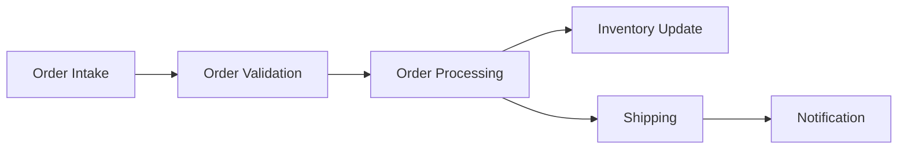

# Microservices and Data Engineering: Designing Modular, Scalable Pipelines

## Introduction

In the world of data engineering, the increasing complexity of data processing workflows and the need for scalable, flexible, and maintainable data pipelines have led to the adoption of the microservices architectural pattern. Microservices offer a paradigm shift in how we design and build data engineering systems, moving away from monolithic architectures towards a more modular, loosely coupled approach.

This article delves into the application of the microservices pattern in the context of data engineering, exploring the key principles, benefits, and challenges of this approach. We'll discuss how microservices can be leveraged to design modular, scalable data pipelines and the tools and technologies commonly used to implement this pattern.

## Key Principles of Microservices

The microservices architectural pattern is characterized by several key principles that make it well-suited for data engineering projects:

1. **Modularity**: Microservices encourage the decomposition of a larger system into smaller, independent services, each responsible for a specific task or functionality. This modular approach allows for easier development, testing, and deployment of individual components.

2. **Loose Coupling**: Microservices are designed to be loosely coupled, meaning that they communicate with each other through well-defined interfaces, such as APIs, rather than tight, direct dependencies. This promotes flexibility and scalability, as services can be modified or replaced without affecting the entire system.

3. **Independent Deployment**: Microservices can be deployed, scaled, and updated independently, without the need to redeploy the entire application. This enables faster iterations, easier troubleshooting, and more efficient resource utilization.

4. **Polyglot Persistence**: Microservices embrace the concept of polyglot persistence, where each service can use the most appropriate data storage solution for its specific needs, such as relational databases, NoSQL databases, or message queues.

5. **Fault Tolerance**: Microservices are designed to be resilient and fault-tolerant, with the ability to gracefully handle failures in individual services without bringing down the entire system.

## Applying Microservices to Data Engineering

The principles of microservices align well with the challenges faced in data engineering, where data processing workflows often involve complex, interconnected components. By adopting a microservices-based approach, data engineers can design modular, scalable data pipelines that offer the following benefits:

1. **Scalability**: Microservices allow for the independent scaling of individual components, enabling data pipelines to handle increasing data volumes and processing demands without affecting the entire system.

2. **Flexibility**: The modular nature of microservices makes it easier to experiment with new technologies, swap out components, and adapt to changing business requirements, without the need to overhaul the entire data pipeline.

3. **Maintainability**: Microservices promote better code organization, easier debugging, and more efficient troubleshooting, as issues can be isolated to specific services rather than the entire data processing workflow.

4. **Reusability**: Microservices can be designed as reusable building blocks, allowing data engineers to leverage existing components and reduce development time for new data pipelines.

5. **Polyglot Data Processing**: Microservices enable the use of the most appropriate data processing technologies for each specific task, such as batch processing, stream processing, or machine learning, without being constrained by a single technology stack.

## Implementing Microservices in Data Engineering

To implement a microservices-based approach in data engineering, data engineers can leverage a variety of tools and technologies:

1. **Containerization**: Microservices are often packaged and deployed as Docker containers, which provide a consistent, isolated runtime environment and facilitate the independent deployment of individual services.

2. **Orchestration**: Container orchestration platforms, such as Kubernetes or Docker Swarm, are used to manage the deployment, scaling, and networking of microservices, ensuring high availability and fault tolerance.

3. **Service Discovery**: Service discovery mechanisms, like Consul or Zookeeper, enable microservices to dynamically locate and communicate with each other, simplifying the management of complex, distributed systems.

4. **Message Queues**: Asynchronous communication between microservices is often facilitated by message queues, such as Apache Kafka or RabbitMQ, which decouple the services and provide reliable, scalable message delivery.

5. **API Gateways**: API gateways, like Kong or Nginx, act as a single entry point for client applications, handling tasks like authentication, rate limiting, and load balancing across multiple microservices.

6. **Monitoring and Observability**: Comprehensive monitoring and observability tools, such as Prometheus, Grafana, and Jaeger, are essential for tracking the health, performance, and interactions of microservices in a distributed system.

To illustrate the application of microservices in data engineering, let's consider a simple example of a data pipeline for processing customer orders:

In a microservices-based approach, each of these components (Order Intake, Order Validation, Order Processing, Inventory Update, Shipping, and Notification) would be implemented as separate, independent services, with well-defined APIs for communication. This allows for the independent scaling, deployment, and maintenance of each service, as well as the flexibility to swap out or modify individual components as needed.

For example, the Order Processing service might be written in Python and use a relational database, while the Shipping service could be written in Go and utilize a message queue for asynchronous communication. The modular design and loose coupling between these services enable data engineers to experiment with different technologies, optimize individual components, and ensure the overall system remains scalable and maintainable.

## Challenges and Considerations

While the microservices architectural pattern offers numerous benefits for data engineering, it also introduces some challenges and considerations:

1. **Increased Complexity**: The distributed nature of microservices can lead to increased complexity in areas such as deployment, monitoring, and troubleshooting, requiring additional tooling and expertise.

2. **Communication and Coordination**: Effective communication and coordination between microservices are crucial, as the failure of one service can potentially impact the entire system. Strategies like circuit breakers, retries, and fallbacks must be implemented to ensure resilience.

3. **Data Consistency and Transactions**: Maintaining data consistency and managing transactions across multiple microservices can be more challenging than in a monolithic architecture, requiring careful design and the use of appropriate data management patterns.

4. **Versioning and Compatibility**: Versioning and backward compatibility between microservices must be carefully managed to ensure seamless upgrades and prevent breaking changes.

5. **Monitoring and Observability**: Comprehensive monitoring and observability are essential in a microservices-based system, as the distributed nature of the architecture can make it more difficult to identify and troubleshoot issues.

Despite these challenges, the benefits of the microservices architectural pattern make it a compelling choice for data engineering projects, particularly as data processing workflows become increasingly complex and the need for scalable, flexible, and maintainable data pipelines grows.

## Conclusion

The adoption of the microservices architectural pattern in data engineering has enabled data engineers to design more modular, scalable, and flexible data pipelines. By leveraging the principles of modularity, loose coupling, and independent deployment, data engineers can build data processing workflows that are easier to maintain, scale, and adapt to changing business requirements.

While the implementation of microservices in data engineering introduces some additional complexity, the benefits in terms of scalability, flexibility, and maintainability make it a valuable approach for modern data engineering projects. By embracing the microservices pattern and the supporting tools and technologies, data engineers can build robust, resilient, and future-proof data processing systems that meet the evolving needs of their organizations.