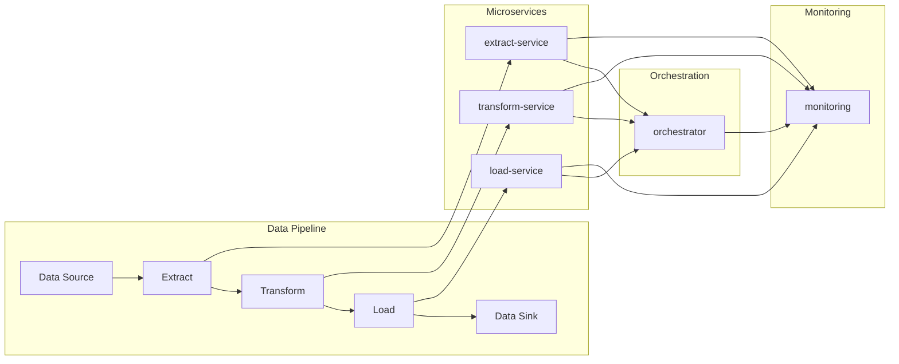

# Microservices in Data Engineering: Designing Modular, Scalable Pipelines

## Introduction

In the world of data engineering, the growing complexity of data pipelines and the need for scalable, flexible, and maintainable systems have led to the adoption of the microservices architectural pattern. Microservices offer a paradigm shift in how we design and build data processing applications, moving away from monolithic architectures towards a more modular and decoupled approach.

## What are Microservices?

Microservices are a software architectural style that structures an application as a collection of loosely coupled, independently deployable services. Each service is responsible for a specific business capability or functionality, and they communicate with each other through well-defined APIs. This contrasts with the traditional monolithic architecture, where the entire application is built as a single, tightly coupled unit.

## Microservices in Data Engineering

In the context of data engineering, microservices can be applied to the design and implementation of data pipelines. Instead of building a single, monolithic data processing application, the pipeline can be broken down into smaller, independent services, each responsible for a specific task or transformation.

### Benefits of Microservices in Data Engineering

1. **Scalability**: Microservices allow you to scale individual components of your data pipeline independently, based on their resource requirements and usage patterns. This enables you to optimize resource utilization and handle increased data volumes more effectively.

2. **Flexibility**: With microservices, you can easily add, remove, or modify individual components of your data pipeline without affecting the entire system. This makes it easier to adapt to changing business requirements and experiment with new technologies or approaches.

3. **Maintainability**: Microservices promote a modular and decoupled design, making it easier to understand, test, and debug individual components of the data pipeline. This can lead to improved code quality, reduced technical debt, and faster development cycles.

4. **Polyglot Programming**: Microservices allow you to choose the most appropriate technology stack for each component of your data pipeline, enabling the use of specialized tools and languages for specific tasks.

5. **Resilience**: If one microservice fails, the rest of the pipeline can continue to operate, reducing the impact of failures and improving overall system reliability.

### Challenges of Microservices in Data Engineering

1. **Increased Complexity**: Microservices introduce additional complexity in terms of service discovery, communication, monitoring, and deployment. Careful planning and the use of appropriate tools and frameworks are necessary to manage this complexity.

2. **Distributed Data Management**: With microservices, data may be distributed across multiple services, requiring careful coordination and data consistency management.

3. **Increased Operational Overhead**: Microservices require more operational overhead, such as managing containerization, orchestration, and service discovery, which can add complexity to the deployment and management of the data pipeline.

4. **Testing and Debugging**: Debugging and testing microservices-based data pipelines can be more challenging due to the distributed nature of the system and the need to ensure end-to-end data integrity.

### Implementing Microservices in Data Engineering

To implement microservices in data engineering, you can leverage a variety of tools and technologies, such as:

1. **Containerization**: Containerization, using tools like Docker, allows you to package each microservice with its dependencies, ensuring consistent and reproducible deployments.

2. **Orchestration**: Orchestration platforms, such as Kubernetes or Apache Mesos, help manage the deployment, scaling, and networking of microservices in a distributed environment.

3. **Service Discovery**: Service discovery mechanisms, like Consul or Zookeeper, enable microservices to find and communicate with each other, even in dynamic, cloud-based environments.

4. **Messaging and Event-Driven Architectures**: Asynchronous communication between microservices can be facilitated through message queues, event streaming platforms (e.g., Apache Kafka), or serverless functions.

5. **Monitoring and Observability**: Comprehensive monitoring and observability tools, such as Prometheus, Grafana, and distributed tracing systems, are essential for understanding the health and performance of a microservices-based data pipeline.

Here's an example of how a microservices-based data pipeline might be structured:

In this example, the data pipeline is broken down into four microservices: Extract, Transform, Load, and Orchestrator. Each microservice is responsible for a specific task within the data pipeline and communicates with the others through well-defined APIs.

The Orchestrator microservice is responsible for coordinating the execution of the pipeline, managing the deployment and scaling of the other microservices, and ensuring the overall integrity of the data flow.

The Monitoring component provides visibility into the health and performance of the individual microservices, as well as the entire data pipeline, enabling effective troubleshooting and optimization.

## Conclusion

Adopting a microservices architecture in data engineering can bring significant benefits, such as improved scalability, flexibility, and maintainability of data pipelines. However, it also introduces additional complexity in terms of service discovery, distributed data management, and operational overhead. By leveraging the right tools and techniques, data engineering teams can overcome these challenges and build modular, scalable, and resilient data processing systems using the microservices architectural pattern.