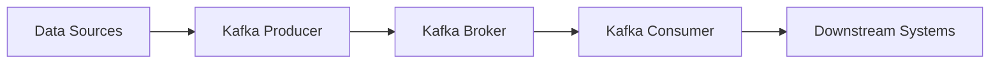
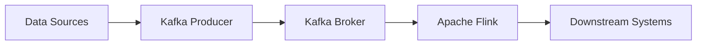
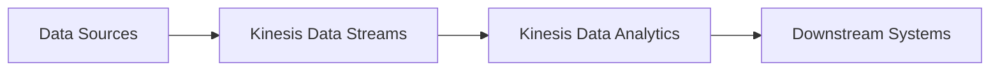

# Streaming Data Patterns: Designing Robust, Scalable Data Pipelines

## Introduction

In the era of big data, where information is generated at an unprecedented rate, the ability to process and analyze data in real-time has become a critical requirement for many organizations. Traditional batch-oriented data processing approaches often struggle to keep up with the velocity and volume of modern data streams, leading to the need for more robust and scalable data engineering solutions. This article explores the key design patterns and architectural considerations for building data pipelines that can effectively handle streaming data, enabling organizations to derive insights and make data-driven decisions in a timely manner.

## Event Sourcing

One of the fundamental design patterns for streaming data is **Event Sourcing**. In this pattern, the state of a system is not stored directly, but rather as a sequence of events that describe how the state has changed over time. Each event is immutable and represents a fact about something that has happened in the system. This approach offers several benefits for streaming data pipelines:

1. **Auditability and Traceability**: The event log provides a complete and auditable record of all changes to the system, allowing for easier debugging, troubleshooting, and compliance requirements.
2. **Scalability and Performance**: By focusing on the capture and processing of events, the system can scale more effectively, as events can be distributed and processed in parallel.
3. **Flexibility and Adaptability**: The event-driven nature of the system makes it easier to adapt to changing requirements, as new event types can be added without disrupting the existing functionality.

Implementing Event Sourcing in a streaming data pipeline typically involves the use of a distributed event streaming platform, such as Apache Kafka or Amazon Kinesis, to capture and store the event log. Downstream systems can then consume these events and update their own state accordingly, enabling real-time processing and analysis.

## Stream Processing

Another key design pattern for streaming data is **Stream Processing**. In this approach, data is processed as it arrives, rather than being stored and processed in batches. This allows for near real-time analysis and decision-making, as opposed to the delayed insights provided by batch processing.

Stream processing frameworks, such as Apache Flink, Apache Spark Streaming, or Amazon Kinesis Data Analytics, provide the necessary tools and abstractions to build scalable, fault-tolerant, and stateful stream processing applications. These frameworks handle the complexities of parallel processing, state management, and fault tolerance, allowing data engineers to focus on the business logic of their data pipelines.

Some key considerations when implementing stream processing include:

1. **Exactly-once Processing**: Ensuring that each event is processed exactly once, even in the face of failures or retries, is a critical requirement for many streaming applications.
2. **Handling of Late-arriving Data**: Streaming data may not always arrive in strict chronological order, and the system must be able to handle and process late-arriving data without compromising the overall data integrity.
3. **Integration with Batch Processing**: In many cases, streaming data pipelines need to be integrated with batch processing systems to provide a comprehensive data processing solution.

By leveraging stream processing patterns, data engineers can build real-time, responsive data pipelines that can quickly react to changes in the data and provide timely insights to the business.

## Change Data Capture (CDC)

**Change Data Capture** is a design pattern that focuses on identifying and capturing changes to data sources, rather than processing the entire dataset. This is particularly useful for streaming data pipelines, as it allows for the efficient and incremental processing of data changes, rather than having to process the entire dataset on every update.

CDC can be implemented using various techniques, such as database triggers, log-based change data capture, or by directly monitoring the data source for changes. The captured changes are then propagated to the downstream systems, enabling real-time updates and data synchronization.

Implementing CDC in a streaming data pipeline can provide several benefits:

1. **Reduced Data Transfer and Processing**: By only processing the changes, rather than the entire dataset, the system can be more efficient and scalable.
2. **Improved Data Freshness**: CDC enables near real-time updates to downstream systems, ensuring that the data is always up-to-date.
3. **Simplified Data Transformation**: By focusing on the changes, the data transformation logic can be simplified, as the system only needs to handle the deltas, rather than the entire dataset.

CDC can be combined with other streaming data patterns, such as Event Sourcing and Stream Processing, to build highly efficient and responsive data pipelines.

## Architectural Patterns

When designing streaming data pipelines, it's important to consider the overall architectural patterns that can be used to ensure scalability, fault tolerance, and the integration of streaming and batch processing.

### Lambda Architecture

The **Lambda Architecture** is a popular pattern that combines batch processing and stream processing to provide a comprehensive data processing solution. In this architecture, the incoming data is processed in two parallel paths:

1. **Batch Layer**: The batch layer processes the entire dataset in batches, providing a comprehensive and accurate view of the data.
2. **Speed Layer**: The speed layer processes the incoming data streams in real-time, providing low-latency insights and updates.

The results from both the batch and speed layers are then combined to provide a complete and up-to-date view of the data.

### Kappa Architecture

The **Kappa Architecture** is a simplified version of the Lambda Architecture, where the batch and speed layers are combined into a single, unified stream processing layer. In this approach, the entire data processing pipeline is built on a streaming platform, such as Apache Kafka or Amazon Kinesis, eliminating the need for a separate batch processing system.

The Kappa Architecture can be more efficient and easier to maintain than the Lambda Architecture, as it reduces the complexity of the overall system. However, it may require more careful design and implementation to ensure that the stream processing layer can handle the full range of data processing requirements.

## Implementation Considerations

When implementing streaming data patterns, there are several technical challenges and trade-offs to consider:

1. **Exactly-once Processing**: Ensuring that each event is processed exactly once, even in the face of failures or retries, is a critical requirement for many streaming applications. Frameworks like Apache Flink and Apache Kafka provide built-in support for exactly-once processing, but the implementation can still be complex.
2. **Handling of Late-arriving Data**: Streaming data may not always arrive in strict chronological order, and the system must be able to handle and process late-arriving data without compromising the overall data integrity. This may require the use of watermarking, event time processing, and other techniques.
3. **Integration with Batch Processing**: In many cases, streaming data pipelines need to be integrated with batch processing systems to provide a comprehensive data processing solution. This can involve the use of technologies like Apache Spark, which can handle both batch and stream processing, or the integration of streaming and batch layers in a Lambda or Kappa architecture.
4. **Scalability and Performance**: Streaming data pipelines must be designed to handle high volumes of data and maintain low latency, even as the data load increases. This may require the use of distributed processing frameworks, horizontal scaling, and other performance optimization techniques.
5. **Monitoring and Observability**: Effective monitoring and observability are critical for streaming data pipelines, as they can help identify and troubleshoot issues in real-time. Tools like Prometheus, Grafana, and Elasticsearch can be used to provide comprehensive monitoring and observability for streaming data systems.

## Examples and Use Cases

Here are some examples of how streaming data patterns can be implemented using popular tools and technologies:

### Event Sourcing with Apache Kafka

Apache Kafka is a widely-used distributed event streaming platform that can be leveraged to implement the Event Sourcing pattern. In this approach, each event is captured as a Kafka message, and the event log is stored as a Kafka topic. Downstream systems can then consume these events and update their own state accordingly.

### Stream Processing with Apache Flink

Apache Flink is a powerful stream processing framework that can be used to build scalable, fault-tolerant, and stateful stream processing applications. Flink provides high-level abstractions, such as DataStreams and WindowedStreams, that allow data engineers to focus on the business logic of their data pipelines, while Flink handles the underlying complexities of parallel processing, state management, and fault tolerance.

### Change Data Capture with Amazon Kinesis Data Streams

Amazon Kinesis Data Streams is a fully managed service for real-time data streaming and processing. It can be used to implement the Change Data Capture pattern by capturing changes from various data sources, such as databases, and propagating them to downstream systems in real-time.

By combining these streaming data patterns and architectural approaches, data engineers can build robust, scalable, and responsive data pipelines that can handle the challenges of modern data streams and provide timely insights to the business.

## Conclusion

Designing effective data pipelines for streaming data is a critical challenge in the era of big data. By leveraging patterns like Event Sourcing, Stream Processing, and Change Data Capture, data engineers can build scalable, fault-tolerant, and responsive data pipelines that can handle the velocity and volume of modern data streams. Additionally, architectural patterns like the Lambda and Kappa architectures can help integrate streaming and batch processing to provide a comprehensive data processing solution.

As data engineering continues to evolve, the ability to effectively manage and process streaming data will become increasingly important for organizations looking to stay competitive and make data-driven decisions in real-time. By mastering these streaming data patterns and architectural considerations, data engineers can position themselves as valuable assets in the data-driven economy.