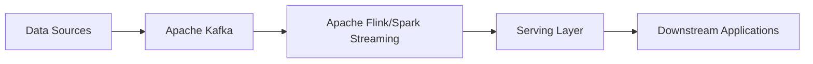

# The Kappa Architecture: Simplifying Data Pipelines with Streaming

## Introduction

The Kappa architecture is an alternative to the widely-known Lambda architecture, which aims to simplify data pipelines by using a single, real-time stream processing engine instead of separate batch and speed layers. In the traditional Lambda architecture, data is processed in two parallel paths - a batch layer for historical data and a speed layer for real-time data. This approach can introduce complexity and operational overhead. The Kappa architecture, on the other hand, focuses on using a unified, real-time stream processing engine to handle both historical and real-time data, thereby reducing the overall complexity of the data pipeline.

## Understanding the Kappa Architecture

The Kappa architecture is based on the premise that with the advancements in stream processing technologies, it is possible to handle both batch and real-time data processing using a single, scalable stream processing engine. This approach eliminates the need for a separate batch layer, which was a key component of the Lambda architecture.

In the Kappa architecture, the data pipeline consists of the following key components:

1. **Event Streaming Platform**: The foundation of the Kappa architecture is an event streaming platform, such as Apache Kafka, which serves as the central hub for all data events. This platform ingests, stores, and distributes data in the form of continuous event streams.

2. **Stream Processing Engine**: The stream processing engine, such as Apache Flink or Apache Spark Streaming, is responsible for processing the event streams in real-time. This engine can handle both historical and real-time data, providing a unified processing layer.

3. **Serving Layer**: The serving layer is responsible for storing the processed data and making it available for downstream applications and end-users. This layer can be implemented using a variety of data storage solutions, such as databases, data warehouses, or data lakes.

The flow of data in the Kappa architecture is as follows:

1. Data is ingested into the event streaming platform (e.g., Apache Kafka) as a continuous stream of events.
2. The stream processing engine (e.g., Apache Flink) consumes the event streams, processes the data, and writes the results to the serving layer.
3. Downstream applications and end-users can access the processed data from the serving layer.

## Advantages of the Kappa Architecture

1. **Reduced Complexity**: By eliminating the separate batch and speed layers, the Kappa architecture simplifies the overall data pipeline, reducing the operational overhead and making it easier to maintain and scale.

2. **Improved Consistency**: With a single, unified processing layer, the Kappa architecture can ensure better data consistency and accuracy, as there is no need to reconcile the results from different processing paths.

3. **Flexibility**: The Kappa architecture's reliance on a stream processing engine allows for greater flexibility in handling both historical and real-time data. This makes it easier to adapt to changing data requirements and processing needs.

4. **Scalability**: Stream processing engines, such as Apache Flink and Apache Spark Streaming, are designed to be highly scalable, allowing the Kappa architecture to handle increasing data volumes and processing demands.

## Disadvantages of the Kappa Architecture

1. **Increased Processing Complexity**: The Kappa architecture requires a more powerful stream processing engine, which may be more complex to set up and maintain compared to a traditional batch processing system.

2. **Potential Data Consistency Challenges**: While the Kappa architecture aims to improve data consistency, maintaining data consistency in a real-time streaming environment can still be a challenge, especially when dealing with complex business logic and data transformations.

3. **Increased Resource Requirements**: The stream processing engine in the Kappa architecture needs to handle both historical and real-time data, which can result in higher resource requirements (e.g., CPU, memory, storage) compared to a traditional Lambda architecture.

## Implementing the Kappa Architecture

To implement the Kappa architecture, you can use tools like Apache Kafka for the event streaming platform and Apache Flink or Apache Spark Streaming for the stream processing engine.

Here's an example of how the Kappa architecture can be implemented using these tools:

1. **Data Ingestion**: Data from various sources is ingested into an Apache Kafka cluster, which acts as the central event streaming platform.

2. **Stream Processing**: Apache Flink or Apache Spark Streaming consumes the event streams from Kafka, processes the data in real-time, and writes the results to the serving layer.

3. **Serving Layer**: The processed data is stored in a suitable data store, such as a data warehouse, data lake, or a database, which serves as the serving layer for downstream applications and end-users.

By using a unified, real-time stream processing engine, the Kappa architecture can simplify data pipelines, improve data consistency, and provide greater flexibility in handling both historical and real-time data. However, it's important to carefully consider the increased processing complexity and resource requirements when implementing the Kappa architecture, and to ensure that data consistency is maintained throughout the data pipeline.