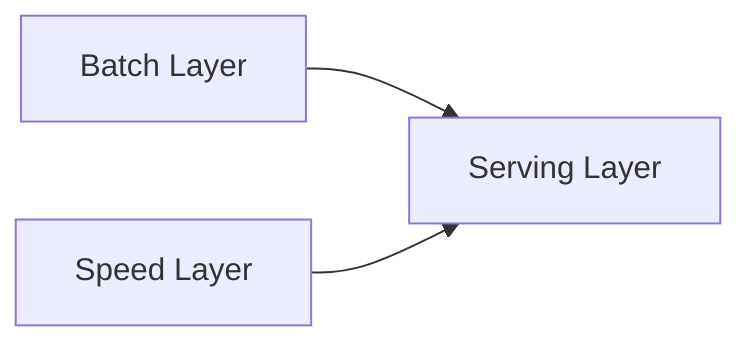

# Introduction to Design Patterns in Data Engineering

## Description
This article provides an overview of common design patterns used in data engineering projects. It explains what design patterns are, why they are important, and gives an overview of some of the most commonly used design patterns in data engineering, such as the Lambda architecture, Kappa architecture, microservices, and event-driven architecture. The benefits and trade-offs of each pattern are also discussed.

## Introduction to Design Patterns
In software engineering, a design pattern is a reusable solution to a commonly occurring problem within a given context. Design patterns are not specific implementations or code, but rather high-level descriptions of how to approach a problem. They provide a common vocabulary and best practices that can be applied to solve recurring issues.

Design patterns are important in data engineering because they help to:

1. **Improve Scalability and Performance**: Design patterns can help to ensure that data processing systems are able to handle increasing amounts of data and user traffic without compromising performance.

2. **Enhance Maintainability and Flexibility**: Well-designed patterns make it easier to modify and extend data systems over time, as requirements change.

3. **Promote Reusability**: Proven design patterns can be applied across multiple projects, saving time and effort.

4. **Facilitate Communication**: Design patterns provide a common language for data engineers to discuss and document system architecture.

## Common Design Patterns in Data Engineering

### Lambda Architecture
The Lambda architecture is a data processing design pattern that aims to address the challenges of handling both batch and real-time data processing requirements. It consists of three layers:

1. **Batch Layer**: Responsible for processing large amounts of historical data in batches, often using technologies like Apache Spark or Apache Hadoop.
2. **Speed Layer**: Handles the processing of real-time data streams, typically using technologies like Apache Storm or Apache Flink.
3. **Serving Layer**: Combines the results from the batch and speed layers to provide a unified view of the data.

The benefits of the Lambda architecture include:
- Ability to handle both batch and real-time data processing
- Fault tolerance and resilience through the separation of batch and speed layers
- Flexibility to adapt to changing requirements

The trade-offs include:
- Increased complexity due to the multiple layers
- Potential for duplication of effort between the batch and speed layers

### Kappa Architecture
The Kappa architecture is a simplified version of the Lambda architecture that uses a single stream-processing engine to handle both batch and real-time data processing. It consists of a single, unified data stream that is processed in real-time, with the ability to reprocess historical data as needed.

The benefits of the Kappa architecture include:
- Reduced complexity compared to the Lambda architecture
- Easier to maintain and evolve over time
- Better resource utilization as there is no need to maintain separate batch and speed layers

The trade-offs include:
- Potential performance issues if the stream-processing engine is not able to handle the entire data processing workload
- Difficulty in handling complex transformations that may require a separate batch processing layer

### Microservices
Microservices is an architectural style that structures an application as a collection of loosely coupled, independently deployable services. In the context of data engineering, microservices can be used to break down complex data processing pipelines into smaller, more manageable components.

The benefits of the microservices pattern include:
- Improved scalability and flexibility as services can be scaled independently
- Easier to maintain and evolve over time as changes can be made to individual services without affecting the entire system
- Increased fault tolerance as the failure of one service does not necessarily impact the entire system

The trade-offs include:
- Increased complexity in terms of service discovery, communication, and orchestration
- Potential for increased operational overhead due to the need to manage multiple services

### Event-Driven Architecture
Event-driven architecture (EDA) is a design pattern where the flow of the program is determined by events, such as user actions or data updates. In data engineering, EDA can be used to build systems that react to changes in data in real-time, rather than relying on periodic batch processing.

The benefits of the event-driven architecture include:
- Improved responsiveness and reduced latency as data is processed as soon as it becomes available
- Increased scalability as the system can handle spikes in event traffic without impacting overall performance
- Easier to extend and evolve over time as new event sources can be added without disrupting the existing system

The trade-offs include:
- Increased complexity in terms of event handling, routing, and coordination
- Potential for increased operational overhead due to the need to manage event-driven infrastructure

## Conclusion
Design patterns are an important tool in the data engineer's toolbox, as they provide proven solutions to common problems in data processing and system architecture. By understanding and applying these patterns, data engineers can build scalable, maintainable, and flexible data systems that meet the evolving needs of their organizations.