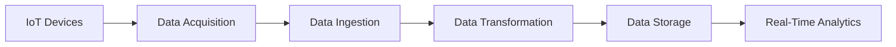
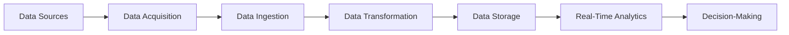
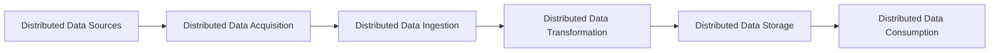

# Adapting the Data Engineering Lifecycle for Emerging Technologies and Use Cases

## Introduction

In today's rapidly evolving digital landscape, data-driven technologies and applications are continuously emerging, each with unique requirements and challenges. As a data engineer, it is crucial to understand how the traditional data engineering lifecycle can be adapted to support these new and evolving use cases effectively. 

In this article, we will explore how the data engineering lifecycle can be tailored to accommodate emerging technologies and use cases, such as the rise of the Internet of Things (IoT), edge computing, and real-time decision-making. We will discuss the unique challenges and considerations data engineers may face when working with high-velocity, high-volume, or geographically distributed data sources, and provide examples of how data engineering practices and architectures can be adapted to meet the requirements of these new data-driven applications, while maintaining the core principles of reliability, scalability, and maintainability.

## The Evolving Data Engineering Lifecycle

The traditional data engineering lifecycle typically consists of the following stages:

1. **Data Acquisition**: Gathering data from various sources, including databases, APIs, and file systems.
2. **Data Ingestion**: Transferring the acquired data into a data processing or storage system.
3. **Data Transformation**: Cleaning, enriching, and preparing the data for analysis.
4. **Data Storage**: Storing the transformed data in a suitable data repository, such as a data warehouse or data lake.
5. **Data Consumption**: Providing access to the stored data for downstream analytics and reporting.

As new technologies and use cases emerge, the data engineering lifecycle must evolve to accommodate the unique requirements of these new data-driven applications. Let's explore how the lifecycle can be adapted to support some of the emerging trends in the data engineering landscape.

## Adapting the Lifecycle for IoT and Edge Computing

The rise of the Internet of Things (IoT) has introduced a new set of challenges for data engineers. IoT devices generate vast amounts of data at the edge, often in real-time, and this data needs to be processed and analyzed quickly to enable timely decision-making.

To adapt the data engineering lifecycle for IoT and edge computing, data engineers may need to consider the following:

1. **Data Acquisition**: Implement efficient data collection mechanisms at the edge, such as using message queues or event-driven architectures, to handle the high-velocity data streams from IoT devices.
2. **Data Ingestion**: Leverage technologies like Apache Kafka or Amazon Kinesis to ingest and process the data in near real-time, ensuring low latency between data generation and data processing.
3. **Data Transformation**: Perform lightweight data transformations at the edge, using technologies like Apache Spark Streaming or AWS Lambda, to reduce the amount of data that needs to be transferred to the central data processing environment.
4. **Data Storage**: Utilize distributed and scalable storage solutions, such as Amazon S3 or Apache HDFS, to handle the high-volume and potentially unstructured data generated by IoT devices.
5. **Data Consumption**: Implement real-time analytics and decision-making capabilities, using tools like Apache Flink or Amazon Kinesis Analytics, to enable immediate insights and actions based on the IoT data.

By adapting the data engineering lifecycle in this way, data engineers can effectively handle the challenges posed by IoT and edge computing, such as high-velocity data streams, geographically distributed data sources, and the need for low-latency processing and decision-making.

## Adapting the Lifecycle for Real-Time Decision-Making

In today's fast-paced business environment, the ability to make real-time decisions based on data is becoming increasingly important. This requires data engineers to adapt the data engineering lifecycle to support low-latency data processing and analysis.

1. **Data Acquisition**: Implement event-driven or stream-based data acquisition mechanisms, such as using message queues or event-streaming platforms, to capture data as it is generated.
2. **Data Ingestion**: Leverage technologies like Apache Kafka or Amazon Kinesis to ingest and process the data in real-time, ensuring low latency between data generation and data processing.
3. **Data Transformation**: Perform incremental and lightweight data transformations, using tools like Apache Spark Streaming or Amazon Kinesis Analytics, to enable real-time data processing and analysis.
4. **Data Storage**: Utilize distributed and scalable storage solutions, such as Amazon S3 or Apache HDFS, to handle the high-volume of data, while also considering the use of in-memory databases or caching technologies for low-latency data access.
5. **Data Consumption**: Implement real-time dashboards, alerts, and decision-support systems, using tools like Apache Superset or Amazon QuickSight, to enable immediate insights and actions based on the real-time data.

By adapting the data engineering lifecycle in this way, data engineers can support the requirements of real-time decision-making, ensuring that the organization can respond quickly to changing market conditions, customer behavior, or other critical events.

## Adapting the Lifecycle for Geographically Distributed Data Sources

As organizations expand their operations globally, data engineers may need to work with data sources that are geographically distributed across multiple locations or cloud regions. This introduces new challenges, such as data latency, data sovereignty, and network bandwidth constraints.

To adapt the data engineering lifecycle for geographically distributed data sources, data engineers may need to consider the following:

1. **Data Acquisition**: Implement distributed data collection mechanisms, such as using edge computing devices or regional data hubs, to gather data closer to the source and minimize the impact of network latency.
2. **Data Ingestion**: Leverage technologies like Apache Kafka or Amazon Kinesis to ingest data from multiple, geographically dispersed sources, ensuring reliable and fault-tolerant data delivery.
3. **Data Transformation**: Perform distributed data transformations, using tools like Apache Spark or AWS Glue, to process the data closer to the source and reduce the amount of data that needs to be transferred to a central location.
4. **Data Storage**: Utilize globally distributed storage solutions, such as Amazon S3 or Azure Blob Storage, to store the data in a way that optimizes for data locality and reduces latency for downstream consumers.
5. **Data Consumption**: Implement multi-region or multi-cloud data processing and analytics pipelines, using technologies like Apache Airflow or AWS Data Pipeline, to enable low-latency access to the data from different geographic locations.

By adapting the data engineering lifecycle in this way, data engineers can effectively handle the challenges posed by geographically distributed data sources, such as data latency, data sovereignty, and network bandwidth constraints, while ensuring reliable, scalable, and maintainable data processing and analytics.

## Maintaining Core Principles

As data engineers adapt the data engineering lifecycle to accommodate emerging technologies and use cases, it is crucial to maintain the core principles of reliability, scalability, and maintainability. This can be achieved by:

1. **Reliability**: Implementing fault-tolerant and resilient data processing pipelines, using technologies like Apache Kafka for reliable data ingestion, and leveraging distributed storage solutions for data redundancy and high availability.
2. **Scalability**: Designing the data engineering architecture to scale up or down based on the changing data volume and processing requirements, using technologies like Apache Spark or AWS Lambda for scalable data transformation, and cloud-based storage and compute resources.
3. **Maintainability**: Adopting best practices for data engineering, such as using version control, implementing automated testing and deployment, and following modular and extensible design patterns to ensure the long-term maintainability of the data engineering ecosystem.

By adhering to these core principles, data engineers can ensure that the adapted data engineering lifecycle continues to deliver reliable, scalable, and maintainable data processing and analytics capabilities, even as the underlying technologies and use cases evolve.

## Conclusion

In the ever-changing landscape of data-driven technologies and applications, the data engineering lifecycle must adapt to accommodate new requirements and challenges. By understanding how to tailor the data engineering lifecycle to support emerging use cases, such as IoT, edge computing, and real-time decision-making, data engineers can ensure that their organizations can effectively leverage the power of data to drive innovation and competitive advantage.

As data engineers, it is our responsibility to stay informed about the latest trends and technologies, and to continuously evolve our practices and architectures to meet the changing needs of the business. By doing so, we can position ourselves as strategic partners in the organization's data-driven transformation, and play a crucial role in shaping the future of data engineering.