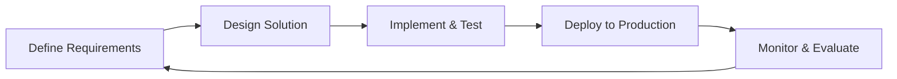
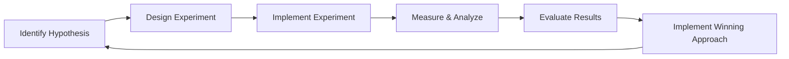
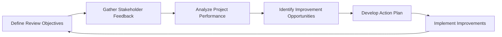
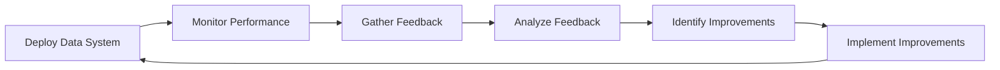
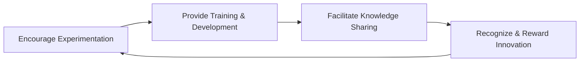

# Continuous Improvement in the Data Engineering Lifecycle

## Introduction

In the dynamic and ever-evolving world of data engineering, the ability to continuously improve data systems and processes is crucial for maintaining a competitive edge and delivering value to the organization. A culture of continuous improvement empowers data engineering teams to proactively identify and address areas for optimization, respond to changing business requirements, and drive innovation within the data landscape.

## The Importance of Continuous Improvement

The data engineering lifecycle is a complex and iterative process, involving the design, implementation, and maintenance of data pipelines, architectures, and systems. As business needs and data requirements evolve, data engineers must be equipped with the mindset and practices to continuously refine and enhance their work. Embracing a culture of continuous improvement offers several key benefits:

1. **Agility and Responsiveness**: By continuously monitoring and iterating on their data systems, data engineers can quickly adapt to changing business needs, emerging technologies, and new data sources. This agility allows the organization to stay ahead of the curve and capitalize on new opportunities.

2. **Increased Efficiency and Performance**: Continuous improvement enables data engineers to identify and address bottlenecks, optimize resource utilization, and streamline data processing workflows. This leads to improved performance, reduced operational costs, and more reliable data delivery.

3. **Enhanced Data Quality and Reliability**: Through regular reviews, testing, and feedback loops, data engineers can identify and address data quality issues, improve data integrity, and ensure the trustworthiness of the data being delivered to stakeholders.

4. **Fostering Innovation**: A culture of continuous improvement encourages data engineers to experiment, explore new approaches, and challenge the status quo. This mindset fosters a spirit of innovation, enabling the team to develop novel solutions and stay ahead of the competition.

5. **Continuous Learning and Skill Development**: By embracing a continuous improvement mindset, data engineers can continuously learn, upskill, and adapt to the evolving landscape of data technologies and best practices. This ensures the team's expertise remains relevant and their contributions remain valuable to the organization.

## Key Principles and Practices for Continuous Improvement

To establish a culture of continuous improvement in the data engineering lifecycle, data engineers can leverage the following key principles and practices:

### 1. Iterative Development

Adopt an iterative development approach, where data engineering projects are broken down into smaller, manageable phases. This allows for regular feedback, testing, and refinement, enabling data engineers to quickly identify and address issues, incorporate new requirements, and deliver incremental improvements.

### 2. A/B Testing and Experimentation

Leverage A/B testing and experimentation to compare the performance and impact of different data engineering approaches, algorithms, or architectural designs. This allows data engineers to make data-driven decisions and continuously optimize their systems.

### 3. Post-Implementation Reviews

Conduct regular post-implementation reviews to assess the performance, impact, and lessons learned from data engineering projects. These reviews should involve key stakeholders, including data consumers, business analysts, and subject matter experts, to gather comprehensive feedback and identify areas for improvement.

### 4. Establishing Feedback Loops

Implement robust feedback loops that enable continuous monitoring, performance measurement, and optimization of data systems. This can include real-time monitoring of data pipeline metrics, user feedback mechanisms, and regular reviews of data quality and usage patterns.

### 5. Fostering a Mindset of Continuous Learning and Innovation

Encourage a culture of continuous learning and innovation among the data engineering team. This can be achieved through regular knowledge-sharing sessions, participation in industry events and conferences, and the exploration of new technologies and methodologies. Empower data engineers to experiment, take calculated risks, and share their learnings with the broader team.

## Implementing Continuous Improvement in Data Engineering

To implement a culture of continuous improvement in the data engineering lifecycle, data engineering teams can follow these steps:

1. **Establish a Continuous Improvement Framework**: Define a structured process for continuous improvement, including regular reviews, feedback mechanisms, and a clear action plan for implementing improvements.

2. **Align with Business Objectives**: Ensure that the continuous improvement efforts are closely aligned with the organization's strategic goals and the evolving needs of the business.

3. **Empower the Data Engineering Team**: Foster a collaborative and supportive environment where data engineers feel empowered to experiment, share their ideas, and contribute to the continuous improvement process.

4. **Leverage Data and Metrics**: Utilize data and metrics to measure the performance and impact of data engineering initiatives, enabling data-driven decision-making and optimization.

5. **Communicate and Celebrate Successes**: Regularly communicate the outcomes of continuous improvement efforts to stakeholders, and celebrate the team's achievements to reinforce the value of this mindset.

By embracing a culture of continuous improvement, data engineering teams can drive innovation, enhance the reliability and performance of their data systems, and deliver greater value to the organization. This mindset not only benefits the data engineering function but also supports the overall data-driven transformation of the business.