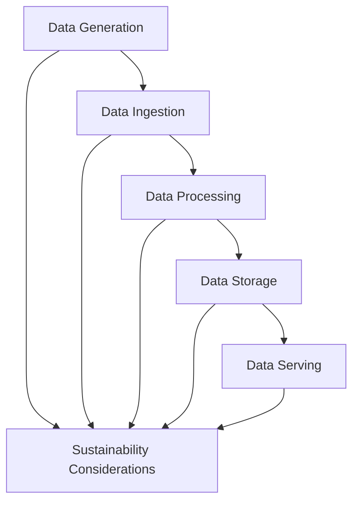

# Embracing Sustainability in the Data Engineering Lifecycle

## Introduction

In today's rapidly evolving business landscape, the need for sustainable practices has become increasingly paramount. As organizations strive to minimize their environmental impact and contribute to a greener future, the role of data engineering has become crucial in supporting these sustainability efforts. Data engineers, with their unique expertise in designing and optimizing data systems and pipelines, are well-positioned to play a pivotal role in driving sustainable initiatives within their organizations.

## Data Engineering Lifecycle and Sustainability

The data engineering lifecycle, which encompasses the various stages of data generation, ingestion, processing, storage, and serving, presents numerous opportunities for data engineers to integrate sustainability considerations. Throughout this lifecycle, data engineers can adopt strategies and best practices to minimize energy consumption, reduce carbon footprint, and support the organization's environmental goals.

### Data Generation
At the data generation stage, data engineers can work closely with stakeholders to identify and implement data collection methods that prioritize sustainability. This may involve leveraging sensors and IoT devices to monitor energy usage, waste management, and environmental impact within the organization's operations. By capturing and analyzing this data, data engineers can provide valuable insights that inform decision-making and drive sustainable initiatives.

### Data Ingestion and Processing
During the data ingestion and processing stages, data engineers can optimize their data pipelines to minimize energy consumption and reduce the carbon footprint associated with data movement and transformation. This can be achieved through techniques such as:

1. **Efficient Data Compression**: Employing data compression algorithms to reduce the size of data being ingested and processed, thereby minimizing the energy required for data transmission and storage.
2. **Serverless Computing**: Leveraging serverless computing platforms, which can automatically scale resources based on demand, reducing the energy consumption associated with always-on infrastructure.
3. **Batch Processing Optimization**: Designing data pipelines that prioritize batch processing over real-time processing, which can be more energy-intensive, for use cases where near-real-time data is not critical.

### Data Storage
In the data storage stage, data engineers can explore sustainable storage solutions, such as cloud-based object storage or distributed file systems, which often have a lower carbon footprint compared to traditional on-premises data centers. Additionally, they can implement data lifecycle management strategies to ensure that data is stored and retained in an efficient and environmentally-friendly manner, reducing unnecessary storage and energy consumption.

### Data Serving
When it comes to data serving, data engineers can design and optimize their data systems to minimize the energy required for data retrieval and delivery. This can involve techniques such as caching, content delivery networks (CDNs), and serverless architectures, which can reduce the energy consumption associated with data serving.

## Sustainable Data-Driven Initiatives

Data engineering can play a crucial role in supporting a wide range of sustainable data-driven initiatives within organizations. Here are a few examples:

1. **Energy Usage Monitoring**: Data engineers can design and implement data pipelines to collect and analyze energy consumption data from various sources, such as buildings, manufacturing facilities, and transportation fleets. This data can then be used to identify opportunities for energy efficiency improvements and track the impact of sustainability initiatives.

2. **Supply Chain Optimization**: By leveraging data analytics and optimization techniques, data engineers can help organizations optimize their supply chains, reducing transportation distances, improving logistics, and minimizing the environmental impact of their operations.

3. **Environmental Impact Analysis**: Data engineers can work with environmental experts to develop data-driven models and simulations that assess the environmental impact of an organization's activities, such as greenhouse gas emissions, water usage, and waste generation. This information can then be used to inform decision-making and drive sustainable initiatives.

4. **Renewable Energy Integration**: Data engineers can contribute to the integration of renewable energy sources, such as solar and wind, by designing data systems that monitor and optimize the performance of these energy systems, ensuring efficient utilization and maximizing the benefits of renewable energy.

## Strategies and Best Practices

To effectively integrate sustainability considerations into the data engineering lifecycle, data engineers can adopt the following strategies and best practices:

1. **Sustainability-Focused Design**: Incorporate sustainability as a key design principle when developing data systems and pipelines. This may involve considering energy efficiency, carbon footprint, and environmental impact during the architecture and design phases.

2. **Continuous Optimization**: Regularly review and optimize data systems and pipelines to ensure they remain energy-efficient and environmentally-friendly. This may include adjusting data processing workflows, storage configurations, and serving mechanisms based on changing requirements and technological advancements.

3. **Collaboration and Knowledge Sharing**: Foster cross-functional collaboration between data engineers, sustainability experts, and environmental stakeholders to align on sustainability goals and share best practices. This can help data engineers better understand the organization's sustainability initiatives and tailor their data engineering efforts accordingly.

4. **Sustainability Metrics and Reporting**: Establish a set of sustainability metrics and Key Performance Indicators (KPIs) to measure the impact of data engineering efforts on the organization's environmental goals. Regularly report on these metrics to stakeholders and continuously refine the data engineering strategies based on the insights gained.

5. **Continuous Learning and Innovation**: Stay up-to-date with the latest trends and technologies in sustainable data engineering, and actively explore innovative approaches to further enhance the environmental impact of data systems and pipelines.

By embracing these strategies and best practices, data engineers can play a pivotal role in supporting their organization's sustainability efforts, contributing to a more environmentally-conscious future.