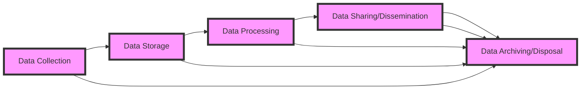

# Ethical Considerations in the Data Engineering Lifecycle

## Introduction

As data engineers, we play a critical role in the data ecosystem, responsible for designing, building, and maintaining the systems that collect, process, and store vast amounts of data. With this responsibility comes an ethical obligation to ensure that our work not only delivers technical excellence but also upholds the principles of data privacy, security, and responsible usage. In this article, we will explore the ethical considerations data engineers must navigate throughout the data engineering lifecycle, providing guidance on how to build data systems that prioritize the well-being of individuals and communities.

## Data Privacy and Security

One of the most fundamental ethical considerations in data engineering is the protection of individual privacy. As we collect, store, and process data, we must be acutely aware of the sensitive and personal nature of the information we handle. Data engineers have a duty to implement robust security measures, such as encryption, access controls, and data anonymization, to safeguard the confidentiality of the data entrusted to us.

Throughout the data engineering lifecycle, we must ensure that data is only collected and retained for legitimate purposes, and that individuals have the right to access, correct, and delete their personal information. This requires a deep understanding of data privacy regulations, such as the General Data Protection Regulation (GDPR) and the California Consumer Privacy Act (CCPA), and the implementation of robust data governance policies and processes.

## Responsible Data Usage

Beyond protecting data privacy and security, data engineers must also consider the ethical implications of how data is used. We have a responsibility to ensure that data is not used in ways that could harm or discriminate against individuals or communities. This includes being mindful of potential biases in the data we work with and the algorithms we develop, and taking steps to mitigate these biases.

Data engineers should also be aware of the potential for data to be used for surveillance, manipulation, or other unethical purposes. We must work closely with data scientists, product managers, and other stakeholders to ensure that the data systems we build are used in a way that respects individual rights and promotes the greater good.

## Data Governance and Ethical Frameworks

Effective data governance is crucial for ensuring that ethical principles are embedded throughout the data engineering lifecycle. Data governance frameworks should include clear policies and procedures for data collection, storage, processing, and sharing, as well as mechanisms for monitoring and enforcing compliance.

Data engineers can also leverage ethical frameworks, such as the IEEE's Ethically Aligned Design or the OECD's Principles for the Governance of AI, to guide their decision-making and ensure that their work aligns with widely accepted ethical standards. These frameworks provide guidance on issues such as transparency, accountability, fairness, and the prevention of harm.

## Collaboration and Continuous Learning

Ethical considerations in data engineering are not the responsibility of data engineers alone. It requires a collaborative effort across the entire organization, involving stakeholders from various disciplines, including legal, compliance, and ethics experts. Data engineers should actively engage with these stakeholders to stay informed about evolving ethical standards and best practices, and to ensure that their work is aligned with the organization's ethical principles.

Moreover, data engineers must commit to continuous learning and professional development to stay abreast of the latest ethical challenges and solutions in the field. This may involve attending industry conferences, participating in online communities, and engaging in ongoing training and education.

## Conclusion

As data engineers, we have a profound impact on the lives of individuals and communities through the data systems we design and build. It is our ethical responsibility to ensure that our work upholds the principles of data privacy, security, and responsible usage. By embracing data governance frameworks, leveraging ethical guidelines, and fostering a culture of collaboration and continuous learning, we can build data systems that not only deliver technical excellence but also prioritize the well-being of all stakeholders.