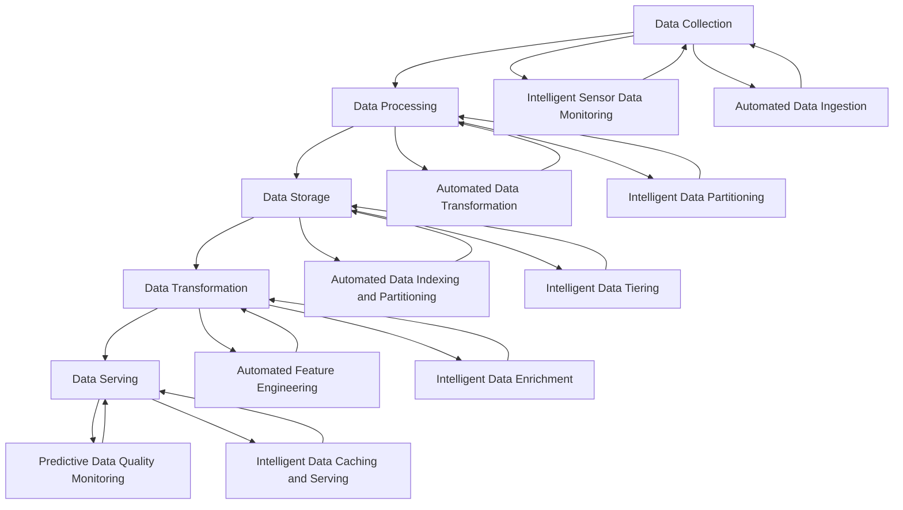

# Incorporating Machine Learning and AI into the Data Engineering Lifecycle

## Introduction

In the rapidly evolving world of data engineering, the integration of machine learning (ML) and artificial intelligence (AI) has become a game-changer. As data volumes and complexity continue to grow, data engineers are increasingly leveraging these advanced technologies to enhance the efficiency, accuracy, and intelligence of the data engineering lifecycle. By incorporating ML and AI into their workflows, data engineers can unlock new levels of automation, optimization, and data-driven decision-making, ultimately delivering greater value to their organizations.

## Leveraging ML and AI in the Data Engineering Lifecycle

The data engineering lifecycle typically consists of several key stages, including data collection, data processing, data storage, data transformation, and data serving. Let's explore how data engineers can leverage ML and AI techniques to enhance each of these stages:

### Data Collection

- **Intelligent Sensor Data Monitoring**: ML-powered anomaly detection algorithms can be used to continuously monitor sensor data, identify anomalies, and trigger alerts, ensuring the integrity and reliability of the data collection process.
- **Automated Data Ingestion**: AI-driven natural language processing (NLP) can be employed to automatically extract and ingest relevant data from unstructured sources, such as web pages, social media, and customer support logs.

### Data Processing

- **Automated Data Transformation**: ML models can be trained to learn the patterns and rules governing data transformations, enabling the automation of complex data transformation tasks, such as data cleaning, normalization, and feature engineering.
- **Intelligent Data Partitioning**: ML algorithms can analyze data characteristics and usage patterns to dynamically partition and organize data, optimizing storage and retrieval performance.

### Data Storage

- **Automated Data Indexing and Partitioning**: ML models can be used to analyze data access patterns and automatically optimize data indexing and partitioning strategies, improving query performance and reducing storage costs.
- **Intelligent Data Tiering**: AI-powered algorithms can be employed to dynamically migrate data between different storage tiers (e.g., hot, warm, and cold storage) based on predicted usage patterns, ensuring that the most frequently accessed data is readily available while reducing the overall storage footprint.

### Data Transformation

- **Automated Feature Engineering**: ML techniques, such as deep learning and genetic algorithms, can be used to automatically generate and select the most relevant features from raw data, streamlining the feature engineering process.
- **Intelligent Data Enrichment**: AI-powered natural language processing and computer vision can be leveraged to enrich data with contextual information, such as sentiment analysis, entity extraction, and image recognition, adding valuable insights to the data.

### Data Serving

- **Predictive Data Quality Monitoring**: ML models can be trained to continuously monitor data quality, identify anomalies, and predict potential data quality issues, enabling proactive data quality management.
- **Intelligent Data Caching and Serving**: AI algorithms can analyze user access patterns and data usage trends to dynamically cache and serve the most relevant data, improving response times and reducing the load on the underlying data infrastructure.

## Building ML-Powered Data Pipelines and Data Products

To incorporate ML and AI into the data engineering lifecycle, data engineers can leverage a range of tools and techniques, such as:

- **ML-Powered Data Pipelines**: Integrating ML models into data pipelines to automate data transformation, anomaly detection, and data quality monitoring tasks.
- **Intelligent Data Products**: Developing data products that leverage ML and AI capabilities to provide advanced analytics, predictive insights, and personalized recommendations to end-users.
- **Automated Data Orchestration**: Employing AI-driven workflow orchestration tools to automatically manage and optimize data pipelines, ensuring seamless data processing and delivery.

By embracing these ML and AI-driven approaches, data engineers can enhance the efficiency, accuracy, and intelligence of the data engineering lifecycle, ultimately driving greater business value from their organization's data assets.

By incorporating ML and AI into the data engineering lifecycle, data engineers can unlock new levels of automation, optimization, and intelligence, ultimately delivering greater value to their organizations. From intelligent sensor data monitoring and automated data ingestion to predictive data quality monitoring and intelligent data serving, the integration of these advanced technologies can significantly enhance the efficiency, accuracy, and responsiveness of the entire data engineering ecosystem.