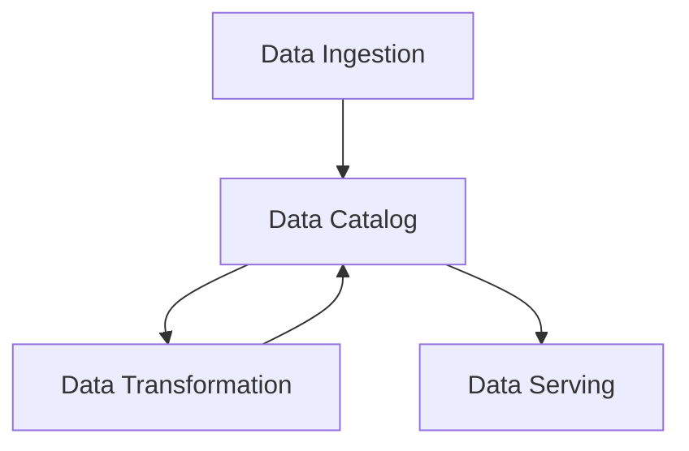

# Leveraging Data Catalogs and Metadata Management in the Data Engineering Lifecycle

## Introduction

In the data-driven world, the volume, variety, and velocity of data continue to grow exponentially, making it increasingly challenging for organizations to effectively manage and leverage their data assets. This is where data catalogs and metadata management play a crucial role in the data engineering lifecycle. A data catalog serves as a centralized repository that helps data engineers and end-users discover, understand, and access the available data assets, while metadata management ensures that the necessary information about these data assets is captured, maintained, and made accessible.

## The Importance of Data Catalogs and Metadata Management

Data catalogs and metadata management are essential components of the data engineering lifecycle for several reasons:

1. **Data Discovery**: Data catalogs provide a comprehensive view of an organization's data assets, making it easier for data engineers and end-users to discover the data they need. By indexing and organizing metadata, data catalogs enable users to search, browse, and understand the available data sources, their contents, and their relationships.

2. **Data Understanding**: Metadata management ensures that the necessary information about data assets, such as data definitions, data lineage, data quality, and business context, is captured and made available. This helps data engineers and end-users better understand the data, its meaning, and its intended use, which is crucial for effective data analysis and decision-making.

3. **Data Governance**: Metadata management supports data governance by providing a centralized view of an organization's data assets and the associated metadata. This enables data stewards and data owners to define and enforce data policies, monitor data usage, and ensure data compliance.

4. **Data Access and Security**: Data catalogs can integrate with data access control mechanisms, allowing data engineers and end-users to securely access the data they need based on their roles and permissions. This helps organizations maintain data privacy and security while enabling data-driven decision-making.

5. **Data Engineering Lifecycle Integration**: Data catalogs and metadata management can be integrated into the different stages of the data engineering lifecycle, such as data ingestion, transformation, and serving, to streamline data management and improve the overall efficiency of the data engineering process.

## Data Catalogs in the Data Engineering Lifecycle

Data catalogs can be integrated into the various stages of the data engineering lifecycle to support data discovery, understanding, and governance:

1. **Data Ingestion**: During data ingestion, metadata about the incoming data sources, such as data schemas, data types, and data formats, can be automatically captured and registered in the data catalog. This helps data engineers understand the structure and characteristics of the data being ingested.

2. **Data Transformation**: As data is transformed and processed, data catalogs can capture information about the transformation logic, data lineage, and data quality metrics. This metadata can be used to understand the data provenance and support impact analysis and troubleshooting.

3. **Data Serving**: When data is made available for consumption, data catalogs can provide information about the data models, data access policies, and data usage patterns. This helps end-users discover and understand the available data assets and access the data they need.

## Key Metadata Attributes and Lineage Information

To enable effective data discovery, governance, and usage, data engineers should capture the following key metadata attributes and lineage information:

1. **Descriptive Metadata**: This includes information such as data source, data owner, data steward, data definitions, data quality metrics, and business context.

2. **Structural Metadata**: This includes information about the data structure, such as data schemas, data types, and data formats.

3. **Administrative Metadata**: This includes information about data access policies, data security, and data retention policies.

4. **Operational Metadata**: This includes information about data processing, such as data transformation logic, data lineage, and data quality metrics.

5. **Technical Metadata**: This includes information about the technical infrastructure, such as data storage locations, data pipelines, and data processing engines.

By capturing and maintaining this rich metadata, data engineers can enable effective data discovery, data understanding, data governance, and data usage across the organization.

## Examples of Data Catalog and Metadata Management Integration

Here are a few examples of how data catalogs and metadata management can be integrated into the data engineering lifecycle:

1. **Data Ingestion**: When ingesting data from various sources, such as databases, data lakes, or external APIs, the data catalog can automatically capture metadata about the data sources, including their schemas, data types, and data formats. This metadata can then be used to facilitate data discovery and understanding.

2. **Data Transformation**: As data is transformed and processed, the data catalog can capture information about the transformation logic, data lineage, and data quality metrics. This metadata can be used to support impact analysis, troubleshooting, and data governance.

3. **Data Serving**: When data is made available for consumption, the data catalog can provide information about the data models, data access policies, and data usage patterns. This helps end-users discover and understand the available data assets and access the data they need.

4. **Data Governance**: The data catalog can serve as a central hub for data governance, allowing data stewards and data owners to define and enforce data policies, monitor data usage, and ensure data compliance.

By integrating data catalogs and metadata management into the data engineering lifecycle, organizations can unlock the full potential of their data assets, improve data-driven decision-making, and enhance overall data governance and data security.

## Conclusion

Data catalogs and metadata management are essential components of the data engineering lifecycle, enabling data discovery, understanding, and governance. By capturing and maintaining rich metadata about data assets, data engineers can empower end-users to discover and access the data they need, while supporting data-driven decision-making and data governance across the organization. As the volume and complexity of data continue to grow, the effective integration of data catalogs and metadata management will become increasingly critical for the success of data engineering initiatives.