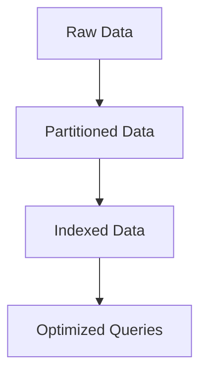
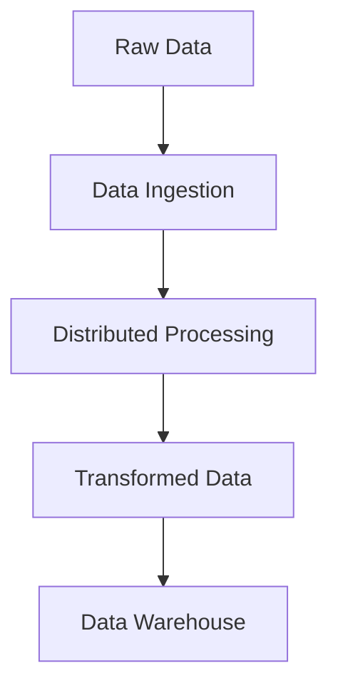
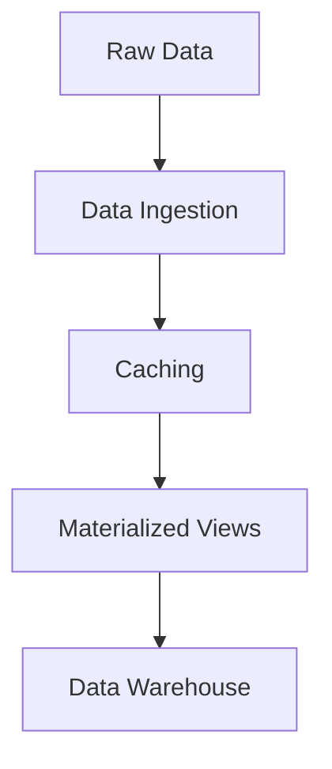
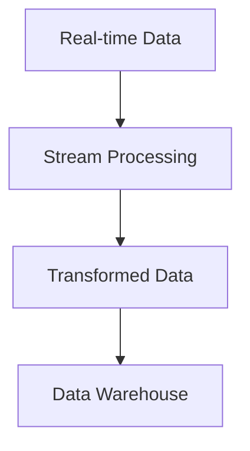

# Optimizing Data Engineering Pipelines for Performance and Scalability

## Introduction

As data volumes continue to grow exponentially and the complexity of data processing tasks increases, ensuring the performance and scalability of data engineering pipelines has become a critical concern for data teams. Inefficient or poorly designed pipelines can lead to bottlenecks, delays, and even data loss, which can have significant consequences for the organization. In this article, we will explore the key factors that can impact pipeline performance and scalability, and discuss the strategies and techniques that data engineers can employ to optimize their data engineering pipelines.

## Key Factors Affecting Pipeline Performance and Scalability

### Data Volume and Complexity
One of the primary factors that can impact the performance and scalability of data engineering pipelines is the volume and complexity of the data being processed. As the amount of data grows, the computational and storage requirements of the pipeline increase, which can lead to longer processing times, higher resource utilization, and potential bottlenecks. Additionally, the complexity of the data processing tasks, such as data transformations, data enrichment, and data quality checks, can also contribute to performance challenges.

### Infrastructure Constraints
The underlying infrastructure that supports the data engineering pipeline, including compute resources, storage systems, and network bandwidth, can also have a significant impact on performance and scalability. Limitations in hardware capacity, such as insufficient CPU, memory, or disk space, can result in resource contention and slower processing times. Similarly, network latency or bandwidth constraints can hinder the efficient transfer of data between different components of the pipeline.

### Architectural Design
The design and architecture of the data engineering pipeline itself can also play a crucial role in its performance and scalability. Factors such as the choice of data processing frameworks, the use of caching and materialized views, and the implementation of partitioning and indexing strategies can all contribute to the overall efficiency and scalability of the pipeline.

## Strategies and Techniques for Optimizing Pipeline Performance and Scalability

### Partitioning and Indexing
One of the most effective strategies for improving the performance and scalability of data engineering pipelines is the use of partitioning and indexing. Partitioning involves dividing data into smaller, more manageable chunks based on specific criteria, such as time, geography, or other relevant attributes. This can significantly reduce the amount of data that needs to be processed for a given query or task, leading to faster processing times. Indexing, on the other hand, involves creating data structures that allow for efficient retrieval of specific data points, further enhancing the performance of the pipeline.

### Query Optimization
Another important technique for optimizing pipeline performance is query optimization. This involves analyzing the structure and execution plan of queries, and making adjustments to improve their efficiency. Strategies such as query rewriting, index utilization, and the use of materialized views can all contribute to faster query processing times.

### Distributed Processing Frameworks
The use of distributed processing frameworks, such as Apache Spark or Apache Flink, can greatly enhance the scalability of data engineering pipelines. These frameworks allow for the parallel processing of data across multiple nodes, enabling the pipeline to handle larger data volumes and more complex processing tasks. By leveraging the distributed nature of these frameworks, data engineers can achieve better performance and scalability, even as the demands on the pipeline increase.

### Caching and Materialized Views
Caching and the use of materialized views can also be effective strategies for improving pipeline performance. Caching involves storing the results of frequently executed queries or data transformations in memory, reducing the need to re-compute the same data. Materialized views, on the other hand, are pre-computed and stored versions of query results, which can be quickly accessed when needed, further enhancing the efficiency of the pipeline.

### Stream Processing
For data engineering pipelines that involve real-time or near-real-time data processing, the use of stream processing frameworks, such as Apache Kafka or Apache Flink, can be a powerful tool for enhancing performance and scalability. These frameworks allow for the continuous processing of data as it arrives, rather than relying on batch-based processing, which can be more efficient and responsive to changing data requirements.

## Conclusion

Optimizing the performance and scalability of data engineering pipelines is a critical challenge for data teams, as they strive to keep pace with the ever-increasing demands of data-driven organizations. By understanding the key factors that can impact pipeline performance, and leveraging the strategies and techniques discussed in this article, data engineers can build more efficient and scalable data systems that can handle the growing volume and complexity of data. By continuously monitoring and optimizing their pipelines, data engineers can ensure that their data engineering efforts remain agile, responsive, and capable of delivering the insights and value that their organizations require.