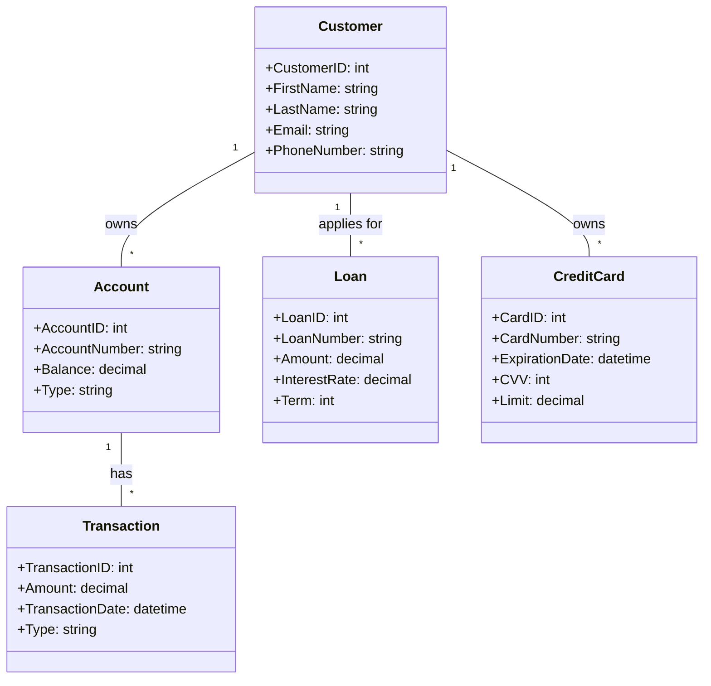

# Conceptual Data Modelling

## Introduction

Conceptual data modelling is a crucial step in the data engineering process, where high-level business requirements are translated into a comprehensive and abstract representation of the data. This model serves as the foundation for the subsequent logical and physical data models, ensuring that the final data infrastructure aligns with the organization's needs and objectives.

## The Conceptual Data Modelling Process

The process of creating a conceptual data model typically involves the following steps:

1. **Understand the Business Requirements**: The first step is to gather and analyze the business requirements, which involves understanding the organization's goals, processes, and the data needed to support them.

2. **Identify Entities**: Entities are the fundamental building blocks of a conceptual data model, representing the key objects or concepts within the business domain. Examples of entities could include "Customer," "Product," "Order," or "Supplier."

3. **Define Attributes**: Attributes are the characteristics or properties of an entity. For each entity, the relevant attributes must be identified and defined. Attributes can be further classified as either *key attributes* (which uniquely identify an entity instance) or *non-key attributes*.

4. **Establish Relationships**: Relationships define the connections between entities. Common types of relationships include one-to-one, one-to-many, and many-to-many. The cardinality and optionality of these relationships must be clearly specified.

5. **Refine and Validate**: The conceptual data model should be reviewed and refined iteratively, ensuring that it accurately represents the business requirements and that all necessary entities, attributes, and relationships have been captured.

## Key Components of a Conceptual Data Model

1. **Entities**: Entities are the primary objects or concepts within the business domain. They represent the things about which data is to be collected and stored.

2. **Attributes**: Attributes are the characteristics or properties of an entity. They describe the entity and provide the necessary information to support the business requirements.

3. **Relationships**: Relationships define the connections between entities. They describe how entities are associated with one another and the nature of those associations.

4. **Cardinality**: Cardinality specifies the number of instances of one entity that can be associated with a single instance of another entity. Common cardinalities include one-to-one, one-to-many, and many-to-many.

5. **Optionality**: Optionality describes whether the presence of a relationship between two entities is required or optional.

## The Role of Conceptual Data Modelling

The conceptual data model serves as the foundation for the subsequent logical and physical data models. It provides a high-level, abstract representation of the data, focusing on the business requirements rather than the technical implementation details.

The conceptual data model:

1. **Aligns with Business Requirements**: By capturing the key entities, attributes, and relationships, the conceptual model ensures that the data infrastructure supports the organization's goals and objectives.

2. **Facilitates Communication**: The conceptual model serves as a common language and understanding between business stakeholders and data engineers, enabling effective collaboration and decision-making.

3. **Guides Logical and Physical Design**: The conceptual model provides a clear blueprint for the development of the logical and physical data models, ensuring consistency and traceability throughout the data engineering process.

4. **Supports Data Governance**: The conceptual model can be used to define data standards, policies, and procedures, contributing to the overall data governance framework within the organization.

## Examples of Conceptual Data Models

1. **Retail Management System**: In a retail management system, the conceptual data model may include entities such as "Customer," "Product," "Order," "Inventory," and "Supplier," with relationships like "Customer places Order," "Order contains Product," and "Supplier provides Product."

2. **Healthcare Management System**: In a healthcare management system, the conceptual data model may include entities such as "Patient," "Doctor," "Appointment," "Diagnosis," "Medication," and "Medical Record," with relationships like "Patient has Appointment with Doctor," "Doctor prescribes Medication," and "Patient has Medical Record."

3. **Online Banking System**: In an online banking system, the conceptual data model may include entities such as "Customer," "Account," "Transaction," "Loan," and "Credit Card," with relationships like "Customer owns Account," "Account has Transactions," and "Customer applies for Loan."

In this conceptual data model for an online banking system, we have the key entities of "Customer," "Account," "Transaction," "Loan," and "CreditCard," along with their respective attributes. The relationships between these entities are also defined, such as a customer owning one or more accounts, an account having one or more transactions, a customer applying for one or more loans, and a customer owning one or more credit cards.

## Conclusion

Conceptual data modelling is a crucial step in the data engineering process, as it provides a high-level, abstract representation of the data that aligns with the business requirements. By identifying the key entities, attributes, and relationships, the conceptual data model serves as the foundation for the subsequent logical and physical data models, ensuring that the final data infrastructure supports the organization's goals and objectives.