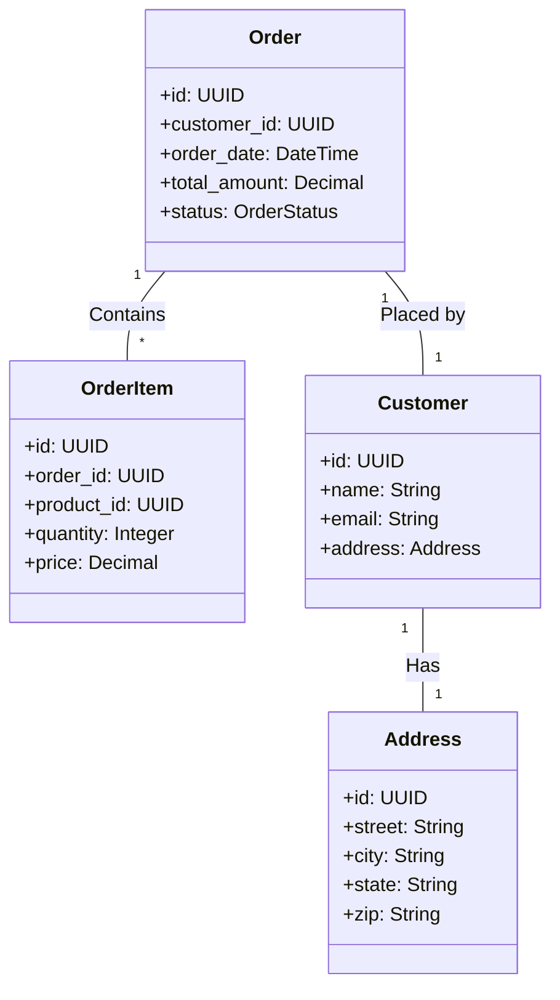

# Data Modelling for Agile and DevOps Environments

## Introduction

In today's fast-paced and ever-evolving business landscape, organizations are increasingly adopting agile methodologies and DevOps practices to drive innovation, improve time-to-market, and enhance overall operational efficiency. This shift has profound implications for data modelling, a critical component of data engineering that underpins the design and implementation of robust data systems.

Agile and DevOps environments demand a more flexible, iterative, and responsive approach to data modelling, as data systems need to be developed and deployed quickly to keep pace with changing business requirements. Traditional data modelling techniques, which often rely on rigid, upfront design and lengthy development cycles, may struggle to meet the demands of these dynamic environments.

In this article, we will explore the key challenges and considerations in adapting data modelling to support agile and DevOps practices, and discuss techniques and patterns that can help data engineers thrive in these rapidly evolving environments.

## Data Modelling Challenges in Agile and DevOps Environments

1. **Rapid Prototyping and Iterative Development**: Agile methodologies emphasize rapid prototyping and iterative development, where requirements and solutions evolve through collaboration between cross-functional teams. This approach can be at odds with traditional data modelling, which often relies on a more linear, waterfall-like process of gathering requirements, designing the data model, and then implementing it.

2. **Continuous Integration and Deployment**: DevOps practices, such as continuous integration (CI) and continuous deployment (CD), require data models to be highly adaptable and easily integrated into automated build and deployment pipelines. This can be challenging when dealing with complex, interdependent data models that may be difficult to version, test, and deploy in a streamlined manner.

3. **Evolving Business Requirements**: Agile environments are characterized by rapidly changing business requirements, which can necessitate frequent updates and modifications to the data model. Traditional data modelling approaches, which often focus on creating a comprehensive, static data model upfront, may struggle to keep pace with these changes.

4. **Data Governance and Compliance**: Agile and DevOps environments, with their emphasis on speed and flexibility, can sometimes overlook the importance of data governance and compliance. Ensuring data quality, security, and regulatory adherence while maintaining the agility required by these environments can be a significant challenge.

5. **Team Collaboration and Knowledge Sharing**: Agile and DevOps teams are often cross-functional, with members from diverse backgrounds and expertise. Effective data modelling in these environments requires close collaboration and knowledge sharing between data engineers, business stakeholders, and other team members, which can be more challenging to achieve compared to traditional, siloed development approaches.

## Techniques for Data Modelling in Agile and DevOps Environments

To address the challenges of data modelling in agile and DevOps environments, data engineers can adopt the following techniques:

1. **Incremental and Iterative Data Modelling**: Instead of attempting to design a comprehensive data model upfront, data engineers can adopt an incremental and iterative approach, where the data model is developed in small, manageable chunks and continuously refined based on feedback and evolving requirements. This allows for rapid prototyping and the ability to adapt to changing business needs.

2. **Modular and Loosely Coupled Data Models**: Designing data models that are modular and loosely coupled can facilitate easier integration, testing, and deployment within CI/CD pipelines. This can be achieved through techniques such as domain-driven design (DDD), where the data model is organized around bounded contexts, and microservices architecture, where each service has its own data model.

3. **Data Modelling as Code**: Treating data models as code, and managing them using version control systems (e.g., Git), can enable better collaboration, automated testing, and seamless integration with CI/CD pipelines. This approach also facilitates the use of infrastructure as code (IaC) techniques, where the data model and its associated infrastructure can be defined and provisioned programmatically.

4. **Automated Data Modelling and Testing**: Developing automated tools and processes for data model generation, validation, and testing can help ensure the integrity of the data model and streamline the deployment process. This can include the use of data modelling domain-specific languages (DSLs), code generators, and automated testing frameworks.

5. **Agile Data Governance**: Implementing agile data governance practices, such as lightweight data cataloging, self-service data discovery, and automated data quality monitoring, can help maintain data integrity and compliance while preserving the agility required by the organization.

6. **Collaborative Data Modelling**: Fostering a collaborative environment where data engineers, business stakeholders, and other team members actively participate in the data modelling process can help ensure that the data model aligns with evolving business requirements and is well-understood by the entire team.

## Data Modelling Patterns and Design Patterns for Agile and DevOps Environments

To support the techniques mentioned above, data engineers can leverage the following data modelling patterns and design patterns that are well-suited for agile and DevOps environments:

1. **Event Sourcing**: This pattern involves modeling the state of the system as a sequence of events, rather than a single, current state. This approach aligns well with the iterative and event-driven nature of agile and DevOps environments, as it allows for easier versioning, testing, and deployment of data models.

2. **Command Query Responsibility Segregation (CQRS)**: CQRS separates the read and write operations of a data model, allowing for more flexibility and scalability in agile and DevOps environments. This pattern can be particularly useful when dealing with complex, evolving data models that need to support a variety of use cases.

3. **Microservices Data Model**: Organizing the data model around bounded contexts, as in a microservices architecture, can facilitate easier integration, testing, and deployment within CI/CD pipelines. This approach also promotes modularity and loose coupling, which are essential in agile and DevOps environments.

4. **Data Mesh**: The data mesh pattern emphasizes a decentralized, domain-driven approach to data management, where each domain owns and manages its own data assets. This aligns well with the cross-functional, collaborative nature of agile and DevOps teams, and can help address the challenges of evolving business requirements and data governance.

5. **Data Virtualization**: Data virtualization, which provides a unified view of data from multiple sources without the need for physical data integration, can be a valuable technique in agile and DevOps environments. This approach allows for faster prototyping and experimentation with data models, as it reduces the overhead of physical data integration.

6. **Schema-on-Read**: In contrast to the traditional schema-on-write approach, schema-on-read allows for more flexibility in data modeling, as the schema is defined at the time of data consumption rather than data ingestion. This can be particularly useful in agile and DevOps environments, where the data model may need to evolve rapidly.

To illustrate some of these patterns, let's consider a simple example of a data model for an e-commerce application:

In this example, the data model is organized around the key entities of the e-commerce application: Order, OrderItem, Customer, and Address. The model is designed to be modular and loosely coupled, with each entity having its own set of attributes and relationships.

This data model could be further enhanced to align with the principles of agile and DevOps environments. For instance, the Order entity could be modeled using the Event Sourcing pattern, where the state of the order is represented as a sequence of events (e.g., OrderCreated, OrderItemAdded, OrderStatusUpdated) rather than a single, current state. This would facilitate easier versioning, testing, and deployment of the data model within a CI/CD pipeline.

Additionally, the data model could be organized around bounded contexts, as in a Microservices Data Model, where each service (e.g., OrderService, CustomerService) owns and manages its own data model. This would promote modularity, loose coupling, and easier integration with other services within the application.

By adopting these data modelling patterns and design patterns, data engineers can create data models that are well-suited for the agile and DevOps environments, enabling faster prototyping, continuous integration, and seamless deployment of data-driven applications.

## Conclusion

In the fast-paced and ever-evolving world of agile and DevOps, data modelling plays a crucial role in the success of data-driven applications. By adapting traditional data modelling techniques to support rapid prototyping, continuous integration, and continuous deployment, data engineers can help organizations stay ahead of the curve and deliver value to their customers more efficiently.

Through the use of incremental and iterative data modelling, modular and loosely coupled data models, data modelling as code, automated data modelling and testing, agile data governance, and collaborative data modelling, data engineers can create data models that are flexible, adaptable, and well-integrated with the overall agile and DevOps ecosystem.

By leveraging data modelling patterns and design patterns, such as Event Sourcing, CQRS, Microservices Data Model, Data Mesh, and Schema-on-Read, data engineers can further enhance the agility and responsiveness of their data models, ensuring that they can keep pace with the rapidly changing business requirements and technological advancements.

As organizations continue to embrace agile and DevOps practices, the ability to effectively model and manage data will be a critical differentiator for data engineers. By mastering these techniques and patterns, data engineers can position themselves as valuable contributors to the success of their organizations in the digital age.