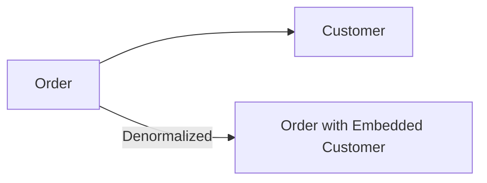
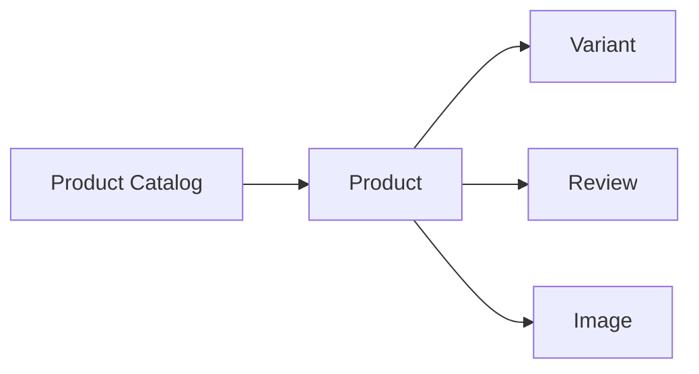
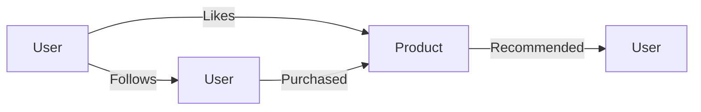

# Data Modelling for Big Data and NoSQL Databases

## Introduction

In the era of big data, where the volume, velocity, and variety of data are constantly increasing, traditional relational data modelling approaches may not be sufficient to handle the complexities of modern data environments. NoSQL databases, such as key-value stores, column-family databases, document-oriented databases, and graph databases, have emerged as viable alternatives to relational databases, offering unique data modelling capabilities that cater to the specific needs of big data applications.

In this article, we will explore the unique data modelling considerations for big data and NoSQL databases, and discuss how data modelling techniques like denormalization, document-oriented modelling, and graph modelling can be applied in these environments. We will also examine the trade-offs between data model complexity and query performance, and provide examples of data models for various NoSQL database types.

## Data Modelling for Big Data

Big data applications often deal with large, unstructured, and rapidly changing datasets that do not fit well into the rigid schema of traditional relational databases. In these scenarios, data modelling approaches need to be more flexible and adaptable to accommodate the dynamic nature of the data.

### Denormalization

One of the key data modelling techniques for big data is denormalization. In a relational database, normalization is used to eliminate data redundancy and ensure data integrity. However, in big data environments, the focus shifts towards query performance and data access patterns, rather than strict data integrity. Denormalization involves intentionally duplicating data across multiple tables or documents to optimize for specific query patterns, even if it means sacrificing some data consistency.

For example, in a e-commerce application, instead of storing customer information in a separate table and linking it to the order table, you might denormalize the data and store the customer information directly within the order document. This can improve query performance for retrieving order details, as the customer information is readily available without the need for additional joins.



### Document-oriented Modelling

NoSQL databases, such as MongoDB and Couchbase, often use a document-oriented data model, where data is stored in self-contained, hierarchical documents. This approach aligns well with the semi-structured and nested nature of big data, as it allows for more flexible and schema-less data representation.

In a document-oriented model, related data is stored together within a single document, reducing the need for complex joins and improving query performance. This can be particularly useful for scenarios where the data has a clear hierarchical structure, such as in e-commerce product catalogs or social media profiles.



### Graph Modelling

Graph databases, such as Neo4j and Amazon Neptune, are designed to handle highly connected data, where the relationships between entities are as important as the entities themselves. This data model is well-suited for big data applications that involve complex, interconnected data, such as social networks, recommendation systems, and fraud detection.

In a graph data model, data is represented as nodes (entities) and edges (relationships) between those nodes. This allows for efficient traversal and exploration of the data, making it easier to uncover insights and patterns that may be difficult to discover in a traditional relational or document-oriented model.



## Trade-offs and Considerations

While the data modelling techniques discussed above can be highly effective in big data and NoSQL environments, they also come with their own trade-offs and considerations.

### Data Model Complexity

Denormalization, document-oriented modelling, and graph modelling can lead to more complex data models, as data is often duplicated or stored in a more hierarchical or interconnected structure. This increased complexity can make it more challenging to manage and maintain the data model, especially as the application and data requirements evolve over time.

### Query Performance

The trade-off for the increased data model complexity is often improved query performance. By denormalizing data or storing related information together in documents or graphs, the need for expensive join operations is reduced, leading to faster query execution times. However, this performance benefit may come at the cost of data consistency and integrity, as updates and modifications to the data may require more complex operations.

### Data Consistency and Integrity

In big data and NoSQL environments, the focus often shifts from strict data consistency to availability and partition tolerance, as defined by the CAP theorem. This means that data modelling techniques like denormalization and document-oriented modelling may sacrifice some data consistency in favor of improved availability and scalability.

### Scalability and Flexibility

NoSQL databases are generally designed to be more scalable and flexible than traditional relational databases. By adopting data modelling techniques like denormalization and document-oriented modelling, big data applications can take advantage of these scalability and flexibility benefits, allowing them to handle large volumes of data and adapt to changing requirements more easily.

## Examples of Data Models for NoSQL Databases

Let's explore some examples of data models for different types of NoSQL databases:

### Key-Value Stores (e.g., Amazon DynamoDB)

In a key-value store, data is stored as a collection of key-value pairs. This simple data model is well-suited for caching, session management, and other use cases where the data access pattern is primarily based on a unique key.

Example: Storing user session data in Amazon DynamoDB

```json
{
  "SessionId": "123456789",
  "UserId": "user123",
  "LastActivity": "2023-04-20T12:34:56Z",
  "UserPreferences": {
    "Theme": "Dark",
    "Language": "en-US"
  }
}
```

### Column-Family Databases (e.g., Apache Cassandra)

Column-family databases store data in a tabular format, but with a flexible schema that allows for dynamic column definitions. This model is well-suited for time-series data, IoT sensor data, and other applications with high write throughput requirements.

Example: Storing sensor data in Apache Cassandra

```
CREATE TABLE sensor_data (
  sensor_id text,
  timestamp timestamp,
  temperature float,
  humidity float,
  PRIMARY KEY ((sensor_id), timestamp)
);
```

### Document-Oriented Databases (e.g., MongoDB)

Document-oriented databases store data in self-contained, hierarchical documents, allowing for more flexible and schema-less data representation. This model is well-suited for content management systems, e-commerce applications, and other use cases with semi-structured data.

Example: Storing product catalog data in MongoDB

```json
{
  "_id": "product_123",
  "name": "Wireless Headphones",
  "description": "High-quality wireless headphones with noise cancellation",
  "category": "Electronics",
  "price": 99.99,
  "reviews": [
    {
      "user": "john_doe",
      "rating": 4.5,
      "comment": "Great sound quality and comfortable to wear."
    },
    {
      "user": "jane_smith",
      "rating": 4.0,
      "comment": "The battery life could be better, but overall a good product."
    }
  ]
}
```

### Graph Databases (e.g., Neo4j)

Graph databases are designed to handle highly connected data, where the relationships between entities are as important as the entities themselves. This model is well-suited for social networks, recommendation systems, and other applications that involve complex, interconnected data.

Example: Storing a social network in Neo4j

```cypher
// Create users
CREATE (alice:User {name: "Alice"})
CREATE (bob:User {name: "Bob"})
CREATE (charlie:User {name: "Charlie"})

// Create relationships between users
CREATE (alice)-[:FOLLOWS]->(bob)
CREATE (bob)-[:FOLLOWS]->(charlie)
CREATE (charlie)-[:FOLLOWS]->(alice)

// Create posts and relationships
CREATE (post1:Post {title: "Hello, world!"})
CREATE (post2:Post {title: "Introducing my new project"})
CREATE (alice)-[:POSTED]->(post1)
CREATE (bob)-[:POSTED]->(post2)
CREATE (alice)-[:LIKED]->(post2)
CREATE (charlie)-[:LIKED]->(post1)
```

## Conclusion

In the era of big data and NoSQL databases, traditional data modelling approaches may not be sufficient to handle the complexities of modern data environments. Techniques like denormalization, document-oriented modelling, and graph modelling offer unique data modelling capabilities that can help big data applications better manage and leverage their data.

While these data modelling techniques come with their own trade-offs and considerations, they can ultimately lead to improved query performance, scalability, and flexibility, which are crucial for the success of big data applications. By understanding the unique data modelling requirements of big data and NoSQL databases, data engineers can design more effective and efficient data solutions that meet the evolving needs of their organizations.