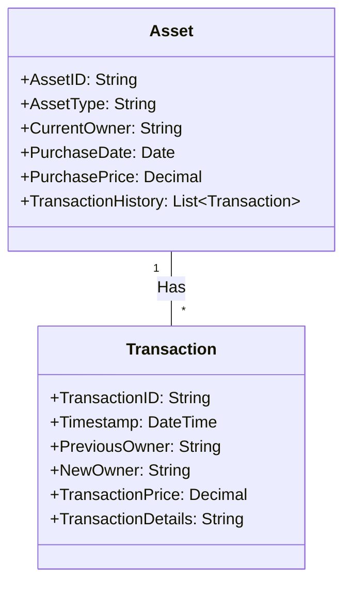

# Data Modelling for Blockchain and Distributed Ledger Technologies

## Introduction

Blockchain and distributed ledger technologies (DLTs) have emerged as transformative innovations, revolutionizing the way data is stored, managed, and shared across various industries. Traditional data modelling approaches, designed for centralized database systems, may not adequately address the unique requirements and characteristics of blockchain and DLT environments. In this article, we will explore the key considerations and techniques for data modelling in the context of blockchain and distributed ledger technologies.

## Blockchain and Distributed Ledger Data Characteristics

Blockchain and DLTs are characterized by several unique features that have a significant impact on data modelling:

1. **Decentralization**: Data is stored and managed in a decentralized manner, across multiple nodes in the network, rather than in a centralized database.
2. **Immutability**: Transactions and data records in the blockchain are immutable, meaning they cannot be altered or deleted once they are added to the ledger.
3. **Transparency**: The blockchain network maintains a transparent, shared, and distributed ledger, where all transactions and data are visible to authorized participants.
4. **Consensus**: Blockchain networks rely on consensus mechanisms, such as Proof-of-Work or Proof-of-Stake, to validate and add new transactions to the ledger, ensuring data integrity and consistency.
5. **Smart Contracts**: Blockchain-based systems often incorporate smart contracts, which are self-executing programs that automatically enforce the terms of an agreement between parties.

## Data Modelling Considerations for Blockchain and DLTs

When designing data models for blockchain and distributed ledger environments, the following key considerations should be taken into account:

1. **Data Structure and Schema**: Traditional data modelling techniques, such as relational or document-oriented models, may not be directly applicable to blockchain and DLTs. Instead, data models should be designed to accommodate the unique characteristics of blockchain, such as the need for immutable and auditable records.

2. **Data Partitioning and Sharding**: In a decentralized blockchain network, data may need to be partitioned or sharded across multiple nodes to improve scalability and performance. Data modelling should consider how to effectively distribute and manage data across the network.

3. **Data Integrity and Auditability**: Blockchain's immutable nature and consensus mechanisms provide inherent data integrity and auditability. Data models should leverage these features to ensure the reliability and traceability of data records.

4. **Smart Contract Integration**: Data models in blockchain-based systems should be designed to support the implementation of smart contracts, which automate the execution of agreements and transactions based on predefined rules and conditions.

5. **Asset Tracking and Provenance**: Blockchain and DLTs are well-suited for tracking the provenance and ownership of digital or physical assets. Data models should be designed to capture and manage the lifecycle and ownership history of these assets.

6. **Performance and Scalability**: Blockchain networks can face challenges in terms of transaction throughput and latency, especially as the network grows. Data modelling should consider techniques to optimize performance and scalability, such as the use of off-chain storage or data compression.

## Data Modelling Patterns and Design Patterns for Blockchain and DLTs

To address the unique requirements of blockchain and distributed ledger environments, several data modelling patterns and design patterns have emerged:

1. **Event-Driven Data Modelling**: In blockchain-based systems, data is often represented as a series of events or transactions, rather than a static data model. Event-driven data modelling focuses on capturing the history and provenance of data changes, rather than the current state of the data.

2. **State-Oriented Data Modelling**: This approach models the current state of the system, where each transaction or event updates the state of the data. This is particularly useful for managing the state of assets, smart contracts, and other blockchain-based entities.

3. **Hierarchical Data Modelling**: Blockchain-based systems often involve complex relationships and hierarchies, such as the ownership structure of assets or the nested structure of smart contracts. Hierarchical data modelling techniques can be used to capture these relationships effectively.

4. **Modular Data Modelling**: To address the scalability and performance challenges of blockchain networks, modular data modelling techniques can be employed. This involves breaking down the data model into smaller, interconnected modules that can be managed and scaled independently.

5. **Hybrid Data Modelling**: A combination of traditional data modelling approaches and blockchain-specific techniques can be used to create hybrid data models. This allows leveraging the benefits of both centralized and decentralized data management, depending on the specific requirements of the use case.

## Example: Data Modelling for Asset Tracking in a Blockchain-based Supply Chain

Let's consider an example of data modelling for a blockchain-based supply chain system that tracks the provenance and ownership of physical assets, such as luxury goods or high-value components.

In this example, the `Asset` entity represents the physical asset being tracked, with attributes such as the asset ID, type, current owner, purchase date, and purchase price. The `Transaction` entity captures the history of ownership changes, including the previous owner, new owner, transaction price, and transaction details.

The data model leverages the immutable and auditable nature of blockchain to maintain a complete history of asset ownership changes. Each transaction is recorded as an event, and the current state of the asset (i.e., the current owner) is derived from the cumulative transaction history.

This data model supports the key requirements of asset tracking and provenance management in a blockchain-based supply chain system, including:

- Maintaining a tamper-proof record of asset ownership changes
- Providing transparency and auditability of the asset's lifecycle
- Enabling the implementation of smart contracts to automate asset transfer and ownership verification
- Facilitating the traceability and provenance of high-value assets throughout the supply chain

By adopting this data modelling approach, the blockchain-based supply chain system can leverage the inherent benefits of blockchain, such as data integrity, transparency, and decentralized consensus, to deliver a robust and reliable asset tracking solution.

## Conclusion

Data modelling for blockchain and distributed ledger technologies requires a shift in mindset from traditional data modelling approaches. By understanding the unique characteristics of blockchain, such as decentralization, immutability, and consensus, data engineers can design data models that effectively leverage the benefits of these technologies. The examples and patterns discussed in this article provide a foundation for adapting data modelling techniques to the blockchain and DLT domain, enabling the development of robust, scalable, and auditable blockchain-based applications.