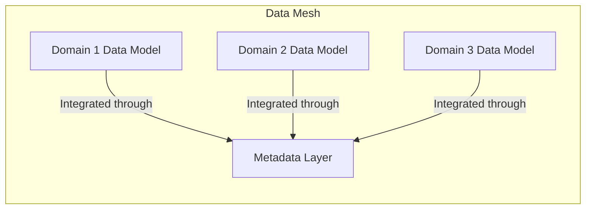
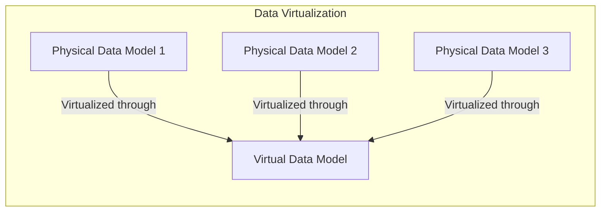
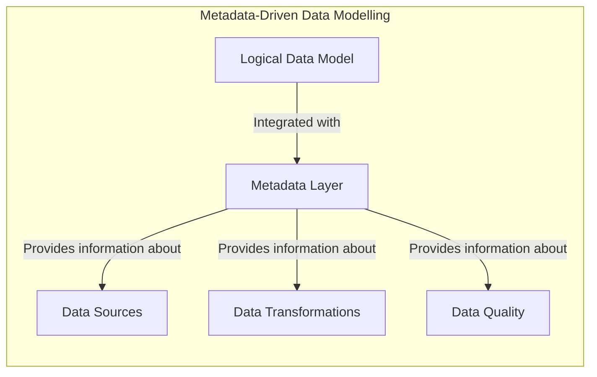
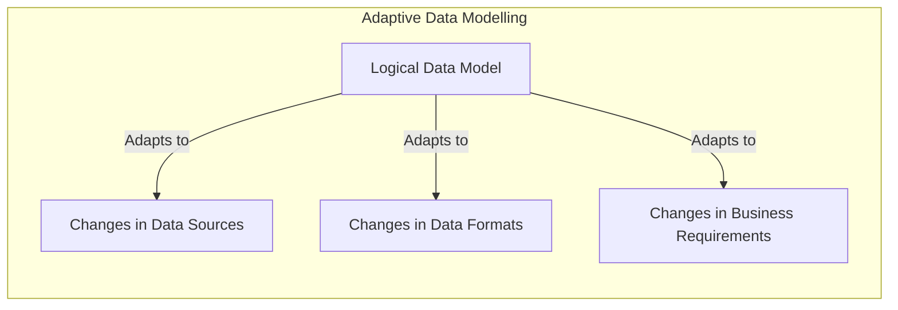
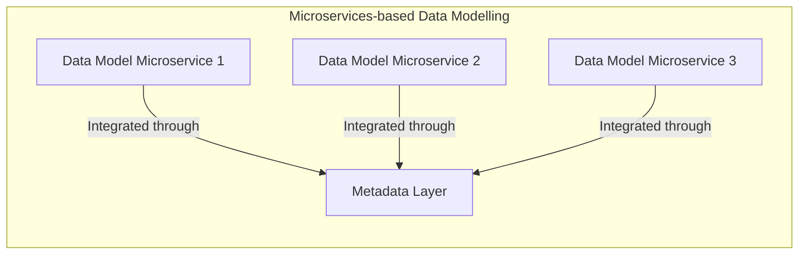

# Data Modelling for Data Fabrics

## Introduction

In the era of big data and distributed systems, traditional data architectures are often unable to keep up with the growing complexity and volume of data. This has led to the emergence of the data fabric, a modern data architecture that aims to provide a unified, flexible, and scalable data layer to support a wide range of data-driven use cases.

One of the key components of a data fabric is the data modelling approach. Data modelling in a data fabric environment presents unique challenges and considerations, as data is distributed, virtualized, and accessed through a unified data layer. In this article, we will explore the data modelling techniques and design patterns that can support the key capabilities of a data fabric, such as data discovery, data access, and data integration.

## Data Modelling Challenges in Data Fabric Architectures

1. **Data Heterogeneity**: Data fabrics often need to integrate data from a wide range of sources, including relational databases, NoSQL stores, data lakes, and external APIs. This heterogeneity in data sources and formats can make it challenging to design a unified data model.

2. **Data Virtualization**: Data fabrics rely on data virtualization to provide a unified view of data, regardless of its physical location or storage format. Designing data models that can seamlessly work with data virtualization can be a complex task.

3. **Metadata Management**: Effective metadata management is crucial for data discovery and lineage in a data fabric. Integrating data modelling with metadata management can be a significant challenge.

4. **Data Governance**: Data fabrics often need to enforce data governance policies, such as access control, data quality, and compliance. Designing data models that can support these governance requirements can be a complex undertaking.

5. **Scalability and Performance**: Data fabrics need to handle large volumes of data and support a wide range of use cases. Designing data models that can scale and perform well in this environment is a critical consideration.

## Data Modelling Techniques for Data Fabrics

To address these challenges, data modelling for data fabrics can leverage the following techniques:

1. **Federated Data Modelling**: Instead of a single, monolithic data model, data fabrics can benefit from a federated data modelling approach. This involves creating multiple, domain-specific data models that can be integrated through a common metadata layer.

2. **Logical Data Modelling**: In a data fabric, the focus should be on logical data modelling, which defines the conceptual structure of data, rather than physical data modelling, which deals with the implementation details. This allows for greater flexibility and adaptability as the data fabric evolves.

3. **Metadata-Driven Data Modelling**: Integrating data modelling with metadata management is crucial for data discovery, lineage, and governance. Data models should be designed to leverage the metadata layer, which can provide information about data sources, data transformations, and data quality.

4. **Adaptive Data Modelling**: Data fabrics need to be able to accommodate changes in data sources, data formats, and business requirements. Adaptive data modelling techniques, such as the use of data virtualization and schema-on-read approaches, can help ensure that the data models remain flexible and responsive to change.

5. **Microservices-based Data Modelling**: Adopting a microservices-based approach to data modelling can help break down complex data models into smaller, more manageable components. This can improve scalability, maintainability, and the ability to evolve the data models over time.

## Data Modelling Patterns for Data Fabrics

To support the key capabilities of a data fabric, data modelling can leverage the following design patterns:

1. **Data Mesh Pattern**: The data mesh pattern promotes the creation of domain-specific data models, where each domain owns and manages its own data. This aligns well with the federated data modelling approach and supports data discovery, data access, and data governance.

2. **Data Virtualization Pattern**: Data models in a data fabric should be designed to work seamlessly with data virtualization, which provides a unified view of data regardless of its physical location or storage format. This can involve the use of virtual data models or the integration of data models with the data virtualization layer.

3. **Metadata-Driven Data Modelling Pattern**: Data models should be designed to leverage the metadata layer, which can provide information about data sources, data transformations, and data quality. This can involve the use of metadata-driven data discovery, data lineage, and data governance capabilities.

4. **Adaptive Data Modelling Pattern**: Data models in a data fabric should be designed to be adaptive and responsive to changes in data sources, data formats, and business requirements. This can involve the use of schema-on-read approaches, data virtualization, and other techniques that allow the data models to evolve over time.

5. **Microservices-based Data Modelling Pattern**: Adopting a microservices-based approach to data modelling can help break down complex data models into smaller, more manageable components. This can improve scalability, maintainability, and the ability to evolve the data models over time.

## Conclusion

Data modelling for data fabrics presents unique challenges and considerations, but by leveraging techniques such as federated data modelling, logical data modelling, metadata-driven data modelling, adaptive data modelling, and microservices-based data modelling, data engineers can design data models that can support the key capabilities of a data fabric, including data discovery, data access, and data integration. By adopting these data modelling patterns and design patterns, organizations can build flexible, scalable, and adaptable data fabrics that can meet the growing demands of modern data-driven use cases.