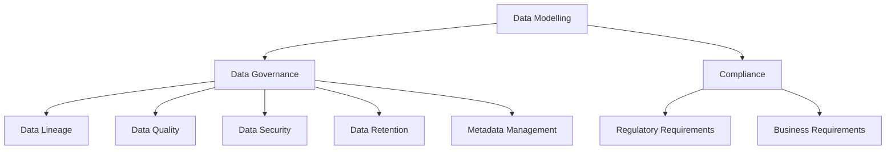

# Data Modelling for Data Governance and Compliance

## Introduction

Data modelling is a fundamental aspect of data engineering, as it provides the foundation for how data is structured, stored, and accessed within an organization. However, data modelling is not just about technical design; it also plays a crucial role in supporting data governance and compliance initiatives. By integrating data modelling with data governance and compliance requirements, organizations can ensure that their data assets are properly managed, secured, and aligned with regulatory and business needs.

## Data Governance and Compliance Considerations in Data Modelling

Data governance and compliance requirements can have a significant impact on the data modelling process. Some key considerations include:

1. **Data Lineage**: Data models can be used to capture the lineage of data, tracking its origin, transformation, and movement through the organization. This information is essential for understanding data provenance and ensuring compliance with regulatory requirements, such as the General Data Protection Regulation (GDPR) or the Health Insurance Portability and Accountability Act (HIPAA).

2. **Data Quality**: Data models can help define data quality standards, such as data types, data formats, and data validation rules. By incorporating these standards into the data model, organizations can ensure that data is consistently captured and maintained in a way that meets regulatory and business requirements.

3. **Data Security and Privacy**: Data models can be used to define access controls, data masking, and other security measures to protect sensitive data and ensure compliance with data privacy regulations.

4. **Data Retention and Archiving**: Data models can help organizations define data retention policies and archiving strategies, ensuring that data is stored and managed in a way that meets regulatory requirements for data retention and disposal.

5. **Metadata Management**: Data models can serve as a central repository for metadata, providing a comprehensive view of the organization's data assets and their relationships. This metadata can be used to support data governance and compliance initiatives, such as data cataloging, data classification, and data discovery.

## Incorporating Data Governance and Compliance into Data Modelling

To effectively integrate data governance and compliance considerations into the data modelling process, organizations can follow these steps:

1. **Identify Regulatory and Business Requirements**: Begin by understanding the regulatory and business requirements that will impact the data modelling process. This may include reviewing industry-specific regulations, internal data policies, and stakeholder needs.

2. **Align Data Models with Governance and Compliance Policies**: Ensure that the data models being developed are aligned with the organization's data governance and compliance policies. This may involve incorporating data quality rules, security controls, and data retention policies into the data model.

3. **Establish Data Stewardship and Ownership**: Clearly define the roles and responsibilities of data stewards and owners, who will be responsible for maintaining the data models and ensuring compliance with data governance and regulatory requirements.

4. **Implement Data Lineage and Traceability**: Incorporate data lineage and traceability into the data models, enabling the organization to understand the origin, transformation, and movement of data throughout the enterprise.

5. **Leverage Metadata Management**: Utilize metadata management tools and techniques to capture and maintain comprehensive information about the data assets, including data definitions, data relationships, and data quality metrics.

6. **Continuously Monitor and Adapt**: Regularly review and update the data models to ensure they remain aligned with evolving data governance and compliance requirements, as well as changes in the business and regulatory landscape.

## Examples and Use Cases

1. **Data Lineage for GDPR Compliance**: A financial services organization needs to ensure compliance with the GDPR's data subject rights, such as the right to access, rectify, and erase personal data. By incorporating data lineage into their data models, the organization can track the flow of personal data through their systems, enabling them to quickly identify and respond to data subject requests.

2. **Data Quality and Data Validation for Financial Reporting**: A manufacturing company needs to ensure the accuracy and completeness of data used in financial reporting to meet regulatory requirements. By defining data quality rules and validation checks in their data models, the organization can enforce data standards and improve the reliability of their financial data.

3. **Data Security and Access Controls for Healthcare Data**: A healthcare provider needs to protect sensitive patient information and comply with HIPAA regulations. By incorporating role-based access controls and data masking techniques into their data models, the organization can ensure that data is only accessible to authorized personnel and that sensitive information is properly protected.

4. **Data Retention and Archiving for Legal and Regulatory Compliance**: A legal services firm needs to maintain client data for a specific period of time to comply with regulatory requirements. By defining data retention policies and archiving strategies in their data models, the organization can ensure that data is properly stored, managed, and disposed of in accordance with the law.

## Conclusion

Data modelling is a crucial component of data engineering, and by integrating data governance and compliance considerations into the data modelling process, organizations can ensure that their data assets are properly managed, secured, and aligned with regulatory and business needs. By leveraging data models to support data lineage, data quality, data security, and other data governance initiatives, organizations can enhance their data-driven decision-making, improve operational efficiency, and mitigate the risk of non-compliance.