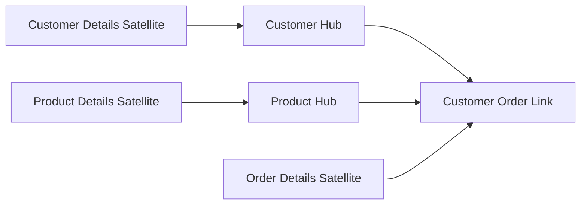
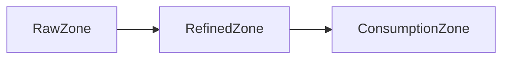
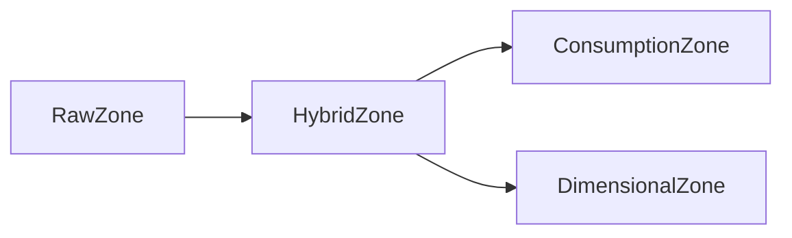

# Data Modelling for Data Lakes

## Introduction

Data lakes have become increasingly popular in the era of big data, as they offer a cost-effective way to store and process large volumes of diverse, unstructured, and semi-structured data. However, the lack of a predefined schema in data lakes poses unique challenges for data modelling, which is a critical aspect of data engineering. Traditional data modelling techniques, designed for structured data in data warehouses, may not be directly applicable to the more flexible and schema-on-read nature of data lakes.

In this article, we will explore the key considerations and approaches for data modelling in a data lake environment, including schema-on-read, data virtualization, and data cataloguing. We will also discuss the Data Vault data modelling technique, which is particularly well-suited for data lakes, and provide examples of data models and design patterns for data lakes.

## Challenges and Considerations in Data Modelling for Data Lakes

1. **Unstructured and Semi-structured Data**: Data lakes often contain a wide variety of data formats, including structured data (e.g., CSV, Excel), semi-structured data (e.g., JSON, XML), and unstructured data (e.g., text, images, audio). Traditional data modelling techniques, which rely on predefined schemas, may not be able to accommodate the diverse and evolving nature of data in a data lake.

2. **Schema-on-read**: Unlike data warehouses, where the schema is defined upfront (schema-on-write), data lakes typically follow a schema-on-read approach. This means that the schema is defined at the time of data consumption, rather than during data ingestion. This flexibility allows for the inclusion of a wider range of data sources, but it also introduces challenges in terms of data discovery, data quality, and data governance.

3. **Data Variety and Velocity**: Data lakes often ingest data from a large number of sources, with varying data formats, structures, and update frequencies. This can make it challenging to maintain a consistent and coherent data model across the entire data lake.

4. **Data Lineage and Provenance**: Tracking the origin, transformation, and usage of data is crucial in a data lake environment, as it enables data governance, data quality assurance, and regulatory compliance. However, maintaining comprehensive data lineage and provenance can be complex in a highly dynamic and flexible data lake.

5. **Data Governance and Security**: Effective data governance and security are essential in a data lake, as it contains a vast amount of sensitive and valuable data. Establishing appropriate access controls, data classification, and data lifecycle management policies can be more challenging in a schema-on-read environment.

## Approaches to Data Modelling for Data Lakes

To address the challenges of data modelling in data lakes, several approaches have been developed:

1. **Schema-on-read**: In a schema-on-read approach, the data model is defined at the time of data consumption, rather than during data ingestion. This allows for greater flexibility in handling diverse and evolving data sources, but it also requires more effort in data discovery, data quality, and data governance.

2. **Data Virtualization**: Data virtualization is the process of providing a unified, logical view of data from multiple, disparate sources. This approach can be particularly useful in a data lake, as it allows for the integration of data from various sources without the need for a predefined, rigid data model.

3. **Data Cataloguing**: Data cataloguing is the process of creating and maintaining a comprehensive inventory of data assets within a data lake. A well-designed data catalogue can facilitate data discovery, data lineage, and data governance, enabling more effective data modelling and data consumption.

4. **Data Vault Modelling**: The Data Vault data modelling technique is specifically designed for data lakes and other big data environments. It focuses on capturing the raw, historical data from various sources, while maintaining the relationships and context between data entities. This approach is highly scalable and adaptable to changes in data sources and requirements.

## Data Modelling Patterns for Data Lakes

1. **Data Vault Model**: The Data Vault model is a popular data modelling approach for data lakes. It consists of three main components:
   - Hubs: Represent the core business entities, such as customers, products, or transactions.
   - Links: Represent the relationships between the business entities.
   - Satellites: Capture the detailed attributes and history of the business entities.

   The Data Vault model is designed to be highly scalable, flexible, and adaptable to changes in data sources and requirements.

2. **Datalake Zones**: Data lakes can be organized into different zones, each with a specific purpose and data modelling approach:
   - Raw Zone: Stores the raw, unprocessed data from various sources, with minimal transformation.
   - Refined Zone: Stores the transformed and curated data, often using a Data Vault or similar data modelling approach.
   - Consumption Zone: Stores the data models and views optimized for specific business use cases and reporting needs.

3. **Hybrid Modelling**: In some cases, a hybrid approach that combines traditional data modelling techniques (e.g., dimensional modelling) with schema-on-read and Data Vault principles can be beneficial. This allows for the creation of well-defined, business-oriented data models while still maintaining the flexibility and scalability of a data lake.

## Conclusion

Data modelling in a data lake environment presents unique challenges and requires a more flexible and adaptive approach compared to traditional data warehousing. By leveraging techniques like schema-on-read, data virtualization, and data cataloguing, data engineers can effectively model and manage the diverse, unstructured, and semi-structured data in a data lake. The Data Vault data modelling technique, in particular, is well-suited for data lakes, as it focuses on capturing the raw, historical data while maintaining the relationships and context between data entities.

By understanding and applying these data modelling approaches, data engineers can build robust and scalable data lake architectures that support a wide range of business use cases and data-driven decision-making.