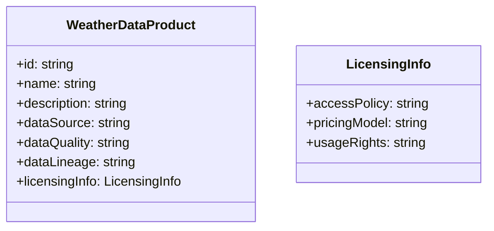

# Data Modelling for Data Sharing and Data Marketplaces

## Introduction

In today's data-driven world, the ability to securely share and exchange data across organizational boundaries has become increasingly important. Data sharing and data marketplaces have emerged as key strategies for unlocking the value of data assets and fostering collaboration and innovation. However, designing data models that can effectively support these use cases presents unique challenges and considerations.

## Data Modelling Challenges in Data Sharing and Data Marketplaces

1. **Data Governance and Security**: When sharing data across organizational boundaries, it is crucial to ensure that the data is properly governed and secured. Data models must support the definition of access policies, data licensing, and other security controls to protect sensitive information and maintain compliance with regulations.

2. **Data Discoverability and Consumption**: In a data marketplace, data consumers need to be able to easily discover and understand the available data assets. Data models should provide a clear and intuitive representation of the data, including metadata, data lineage, and data quality information, to facilitate data discovery and consumption.

3. **Data Monetization**: For data marketplaces, the data model should support the definition of data products and the associated pricing and licensing models. This allows data providers to effectively monetize their data assets and create new revenue streams.

4. **Data Heterogeneity and Integration**: Data shared across organizations may come from diverse sources and have different structures, formats, and semantics. Data models must be designed to handle this heterogeneity and enable seamless integration of data from multiple sources.

5. **Scalability and Performance**: As the volume and complexity of shared data increase, the data model must be scalable and efficient to support high-performance data access and processing.

## Data Modelling Techniques for Data Sharing and Data Marketplaces

1. **Federated Data Model**: A federated data model allows data to be shared and accessed across organizational boundaries while maintaining control and governance over the data. This model typically involves a central metadata repository that provides a unified view of the available data assets, along with access policies and licensing information.

2. **Data Product Model**: The data product model defines the structure and metadata of a data asset that is made available for sharing or monetization in a data marketplace. This model should include information about the data's content, quality, lineage, and usage rights.

3. **Data Catalog Model**: A data catalog model provides a comprehensive inventory of all the data assets available in a data marketplace. This model includes metadata about the data, such as descriptions, tags, and lineage, to enable effective data discovery and understanding.

4. **Semantic Data Model**: A semantic data model leverages ontologies and taxonomies to capture the meaning and relationships of data elements. This model can facilitate the integration and interoperability of data from diverse sources, enabling more effective data sharing and consumption.

5. **Data Licensing Model**: The data licensing model defines the terms and conditions under which data can be accessed and used. This model should include information about data ownership, usage rights, pricing, and any restrictions or limitations on the use of the data.

## Design Patterns for Data Sharing and Data Marketplaces

1. **Data Virtualization Pattern**: This pattern allows data consumers to access and query data from multiple sources without the need for physical data integration. The data model acts as a virtual layer that abstracts the underlying data sources and provides a unified view of the data.

2. **Data Mesh Pattern**: The data mesh pattern promotes a decentralized, domain-driven approach to data management, where each domain owns and manages its own data assets. This model can facilitate data sharing and collaboration by enabling the creation of data products that can be easily discovered and consumed across organizational boundaries.

3. **Data Lineage Pattern**: The data lineage pattern captures the provenance and transformation history of data, enabling data consumers to understand the origin, quality, and trustworthiness of the data. This information can be incorporated into the data model to support data governance and compliance requirements.

4. **Data Marketplace Pattern**: The data marketplace pattern provides a platform for data providers to offer their data assets for consumption by data consumers. The data model in this pattern should support the definition of data products, pricing and licensing models, and access control mechanisms.

## Example: Data Modelling for a Data Marketplace

Let's consider an example of a data marketplace for weather data. The key data modelling considerations and patterns in this context would be:

1. **Federated Data Model**: The data marketplace would have a central metadata repository that provides a unified view of the available weather data assets from multiple data providers, along with their associated access policies and licensing information.

2. **Data Product Model**: Each weather data asset would be defined as a data product, with metadata describing its content (e.g., temperature, precipitation, wind speed), quality, lineage, and usage rights.

3. **Data Catalog Model**: The data marketplace would maintain a comprehensive data catalog that allows data consumers to search, browse, and understand the available weather data assets based on their metadata.

4. **Semantic Data Model**: The weather data model would leverage ontologies and taxonomies to capture the relationships between different weather-related concepts (e.g., temperature, precipitation, wind) and enable more effective data integration and consumption.

5. **Data Licensing Model**: The data licensing model would define the terms and conditions under which the weather data assets can be accessed and used, including pricing, usage restrictions, and any compliance requirements.

By incorporating these data modelling techniques and design patterns, the data marketplace for weather data can effectively support secure and governed data sharing, enable data discovery and consumption, and facilitate the monetization of weather data assets.

## Conclusion

Designing data models that can support secure and governed data sharing, as well as data marketplaces, is a critical challenge for data engineers. By leveraging techniques such as federated data models, data product models, data catalog models, semantic data models, and data licensing models, data engineers can create data models that enable effective data sharing, discovery, consumption, and monetization across organizational boundaries. The examples and design patterns discussed in this article provide a foundation for data engineers to address the unique requirements of data sharing and data marketplace use cases.