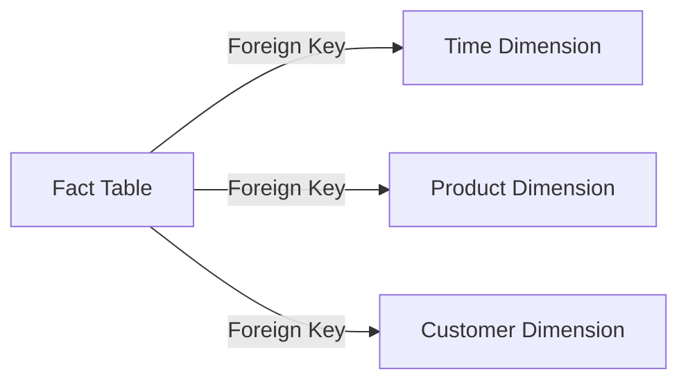
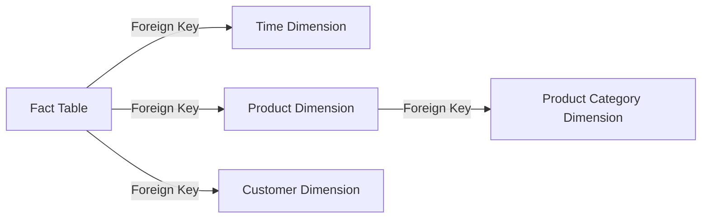
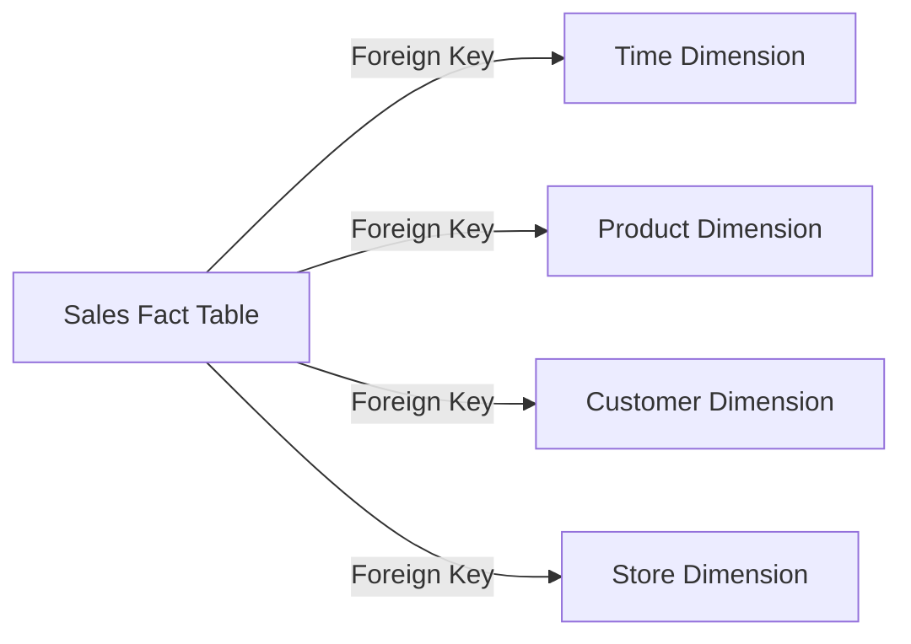
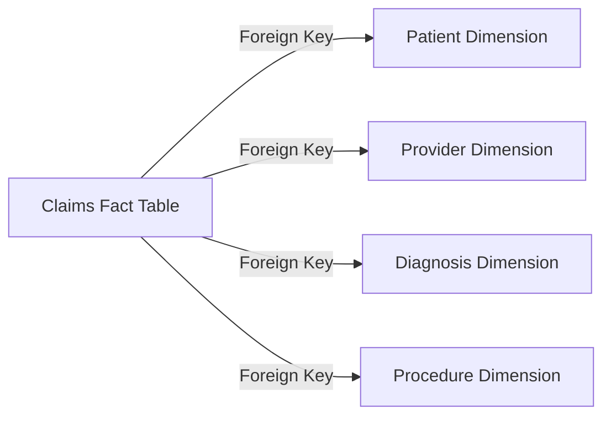
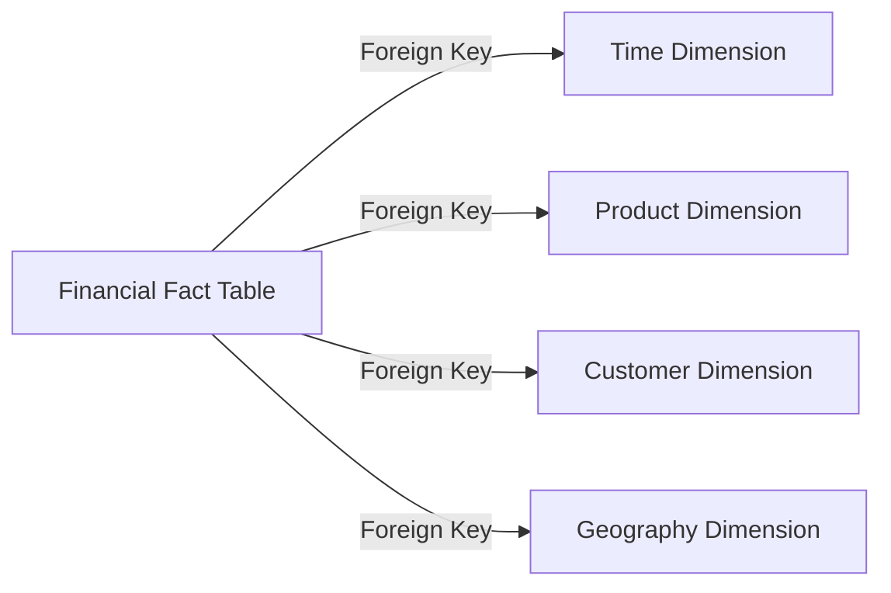

# Data Modelling for Data Warehouses

## Introduction

Data warehousing is a crucial component of modern business intelligence and analytics. Unlike transactional systems that focus on day-to-day operations, data warehouses are designed to support strategic decision-making by providing a consolidated, integrated, and historical view of an organization's data. To achieve this, data warehouses employ specialized data modelling techniques that differ from those used in transactional systems.

In this article, we will explore the unique data modelling requirements for data warehouses, including dimensional modelling, star schemas, and snowflake schemas. We will discuss the benefits and trade-offs of different dimensional modelling approaches, and how data modelling for data warehouses differs from transactional data modelling. Finally, we will provide examples of data warehouse data models and their business applications.

## Dimensional Modelling

Dimensional modelling is a widely-adopted approach for designing data warehouses. It focuses on organizing data around business concepts, known as dimensions, and the measurements or facts associated with those dimensions. The key principles of dimensional modelling are:

1. **Fact Table**: The fact table contains the numerical measurements or metrics that are of interest to the business, such as sales, revenue, or customer interactions.
2. **Dimension Tables**: Dimension tables provide the context and descriptive attributes for the facts, such as time, product, customer, or geography.
3. **Hierarchies**: Dimension tables often contain hierarchical relationships, such as a time dimension with levels for year, quarter, month, and day.

The two primary dimensional modelling approaches are:

1. **Star Schema**: In a star schema, the fact table is at the center, surrounded by dimension tables that are directly connected to the fact table.
2. **Snowflake Schema**: The snowflake schema is a variation of the star schema, where dimension tables are further normalized, resulting in a more complex, hierarchical structure.

*Figure 1: Example of a Star Schema*

*Figure 2: Example of a Snowflake Schema*

## Benefits and Trade-offs of Dimensional Modelling

The key benefits of dimensional modelling for data warehouses include:

1. **Simplicity**: Dimensional models are easy to understand and navigate, making them user-friendly for business analysts and decision-makers.
2. **Performance**: Dimensional models are optimized for fast query performance, as the fact table is denormalized and the dimensions are pre-aggregated.
3. **Flexibility**: Dimensional models can easily accommodate new data sources and business requirements by adding new dimensions or facts.

The trade-offs of dimensional modelling include:

1. **Storage Overhead**: Dimensional models can require more storage space due to the denormalization of data and the replication of dimension data across fact tables.
2. **Complexity**: Snowflake schemas can become complex, with multiple levels of dimension tables and hierarchies, which can make them more challenging to manage and maintain.
3. **Potential Data Redundancy**: In some cases, dimensional models may result in data redundancy, where the same data is stored in multiple dimension tables.

## Differences from Transactional Data Modelling

Data modelling for data warehouses differs from transactional data modelling in several key ways:

1. **Purpose**: Transactional data models are designed to support day-to-day business operations, while data warehouse models are optimized for strategic decision-making and analysis.
2. **Data Structure**: Transactional data models focus on normalizing data to minimize redundancy, while data warehouse models denormalize data to improve query performance.
3. **Data Granularity**: Transactional data models typically store data at a detailed, granular level, while data warehouse models often aggregate data to a higher level of abstraction.
4. **Data Volatility**: Transactional data is constantly changing, while data warehouse data is more static and historical.

## Examples of Data Warehouse Data Models

1. **Retail Sales Data Warehouse**: A retail sales data warehouse may have a fact table that stores sales transactions, with dimensions for time, product, customer, and store location. This model would allow analysts to analyze sales trends, customer behavior, and the performance of specific products or stores.

2. **Healthcare Claims Data Warehouse**: A healthcare claims data warehouse may have a fact table that stores medical claims, with dimensions for patient, provider, diagnosis, and procedure. This model would allow healthcare organizations to analyze trends in healthcare utilization, costs, and outcomes.

3. **Financial Performance Data Warehouse**: A financial performance data warehouse may have a fact table that stores financial metrics, such as revenue, expenses, and profitability, with dimensions for time, product, customer, and geography. This model would allow financial analysts to track and analyze the company's financial performance across various dimensions.

These examples illustrate how dimensional modelling can be applied to different business domains, allowing organizations to gain valuable insights and make informed decisions based on their data.

## Conclusion

Data modelling for data warehouses is a crucial aspect of building effective business intelligence and analytics solutions. By employing specialized techniques such as dimensional modelling, star schemas, and snowflake schemas, data engineers can create data models that are optimized for fast query performance, flexibility, and user-friendliness.

Understanding the unique requirements and trade-offs of data warehouse data modelling, as well as how it differs from transactional data modelling, is essential for data engineers preparing for data engineering interviews. By mastering these concepts and being able to provide concrete examples, candidates can demonstrate their expertise in designing and implementing robust and scalable data warehouse solutions.