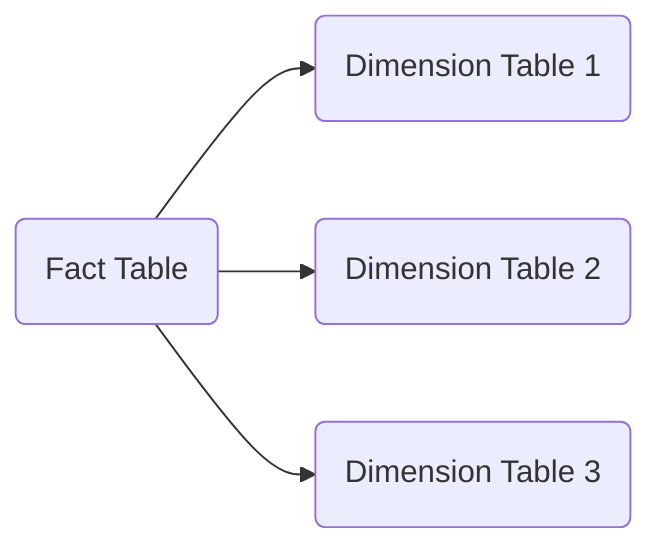
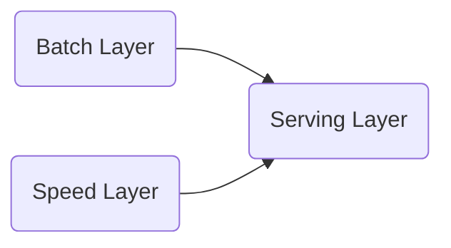

# Data Modelling for Hybrid Transactional and Analytical Processing (HTAP)

## Introduction

In the era of big data and real-time decision-making, organizations are increasingly seeking to bridge the gap between their transactional and analytical data. Hybrid Transactional and Analytical Processing (HTAP) architectures have emerged as a powerful approach to enable this convergence, allowing organizations to derive actionable insights from their operational data in real-time.

At the heart of an HTAP system lies the data model, which must be designed to support the diverse requirements of both transactional and analytical workloads. In this article, we will explore the key considerations and techniques for data modelling in HTAP environments, helping you design data models that can optimize performance and efficiency for a wide range of use cases.

## Data Modelling Considerations in HTAP Architectures

### 1. Bridging the Transactional-Analytical Divide
Traditionally, transactional and analytical data have been stored and processed separately, leading to a disconnect between operational intelligence and strategic decision-making. In an HTAP architecture, the data model must be designed to seamlessly integrate these two domains, enabling real-time analytics and operational intelligence.

This requires a careful balance between the normalization principles of transactional data models and the denormalization techniques often employed in analytical data models. Techniques such as star schema and snowflake schema can help bridge this gap, allowing for efficient data retrieval and aggregation while maintaining data integrity and consistency.

### 2. Performance and Efficiency
HTAP environments must deliver high performance for both transactional and analytical workloads, often with stringent latency requirements. Data modelling plays a crucial role in optimizing performance and efficiency in these scenarios.

Techniques such as partitioning, indexing, and materialized views can be employed to ensure that the data model is optimized for the specific access patterns and query requirements of both transactional and analytical use cases. Additionally, the use of in-memory data structures and caching mechanisms can further enhance performance in HTAP systems.

### 3. Data Freshness and Consistency
In an HTAP architecture, it is essential to maintain data freshness and consistency across the transactional and analytical domains. This can be challenging, as the data may be subject to frequent updates and modifications in the transactional system, while the analytical system requires a stable, consistent view of the data.

Data modelling techniques such as slowly changing dimensions, change data capture, and incremental data loading can help ensure that the analytical data remains up-to-date and consistent with the transactional data, without compromising the performance and efficiency of the overall system.

### 4. Scalability and Flexibility
As the volume and complexity of data continue to grow, HTAP architectures must be designed to scale seamlessly to accommodate increasing workloads and evolving requirements. Data modelling plays a crucial role in ensuring the scalability and flexibility of the system.

Techniques such as data partitioning, sharding, and the use of NoSQL data models can help the data model adapt to changing data volumes and access patterns. Additionally, the use of schema-on-read approaches and flexible data formats (e.g., JSON, Parquet) can enhance the system's ability to accommodate new data sources and evolving data structures.

## Data Modelling Patterns and Design Patterns for HTAP Environments

### 1. Star Schema and Snowflake Schema
The star schema and snowflake schema are well-established data modelling patterns that are particularly well-suited for HTAP environments. These patterns allow for efficient data aggregation and analysis, while maintaining data integrity and consistency.

In an HTAP context, the star schema can be used to model the transactional data, with the fact table representing the core business events and the dimension tables providing the necessary context and metadata. The snowflake schema can then be used to model the analytical data, with additional levels of normalization to support complex analytical queries and reporting requirements.

### 2. Lambda Architecture
The Lambda architecture is a data processing design pattern that can be particularly useful in HTAP environments. This pattern combines a batch layer for historical data processing and a speed layer for real-time data processing, allowing for the seamless integration of both transactional and analytical workloads.

In an HTAP context, the batch layer can be used to process and store the historical transactional data, while the speed layer can be used to handle the real-time updates and analytical queries. The data model must be designed to support both layers, with techniques such as incremental data loading and materialized views used to ensure data freshness and consistency.

### 3. Kappa Architecture
The Kappa architecture is a data processing design pattern that simplifies the Lambda architecture by using a single, unified stream processing layer to handle both batch and real-time data processing. In an HTAP context, the Kappa architecture can be particularly useful for scenarios where the distinction between batch and real-time data processing is less pronounced.

The data model in a Kappa architecture for HTAP must be designed to support efficient stream processing and real-time analytics, with techniques such as event sourcing and CQRS (Command Query Responsibility Segregation) used to ensure data consistency and performance.

### 4. Microservices and Domain-Driven Design
In complex HTAP environments, the data model can benefit from a microservices-based architecture and the principles of Domain-Driven Design (DDD). By organizing the data model around bounded contexts and microservices, the system can better accommodate the diverse requirements of transactional and analytical workloads, while also improving scalability, flexibility, and maintainability.

In this approach, each microservice is responsible for a specific domain or subdomain, with its own data model and data access patterns. The data models within each microservice can then be optimized for the specific requirements of the transactional and analytical use cases, while the overall system architecture ensures the seamless integration and consistency of data across the various domains.

## Conclusion

Designing data models for Hybrid Transactional and Analytical Processing (HTAP) environments is a complex and multifaceted challenge, requiring a deep understanding of the diverse requirements of both transactional and analytical workloads. By leveraging the data modelling techniques and design patterns discussed in this article, you can create data models that bridge the gap between these two domains, enabling real-time analytics and operational intelligence.

Remember, the key to successful data modelling in HTAP environments is to maintain a balance between performance, efficiency, data freshness, and consistency, while also ensuring the scalability and flexibility of the overall system. By mastering these concepts, you will be well-equipped to design and implement data models that can power the next generation of HTAP-powered applications and solutions.