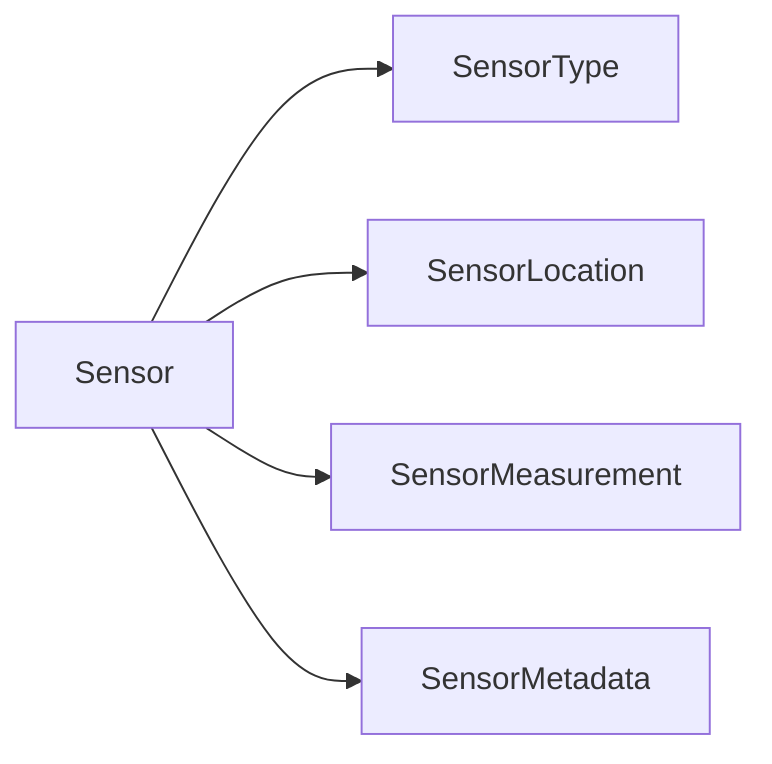
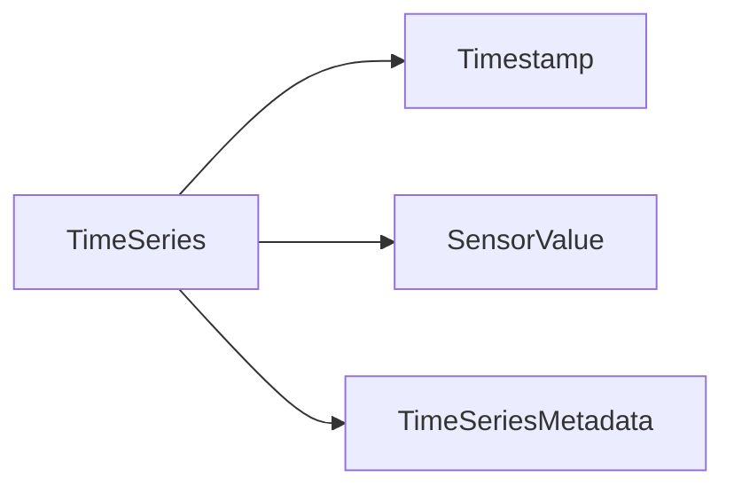
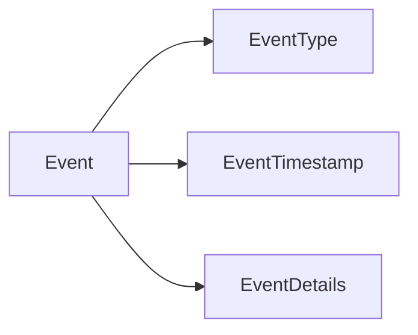
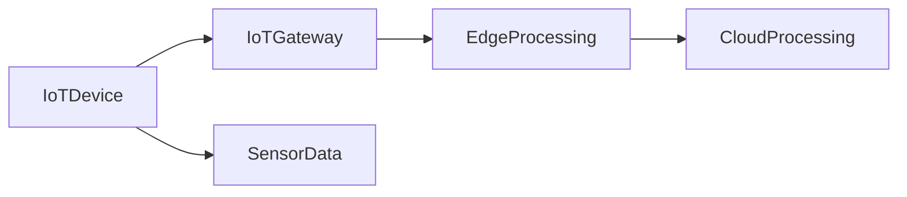
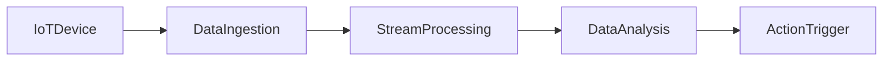

# Data Modelling for IoT and Edge Computing

## Introduction

In the era of the Internet of Things (IoT) and edge computing, the volume, velocity, and variety of data being generated have increased exponentially. IoT devices and edge computing environments produce a vast amount of sensor data, time-series data, and event-driven data that need to be effectively modelled and managed. Traditional data modelling approaches may not be sufficient to handle the unique characteristics and requirements of IoT and edge computing data. In this article, we will explore the data modelling challenges, considerations, and techniques for IoT and edge computing environments.

## Data Modelling Challenges in IoT and Edge Computing

1. **Heterogeneous Data Sources**: IoT and edge computing environments often involve a diverse range of devices, sensors, and data sources, each with its own data format, structure, and characteristics. Integrating and modelling this heterogeneous data can be a significant challenge.

2. **Real-time and Streaming Data**: IoT and edge devices generate data continuously and in real-time, often in the form of time-series data. Traditional batch-oriented data modelling approaches may not be suitable for handling this continuous stream of data.

3. **Distributed and Decentralized Data**: IoT and edge computing systems are inherently distributed, with data being generated and processed at the edge, closer to the source. This distributed nature can complicate data modelling and integration efforts.

4. **Constrained Devices and Resources**: IoT devices and edge computing nodes often have limited computational power, storage, and energy resources. Data modelling approaches need to be efficient and lightweight to work within these constraints.

5. **Data Volume and Velocity**: The sheer volume and velocity of data generated by IoT and edge devices can overwhelm traditional data storage and processing systems, requiring new approaches to data modelling and management.

6. **Data Quality and Reliability**: IoT and edge devices can be prone to failures, sensor errors, and environmental factors, which can impact the quality and reliability of the data. Data modelling needs to account for these challenges and provide mechanisms for data validation and cleaning.

7. **Data Privacy and Security**: IoT and edge computing systems often handle sensitive data, such as personal information or critical infrastructure data. Data modelling must consider data privacy and security requirements, including data encryption, access control, and compliance with regulations.

## Data Modelling Techniques for IoT and Edge Computing

1. **Time-series Data Modelling**: IoT and edge computing environments generate a significant amount of time-series data from sensors and other devices. Techniques like the Sensor Model Language (SenML) and the Hierarchical Data Format (HDF5) can be used to model and represent time-series data effectively.

2. **Event-driven Data Modelling**: Many IoT and edge computing use cases involve event-driven data, such as alerts, notifications, and anomaly detection. Event-driven data modelling approaches, such as the Event Sourcing pattern, can be used to capture and process these types of data.

3. **Flexible and Schemaless Data Modelling**: Traditional relational data models may not be suitable for the dynamic and evolving nature of IoT and edge computing data. NoSQL databases, such as document-oriented or key-value stores, can provide more flexible and schemaless data modelling capabilities to handle the diverse and changing data requirements.

4. **Hierarchical and Nested Data Modelling**: IoT and edge computing data often exhibits hierarchical or nested structures, reflecting the relationships between devices, sensors, and the data they generate. Techniques like the JSON data model or the Parquet file format can be used to model and represent these hierarchical data structures.

5. **Distributed and Edge-centric Data Modelling**: To address the distributed and decentralized nature of IoT and edge computing systems, data modelling approaches should consider edge-centric data processing and storage. This can involve techniques like distributed data models, edge-based data aggregation, and data synchronization between edge and cloud environments.

6. **Streaming Data Modelling**: IoT and edge computing systems generate continuous streams of data, which requires data modelling approaches that can handle real-time data ingestion, processing, and analysis. Techniques like the Lambda architecture or the Kappa architecture can be used to model and process streaming data effectively.

7. **Metadata and Semantic Modelling**: IoT and edge computing data often requires rich metadata and semantic information to provide context and enable advanced analytics. Techniques like the W3C's Semantic Sensor Network (SSN) ontology can be used to model and represent the metadata and semantic relationships within IoT and edge computing data.

## Data Modelling Patterns and Examples for IoT and Edge Computing

1. **Sensor Data Model**: A common data model for representing sensor data, including sensor type, sensor location, sensor measurements, and associated metadata. This can be based on standards like SenML or custom models tailored to specific use cases.

2. **Time-series Data Model**: A data model for handling time-series data from IoT devices, including timestamp, sensor value, and optional metadata. This can leverage time-series databases or file formats like Parquet.

3. **Event-driven Data Model**: A data model for representing event-driven data, such as alerts, notifications, and anomaly detection, including event type, event timestamp, and event details.

4. **Hierarchical Device Model**: A data model that captures the hierarchical relationships between IoT devices, gateways, and the data they generate, enabling efficient data organization and processing at the edge.

5. **Streaming Data Model**: A data model that supports the ingestion, processing, and analysis of real-time streaming data from IoT and edge computing environments, leveraging technologies like Apache Kafka or Azure Event Hubs.

These are just a few examples of data modelling patterns and designs that can be applied to IoT and edge computing environments. The specific data modelling approach will depend on the requirements, constraints, and characteristics of the particular use case.

## Conclusion

Effective data modelling is crucial for the success of IoT and edge computing systems. By understanding the unique challenges and considerations in these environments, data engineers can design data models that support the efficient ingestion, processing, and analysis of the diverse and dynamic data generated by IoT devices and edge computing nodes. By leveraging techniques like time-series data modelling, event-driven data modelling, flexible and schemaless data modelling, and distributed data modelling, data engineers can build robust and scalable IoT and edge computing solutions that meet the evolving needs of modern data-driven applications.