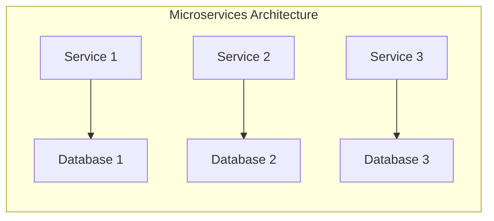
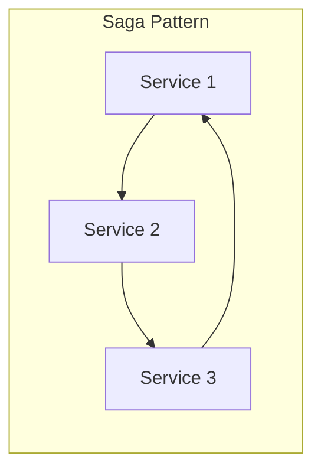
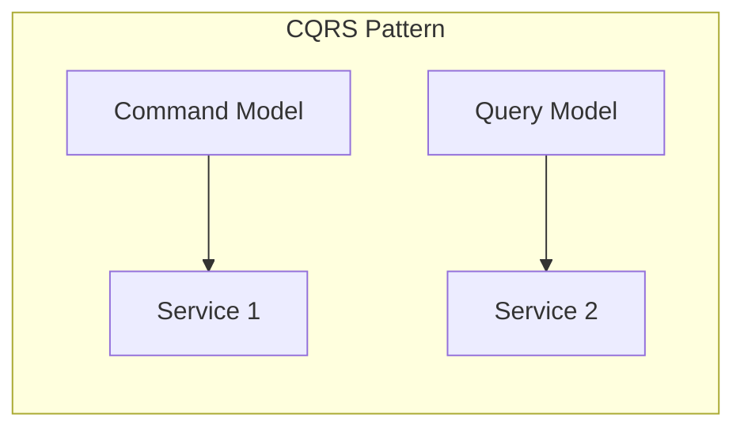

# Data Modelling for Microservices and Distributed Systems

## Introduction

In the era of modern software development, microservices and distributed systems have become increasingly prevalent. These architectural styles offer numerous benefits, such as scalability, flexibility, and the ability to independently develop and deploy individual components. However, the shift towards a microservices-based approach also introduces new challenges when it comes to data modelling and management.

In a traditional monolithic application, the data model is typically designed to serve the entire application. In a microservices architecture, each service is responsible for its own data, leading to the need for a more decentralized and service-oriented approach to data modelling. This article will explore the key considerations and techniques for designing data models that can effectively support microservices and distributed systems.

## Bounded Contexts and Domain-Driven Design

One of the fundamental concepts in microservices architecture is the idea of bounded contexts, which is closely tied to the principles of Domain-Driven Design (DDD). A bounded context represents a specific subdomain within the overall system, with its own ubiquitous language, business rules, and data model.

In a microservices architecture, each service should have a well-defined bounded context, which helps to ensure service independence and minimize the need for cross-service data sharing. By aligning the data model with the bounded context, you can create services that are more cohesive, maintainable, and scalable.

When designing data models for microservices, it's essential to identify the appropriate bounded contexts and apply DDD principles to ensure that the data model accurately reflects the business domain and the specific requirements of each service.

## Data Ownership and Data Consistency

In a microservices architecture, data ownership is a crucial concept. Each service is responsible for its own data and should be the sole authority for that data. This means that services should not directly access or modify the data owned by other services, as this can lead to data inconsistency and coupling between services.

To maintain data consistency and integrity, microservices should follow the principle of data encapsulation, where each service exposes a well-defined API for interacting with its own data. This helps to ensure that the data model and business logic are tightly coupled within the service, and that the service is the only entity that can modify its own data.

However, in some cases, there may be a need for data sharing across services. In such scenarios, you can consider using techniques like the Saga pattern or the CQRS (Command Query Responsibility Segregation) pattern to maintain data consistency and ensure that the data model supports the required data sharing capabilities.

## Data Modelling Patterns for Microservices

When designing data models for microservices, there are several patterns and techniques that can be employed to address the unique challenges of this architectural style.

### Database per Service Pattern

The Database per Service pattern is a common approach in microservices architecture, where each service has its own dedicated database. This pattern helps to ensure service independence and data encapsulation, as each service is responsible for its own data storage and management.

By having a separate database for each service, you can:
- Avoid the need for cross-service data sharing, which can lead to tight coupling and data consistency issues.
- Optimize the data model and schema for the specific requirements of each service, without having to compromise for the needs of other services.
- Independently scale and manage the data storage and processing for each service, based on its specific requirements.

### Saga Pattern

The Saga pattern is a popular technique for maintaining data consistency in distributed systems, particularly in the context of microservices. A Saga is a sequence of local transactions that updates data within each service, and these local transactions are coordinated to maintain overall data consistency.

In a Saga, each step of the transaction is executed as a separate service, and the overall transaction is coordinated using either a choreographed or orchestrated approach. This allows for the implementation of complex business processes that span multiple services, while still maintaining data consistency and atomicity.

### CQRS Pattern

The CQRS (Command Query Responsibility Segregation) pattern is another technique that can be useful in microservices architectures. In CQRS, the read and write operations are separated into distinct models, allowing for more specialized and optimized data models for each type of operation.

In a microservices context, CQRS can be used to decouple the data models and processing requirements for different types of operations, such as creating, updating, and querying data. This can be particularly useful when dealing with complex data models or when the read and write requirements of a service differ significantly.

## Challenges and Considerations

While the patterns and techniques discussed above can help address the data modelling challenges in microservices and distributed systems, there are still several key considerations and potential pitfalls to be aware of:

1. **Data Consistency and Eventual Consistency**: Maintaining data consistency in a distributed system can be challenging, and the trade-off between strong consistency and availability (as per the CAP theorem) must be carefully considered. Techniques like the Saga pattern can help, but you may need to accept the possibility of eventual consistency in some cases.

2. **Data Duplication and Denormalization**: With the Database per Service pattern, there may be a need for data duplication or denormalization to support specific service requirements. This can introduce challenges in terms of data synchronization and maintaining data integrity.

3. **Data Governance and Lineage**: In a microservices architecture, it can be more challenging to maintain a holistic view of the data and its lineage across the various services. Implementing effective data governance and lineage tracking mechanisms is crucial for understanding the data flow and ensuring data quality.

4. **Data Migration and Versioning**: As services evolve and data models change, managing data migration and versioning can become more complex in a microservices environment. Careful planning and coordination are required to ensure a smooth transition between data model versions.

5. **Distributed Transactions and Compensation**: When dealing with cross-service transactions, the use of distributed transactions and compensation mechanisms (e.g., the Saga pattern) adds complexity and requires careful design and implementation.

6. **Monitoring and Observability**: Monitoring the data-related aspects of a microservices architecture, such as data consistency, data latency, and data quality, requires specialized tools and techniques to ensure the overall system's health and performance.

By understanding these challenges and considerations, data engineers can design data models that effectively support the unique requirements of microservices and distributed systems, while also ensuring data consistency, service independence, and overall system resilience.

## Conclusion

Designing data models for microservices and distributed systems requires a shift in mindset and the application of specialized techniques and patterns. By embracing concepts like bounded contexts, data ownership, and data encapsulation, data engineers can create data models that are aligned with the business domain, support service independence, and maintain data consistency across the distributed architecture.

The patterns discussed in this article, such as the Database per Service pattern, the Saga pattern, and the CQRS pattern, provide a solid foundation for building data models that can effectively support the unique requirements of microservices and distributed systems. However, it's important to also consider the broader challenges and trade-offs, such as data consistency, data governance, and distributed transactions, to ensure the overall success and resilience of the system.

As the adoption of microservices and distributed architectures continues to grow, the importance of effective data modelling and management will only increase. By mastering these concepts and techniques, data engineers can play a crucial role in the design and implementation of modern, scalable, and resilient software systems.