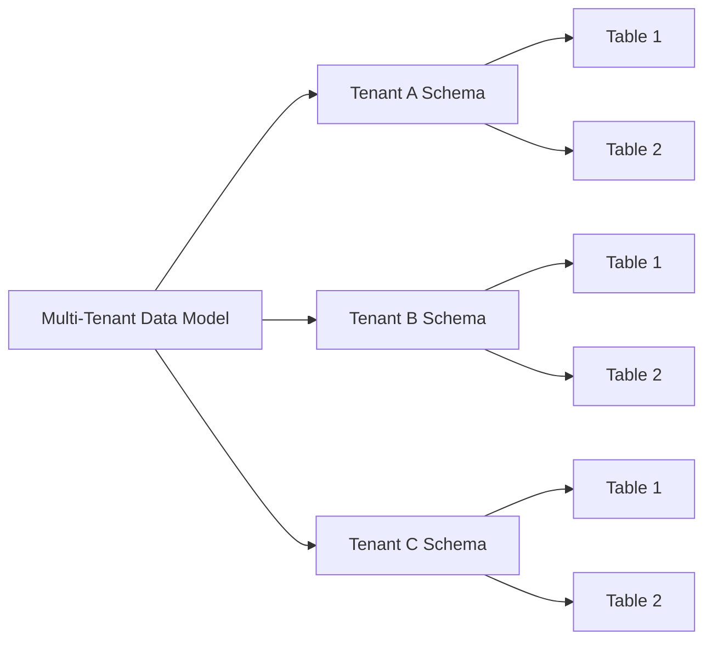
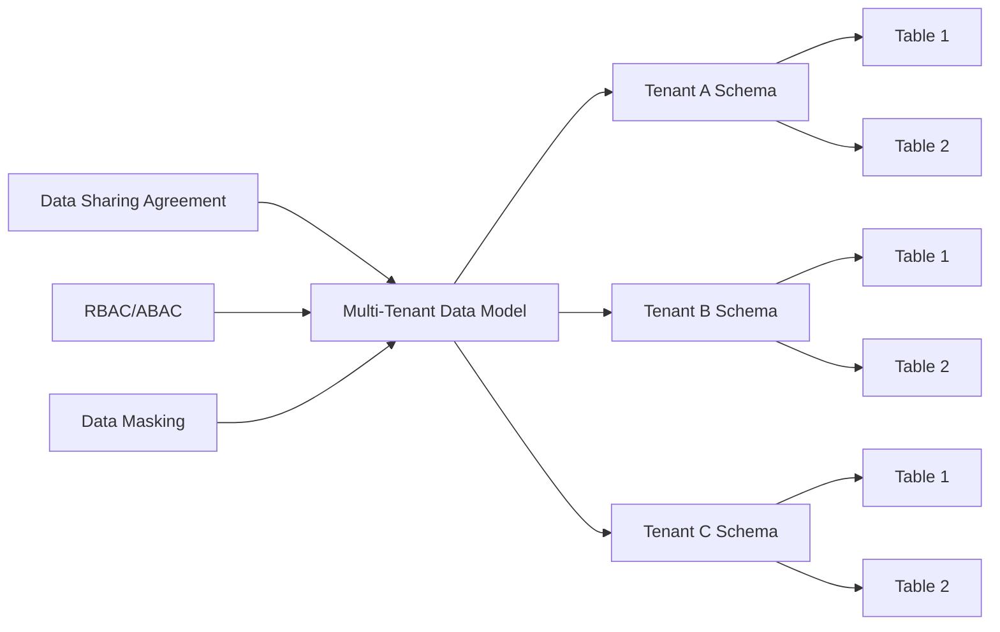
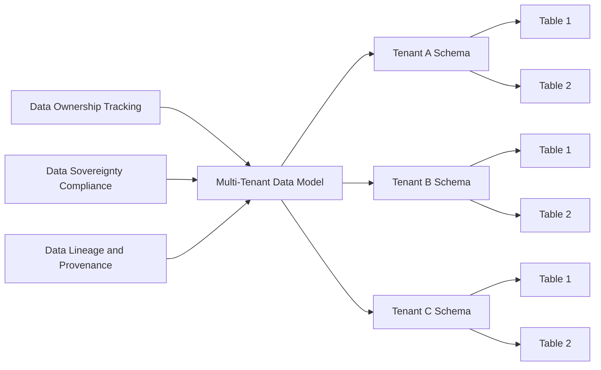

# Data Modelling for Multi-Tenant and Shared Data Environments

## Introduction
In today's data-driven world, many organizations are faced with the challenge of managing and sharing data across multiple tenants or business units. This is particularly common in Software-as-a-Service (SaaS) applications, where a single application or platform needs to serve the needs of multiple customers or organizations. It is also prevalent in enterprise data platforms, where data from various departments or business units needs to be consolidated and shared.

Designing data models for these multi-tenant and shared data environments requires careful consideration of several unique factors, such as data isolation, access control, data ownership, and data sovereignty. In this article, we will explore the key data modelling considerations and techniques for addressing these challenges.

## Data Modelling Considerations in Multi-Tenant and Shared Data Environments

### Data Isolation
One of the primary concerns in a multi-tenant or shared data environment is ensuring that data belonging to different tenants or organizations is properly isolated. This is crucial for maintaining data privacy, security, and compliance with regulatory requirements. Data isolation can be achieved through various techniques, such as:

1. **Logical Data Partitioning**: Organizing data into separate logical partitions or schemas based on the tenant or organization. This allows for the enforcement of access control and data security policies at the partition level.

2. **Physical Data Separation**: Storing data for different tenants or organizations on separate physical storage resources, such as dedicated databases or storage volumes. This provides an additional layer of isolation and security.

3. **Tenant Identifiers**: Incorporating tenant or organization-specific identifiers into the data model, allowing for the clear attribution of data ownership and enabling efficient data filtering and access control.

### Access Control and Data Sharing
In a multi-tenant or shared data environment, it is essential to have a robust access control mechanism to ensure that users and applications can only access the data they are authorized to view or modify. This can be achieved through:

1. **Role-Based Access Control (RBAC)**: Defining user roles and associated permissions to control access to specific data entities or partitions.

2. **Attribute-Based Access Control (ABAC)**: Leveraging user attributes, such as organization, department, or job function, to dynamically determine data access privileges.

3. **Data Masking and Obfuscation**: Applying techniques like data masking or obfuscation to sensitive data fields, ensuring that users can only see the information they are authorized to access.

In addition to access control, data sharing mechanisms need to be in place to enable the controlled and secure exchange of data between tenants or organizations. This can involve the use of data sharing agreements, data federation, or the creation of shared data marts or data lakes.

### Data Ownership and Data Sovereignty
In a multi-tenant or shared data environment, it is crucial to address the challenges of data ownership and data sovereignty. Data ownership refers to the determination of who has the right to access, modify, or delete specific data assets. Data sovereignty, on the other hand, deals with the legal and regulatory requirements around the storage, processing, and management of data within specific geographical or jurisdictional boundaries.

To address these challenges, the data model should incorporate mechanisms for:

1. **Data Ownership Tracking**: Maintaining metadata or attributes that clearly identify the owner of each data asset, enabling the enforcement of data ownership policies.

2. **Data Sovereignty Compliance**: Ensuring that the data model and data storage locations adhere to the relevant data sovereignty regulations, such as the General Data Protection Regulation (GDPR) or the Health Insurance Portability and Accountability Act (HIPAA).

3. **Data Lineage and Provenance**: Capturing the lineage and provenance of data, allowing for the traceability of data origins and the enforcement of data governance policies.

### Data Modelling Techniques for Multi-Tenant and Shared Data Environments

#### Logical Data Partitioning
One of the key techniques for data modelling in multi-tenant and shared data environments is logical data partitioning. This involves organizing the data model into separate logical partitions or schemas based on the tenant or organization. This can be achieved through the following approaches:

1. **Tenant-Specific Schemas**: Creating a separate database schema or namespace for each tenant or organization, with dedicated tables and data structures.

2. **Tenant ID Column**: Incorporating a tenant or organization identifier column into the data model, allowing for efficient data filtering and access control.

3. **Partitioned Tables**: Partitioning tables based on the tenant or organization identifier, enabling the enforcement of access control and data security policies at the partition level.

#### Access Control and Data Sharing
To address access control and data sharing requirements, the data model should incorporate the following design patterns:

1. **Role-Based Access Control (RBAC)**: Defining user roles and associating them with specific data access privileges. This can be implemented by maintaining role-based access control tables or views.

2. **Attribute-Based Access Control (ABAC)**: Leveraging user attributes, such as organization, department, or job function, to dynamically determine data access privileges. This can be achieved by incorporating these attributes into the data model and using them in access control logic.

3. **Data Masking and Obfuscation**: Applying techniques like data masking or obfuscation to sensitive data fields, ensuring that users can only see the information they are authorized to access. This can be implemented as part of the data access layer or through database-level security features.

4. **Data Sharing Agreements**: Establishing data sharing agreements between tenants or organizations, defining the terms and conditions for data exchange and access. These agreements can be reflected in the data model through dedicated tables or metadata.

5. **Data Federation**: Enabling the federated access to data across different tenants or organizations, allowing for controlled and secure data sharing. This can be implemented using technologies like data virtualization or federated query engines.

#### Data Ownership and Data Sovereignty
To address data ownership and data sovereignty requirements, the data model should incorporate the following design patterns:

1. **Data Ownership Tracking**: Maintaining metadata or attributes that clearly identify the owner of each data asset, enabling the enforcement of data ownership policies. This can be achieved by incorporating owner-specific columns or using dedicated ownership tracking tables.

2. **Data Sovereignty Compliance**: Ensuring that the data model and data storage locations adhere to the relevant data sovereignty regulations, such as the General Data Protection Regulation (GDPR) or the Health Insurance Portability and Accountability Act (HIPAA). This may involve the use of dedicated data sovereignty metadata or the integration with data governance frameworks.

3. **Data Lineage and Provenance**: Capturing the lineage and provenance of data, allowing for the traceability of data origins and the enforcement of data governance policies. This can be implemented through the use of metadata tables or the integration with data lineage tracking systems.

## Conclusion
Designing data models for multi-tenant and shared data environments requires a comprehensive understanding of the unique challenges and considerations involved. By incorporating techniques such as logical data partitioning, access control, data sharing, data ownership tracking, and data sovereignty compliance, you can create data models that effectively address the needs of these complex environments.

The examples and design patterns presented in this article provide a solid foundation for building robust and scalable data models that can support the diverse requirements of multi-tenant and shared data use cases. As you continue to work on data engineering projects, keep these principles in mind and adapt them to the specific needs of your organization or client.