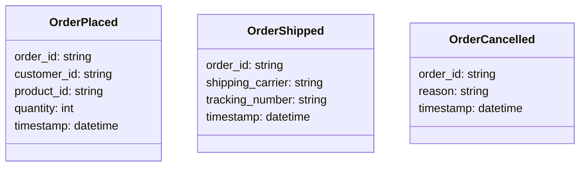
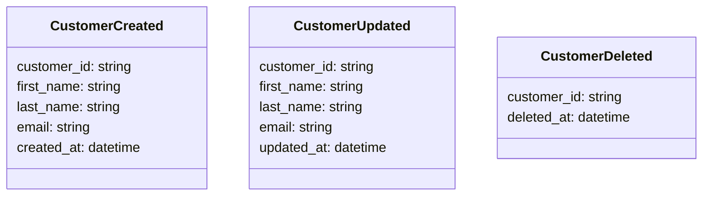
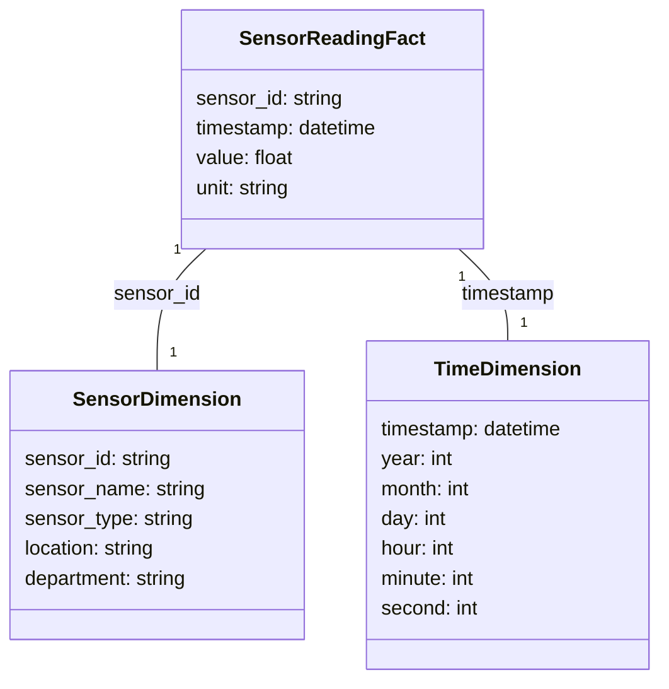

# Data Modelling for Real-time and Streaming Data

## Introduction

In the era of big data and digital transformation, organizations are increasingly relying on real-time and streaming data to drive their business decisions and gain a competitive edge. Traditional batch-oriented data modelling approaches often fall short when it comes to handling the unique requirements of real-time and streaming data systems. In this article, we will explore the key considerations and best practices for data modelling in the context of real-time and streaming data architectures.

## Batch vs. Stream Processing Data Models

The fundamental difference between batch and stream processing data models lies in the way data is ingested, processed, and stored.

In a batch processing system, data is collected over a period of time and then processed in large chunks or batches. The data model for a batch processing system is typically optimized for efficient storage, querying, and analysis of historical data. The data is often stored in a relational database or a data warehouse, and the data model is designed to support complex queries and analytical workloads.

On the other hand, in a stream processing system, data is continuously generated and processed in real-time or near-real-time. The data model for a stream processing system needs to be designed to handle the high velocity, volume, and variety of data, as well as the need for low-latency processing and decision-making. Stream processing data models often leverage NoSQL databases, event-driven architectures, and specialized stream processing engines like Apache Kafka, Apache Flink, or Amazon Kinesis.

## Key Concepts for Real-time and Streaming Data Modelling

### Event Sourcing

Event sourcing is a data modelling pattern that focuses on capturing the full history of events or changes that have occurred within a system, rather than just storing the current state of the data. In an event-sourced system, every change to the state of the application is captured as an immutable event. These events are stored in an event log or event stream, which can be used to reconstruct the current state of the system or to analyze historical data.

Event sourcing is particularly well-suited for real-time and streaming data systems, as it allows for efficient handling of high-velocity data and enables the ability to replay or rewind the event stream to analyze historical data or correct errors.

### Change Data Capture (CDC)

Change data capture (CDC) is a technique that involves continuously monitoring and capturing changes to data in a source system, and then propagating those changes to a target system or data store. CDC is often used in real-time and streaming data architectures to keep downstream systems, data warehouses, or data lakes up-to-date with the latest changes in the source data.

CDC can be implemented using various approaches, such as database triggers, log-based CDC, or stream-based CDC. The choice of CDC approach depends on the specific requirements of the system, the capabilities of the source and target systems, and the desired level of latency and reliability.

### Stream Processing

Stream processing is a data processing paradigm that focuses on processing data in real-time or near-real-time, as it is generated or received. In a stream processing system, data is continuously ingested, transformed, and analyzed, with the results being made available immediately or with minimal latency.

Stream processing data models need to be designed to support the high-velocity, high-volume, and potentially unbounded nature of streaming data. This often involves the use of event-driven architectures, in-memory data structures, and specialized stream processing engines like Apache Kafka, Apache Flink, or Amazon Kinesis.

## Data Modelling Patterns for Real-time and Streaming Data

### Event-Driven Data Model

In an event-driven data model, the data is organized around the events or changes that occur within the system. Each event is captured as an immutable record, and the current state of the system is derived by processing the sequence of events.

This data model is well-suited for real-time and streaming data systems, as it allows for efficient handling of high-velocity data and enables the ability to replay or rewind the event stream to analyze historical data or correct errors.

Here's an example of an event-driven data model for a e-commerce order processing system:

In this example, each event (OrderPlaced, OrderShipped, OrderCancelled) represents a change to the state of the order processing system. By processing the sequence of these events, the current state of each order can be reconstructed.

### Change Data Capture (CDC) Data Model

In a CDC data model, the data is organized around the changes that occur in the source system, rather than the current state of the data. The CDC data model typically consists of a series of tables or event streams that capture the changes to the source data, along with metadata about the change (e.g., timestamp, operation type, before and after values).

This data model is well-suited for real-time and streaming data systems, as it allows for efficient propagation of changes from the source system to downstream systems or data stores.

Here's an example of a CDC data model for a customer table:

In this example, each event (CustomerCreated, CustomerUpdated, CustomerDeleted) represents a change to the customer data in the source system. By processing these events, downstream systems can keep their data synchronized with the source system.

### Dimensional Data Model for Streaming Data

In a dimensional data model for streaming data, the data is organized around a set of fact tables and dimension tables, similar to a traditional data warehouse model. However, the design of the data model needs to take into account the high-velocity, high-volume, and potentially unbounded nature of streaming data.

This data model is well-suited for real-time and streaming data systems that require complex analytical queries and reporting, as it provides a structured and optimized way to store and query the data.

Here's an example of a dimensional data model for a real-time sensor monitoring system:

In this example, the SensorReadingFact table stores the actual sensor readings, while the SensorDimension and TimeDimension tables provide additional context and metadata about the sensors and the time of the readings. This dimensional data model allows for efficient querying and analysis of the sensor data, such as aggregating sensor readings by sensor type, location, or time of day.

## Best Practices for Real-time and Streaming Data Modelling

1. **Embrace Event-Driven Architectures**: Real-time and streaming data systems often benefit from an event-driven architecture, where changes to the data are captured as immutable events. This allows for efficient handling of high-velocity data and enables the ability to replay or rewind the event stream to analyze historical data or correct errors.

2. **Leverage Change Data Capture (CDC)**: CDC is a powerful technique for keeping downstream systems or data stores up-to-date with the latest changes in the source data. By continuously monitoring and capturing changes, CDC can help ensure that your data models are always in sync with the source system.

3. **Design for Scalability and Performance**: Real-time and streaming data systems often need to handle high volumes of data and low-latency processing requirements. Your data models should be designed with scalability and performance in mind, leveraging technologies like in-memory data structures, distributed processing, and specialized stream processing engines.

4. **Embrace Denormalization**: In real-time and streaming data systems, denormalization can be a useful technique to improve query performance and reduce the need for complex joins. By storing redundant data or pre-aggregating information, you can optimize your data models for the specific queries and use cases of your system.

5. **Incorporate Metadata and Context**: In addition to the core data, your data models should also capture relevant metadata and contextual information about the data, such as timestamps, sensor locations, or product categories. This additional context can be invaluable for analyzing and interpreting the data.

6. **Prioritize Flexibility and Adaptability**: Real-time and streaming data systems often need to evolve and adapt to changing business requirements or new data sources. Your data models should be designed with flexibility in mind, allowing for easy addition of new data elements or modification of existing ones.

7. **Leverage Streaming Data Patterns**: Familiarize yourself with common data modelling patterns for real-time and streaming data, such as event sourcing, change data capture, and dimensional data models for streaming data. These patterns can provide a solid foundation for designing your data models.

By following these best practices and leveraging the key concepts and data modelling patterns discussed in this article, you can create robust and scalable data models that are well-suited for real-time and streaming data systems.