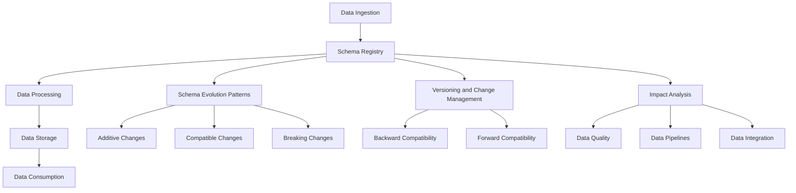

# Evolving Data Models and Schema Management

## Introduction

In the world of data engineering, the ability to effectively manage the evolution of data models and schemas is a critical skill. As data systems become increasingly complex, with distributed architectures and real-time data streams, the challenges of schema management become more pronounced. Data models and schemas must be able to adapt to changing business requirements, new data sources, and evolving data formats, all while maintaining data integrity, data quality, and the reliability of data pipelines.

## Challenges of Evolving Data Models and Schemas

1. **Distributed and Real-time Data Systems**: In distributed and real-time data environments, where data is constantly flowing from multiple sources, managing schema changes can be particularly challenging. Coordinating schema updates across different components of the data ecosystem, such as data ingestion, processing, and storage, can be complex and error-prone.

2. **Data Compatibility and Versioning**: As data models and schemas evolve, ensuring data compatibility between different versions of the schema becomes a crucial concern. Maintaining backward and forward compatibility is essential to avoid breaking existing data pipelines and applications.

3. **Data Quality and Integrity**: Schema changes can have a significant impact on data quality and integrity, especially if they are not properly planned and executed. Inconsistent or incomplete data, due to schema mismatches, can lead to data quality issues and downstream processing errors.

4. **Impact on Data Pipelines**: Evolving data models and schemas can disrupt the functioning of data pipelines, which are often tightly coupled with the underlying data structures. Updating data pipelines to accommodate schema changes can be time-consuming and error-prone, potentially leading to data processing failures and service disruptions.

5. **Coordination and Governance**: In large-scale data environments, coordinating schema changes across multiple teams and systems can be a significant challenge. Establishing effective governance processes, clear communication channels, and change management procedures is essential to ensure a smooth transition during schema evolution.

## Strategies for Managing Data Model and Schema Evolution

To address the challenges of evolving data models and schemas, data engineers can employ various strategies and techniques:

1. **Schema Registries and Versioning**:
   - Maintain a central schema registry that serves as a single source of truth for data models and schemas.
   - Implement versioning and change management processes to track schema changes over time.
   - Use schema versioning to ensure backward and forward compatibility, allowing different versions of the schema to coexist.

2. **Schema Evolution Patterns**:
   - Adopt schema evolution patterns, such as additive changes (adding new fields), compatible changes (modifying existing fields), and breaking changes (removing or renaming fields).
   - Implement strategies for handling schema changes, such as schema-on-read, schema-on-write, and schema-on-demand approaches.
   - Leverage schema evolution tools and frameworks, such as Avro, Protobuf, or Confluent Schema Registry, to manage schema changes and ensure data compatibility.

3. **Data Lineage and Impact Analysis**:
   - Maintain comprehensive data lineage information to understand the dependencies and impact of schema changes on data pipelines and downstream applications.
   - Perform impact analysis to assess the potential consequences of schema changes, including data quality, data processing, and integration implications.
   - Develop automated testing and validation processes to ensure the integrity of data after schema changes.

4. **Gradual Migration and Phased Rollouts**:
   - Plan and execute schema changes in a gradual, phased manner, allowing for a smooth transition and minimizing disruptions to data pipelines and applications.
   - Implement strategies for graceful degradation, where older versions of the schema are supported for a certain period to maintain backward compatibility.
   - Leverage feature flags or toggles to gradually roll out schema changes and monitor their impact before fully deploying them.

5. **Governance and Change Management**:
   - Establish clear governance processes and decision-making frameworks for managing schema changes.
   - Implement change management procedures, including impact assessments, approval workflows, and communication plans.
   - Ensure cross-functional collaboration and alignment between data engineering, data architecture, and business teams to align schema changes with evolving requirements.

## Examples and Best Practices

1. **Schema Evolution in a Streaming Data Environment**:
   - Consider a scenario where a company is ingesting real-time data from various IoT devices into a Kafka-based streaming platform.
   - As new device types are introduced, the data schema needs to evolve to accommodate additional fields or changes in data formats.
   - Leverage a schema registry, such as Confluent Schema Registry, to manage the versioning and evolution of the data schema.
   - Implement a schema-on-read approach, where the schema is applied during data consumption, allowing for gradual schema changes without disrupting the data pipeline.
   - Ensure that data producers and consumers can handle schema changes gracefully, using techniques like schema evolution patterns and feature flags.

2. **Schema Evolution in a Data Warehouse Environment**:
   - In a data warehouse environment, where data is ingested from various sources and transformed for analytical purposes, schema changes can have a significant impact on data quality and downstream reporting.
   - Maintain a centralized schema registry to track and version the data models used in the data warehouse.
   - Implement a phased approach to schema changes, where new fields or tables are added incrementally, and older versions are gradually deprecated.
   - Leverage schema evolution patterns, such as additive changes, to ensure backward compatibility and minimize the impact on existing data pipelines and reporting.
   - Develop automated testing and validation processes to ensure the integrity of data after schema changes, including data quality checks and end-to-end pipeline validation.

3. **Schema Evolution in a Microservices Architecture**:
   - In a microservices-based data architecture, where different services own and manage their own data models, schema evolution can be particularly challenging due to the distributed nature of the system.
   - Implement a schema registry that serves as a central repository for all data models and schemas used across the microservices.
   - Establish clear versioning and change management processes, ensuring that schema changes are coordinated and communicated across the various microservices.
   - Leverage schema evolution patterns, such as compatible changes, to allow microservices to gradually adopt schema updates without breaking existing integrations.
   - Develop robust data transformation and mapping capabilities to handle schema differences between microservices, ensuring data consistency and integrity.

By adopting these strategies and best practices, data engineers can effectively manage the evolution of data models and schemas, ensuring the reliability, scalability, and maintainability of complex data environments.

