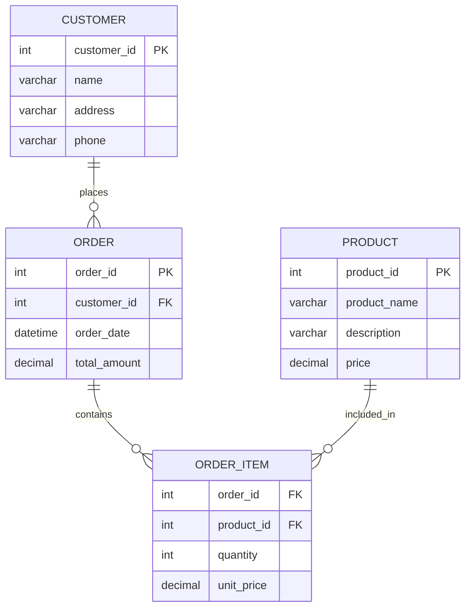
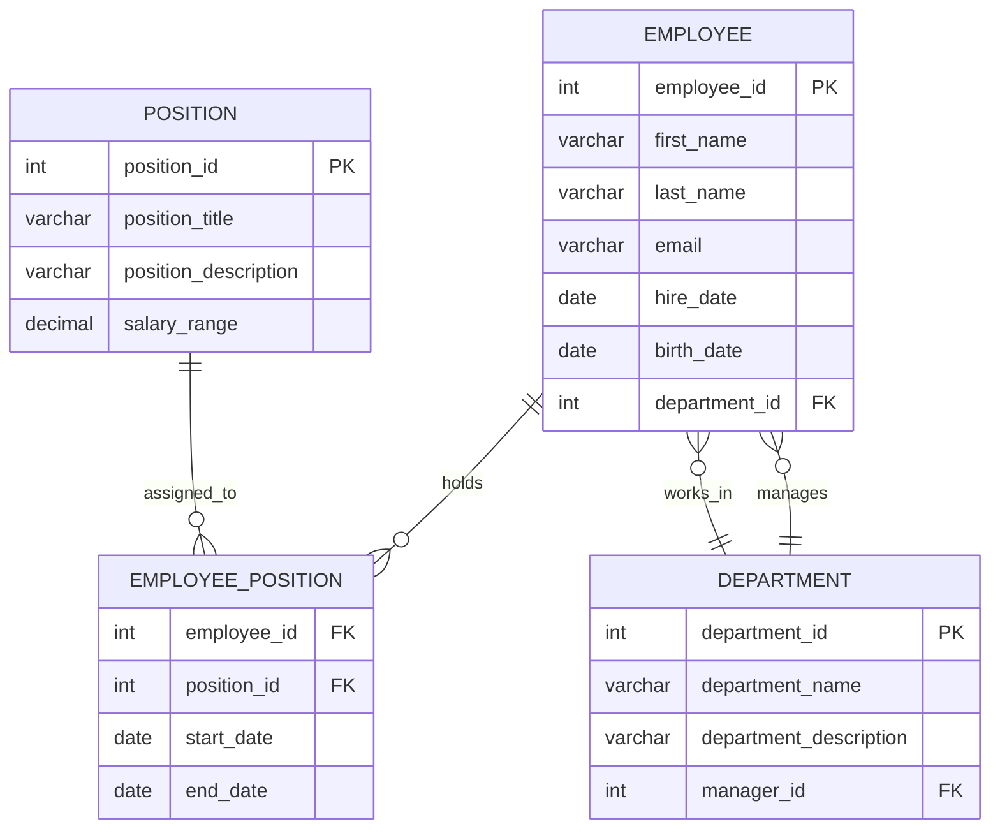

# Logical Data Modelling

## Introduction

The conceptual data model, which represents the high-level, abstract understanding of the data requirements, needs to be transformed into a more detailed and implementation-oriented logical data model. The logical data model bridges the gap between the conceptual model and the physical data implementation, providing a comprehensive blueprint for the database design.

## Purpose and Benefits of a Logical Data Model

The primary purpose of a logical data model is to define the data entities, their relationships, and the business rules that govern the data. It serves as a blueprint for the physical implementation of the data system, ensuring that the data is structured in a way that supports the organization's information needs and business processes.

Some of the key benefits of a well-designed logical data model include:

1. **Data Integrity**: The logical model helps ensure the consistency, accuracy, and completeness of data by defining the appropriate data types, relationships, and constraints.
2. **Scalability and Performance**: The logical model can be optimized for scalability and performance by incorporating techniques like normalization, denormalization, and dimensional modeling.
3. **Flexibility and Adaptability**: A well-structured logical model can accommodate changes in business requirements and data needs, making it easier to adapt the data system over time.
4. **Communication and Collaboration**: The logical model provides a common understanding of the data structure, which facilitates communication and collaboration among various stakeholders, such as business analysts, data engineers, and database administrators.
5. **Reusability**: The logical model can be reused and extended to support multiple applications or business domains, promoting consistency and reducing development efforts.

## Logical Data Modelling Techniques

### Normalization
Normalization is a process of organizing data in a database to reduce redundancy and improve data integrity. It involves breaking down a table into smaller tables and defining relationships between them. The goal is to eliminate repeating groups of data and ensure that data is stored in the most efficient way possible. Common normalization techniques include:

1. **First Normal Form (1NF)**: Eliminating repeating groups and ensuring that all attributes are atomic (indivisible).
2. **Second Normal Form (2NF)**: Ensuring that all non-key attributes are fully dependent on the primary key.
3. **Third Normal Form (3NF)**: Eliminating transitive dependencies, where a non-key attribute is dependent on another non-key attribute.

### Denormalization
Denormalization is the process of intentionally introducing controlled redundancy in the logical data model to improve query performance and reduce the need for complex joins. This technique is often used in data warehouse and business intelligence applications, where read performance is more critical than write performance. Denormalization techniques include:

1. **Combining related tables**: Combining related tables into a single table to reduce the need for joins.
2. **Pre-calculating derived data**: Storing pre-calculated values, such as totals or aggregates, to avoid expensive computations during queries.
3. **Partitioning and indexing**: Partitioning tables and creating appropriate indexes to optimize query performance.

### Dimensional Modelling
Dimensional modeling is a specific approach to logical data modeling that is commonly used in data warehouse and business intelligence applications. It focuses on organizing data around business concepts, known as dimensions, and the measurements or facts associated with those dimensions. The key components of dimensional modeling include:

1. **Fact Tables**: Contain the quantitative measurements or facts of a business process.
2. **Dimension Tables**: Provide the context and descriptive information about the facts.
3. **Slowly Changing Dimensions (SCDs)**: Techniques for handling changes to dimension attributes over time, such as Type 1 (overwrite), Type 2 (add new record), and Type 3 (add new column) changes.

## Mapping the Logical Model to the Physical Implementation

The logical data model serves as a bridge between the conceptual understanding of the data and its physical implementation in a database management system (DBMS). The process of mapping the logical model to the physical implementation involves the following steps:

1. **Data Type Mapping**: Translating the logical data types (e.g., integer, decimal, varchar) to the corresponding physical data types supported by the target DBMS.
2. **Constraint Mapping**: Defining the physical constraints, such as primary keys, foreign keys, and unique constraints, based on the logical model.
3. **Index Design**: Identifying the appropriate indexes to improve query performance, based on the access patterns and business requirements.
4. **Partitioning and Denormalization**: Applying denormalization techniques and partitioning strategies to optimize the physical data structure for performance.
5. **Storage and Optimization**: Selecting the appropriate storage structures (e.g., tables, views, materialized views) and configuring the DBMS settings to align with the performance requirements.

## Examples of Logical Data Models

### Retail Sales Example

In a retail sales domain, the logical data model might include the following entities:

This logical model captures the key entities (Customer, Order, Product, and Order Item) and their relationships, ensuring data integrity and supporting the business requirements for retail sales.

### Human Resources Example

In a human resources domain, the logical data model might include the following entities:

This logical model captures the key entities (Employee, Department, Position, and Employee Position) and their relationships, supporting the human resources management requirements, such as tracking employee information, department structure, and job assignments.

## Conclusion

The logical data model is a crucial step in the data engineering process, bridging the gap between the conceptual understanding of the data and its physical implementation. By applying techniques like normalization, denormalization, and dimensional modeling, data engineers can design a logical model that ensures data integrity, scalability, and performance, while also aligning with the organization's business requirements. The examples provided illustrate how logical data models can be tailored to different business domains, demonstrating the flexibility and adaptability of this approach.