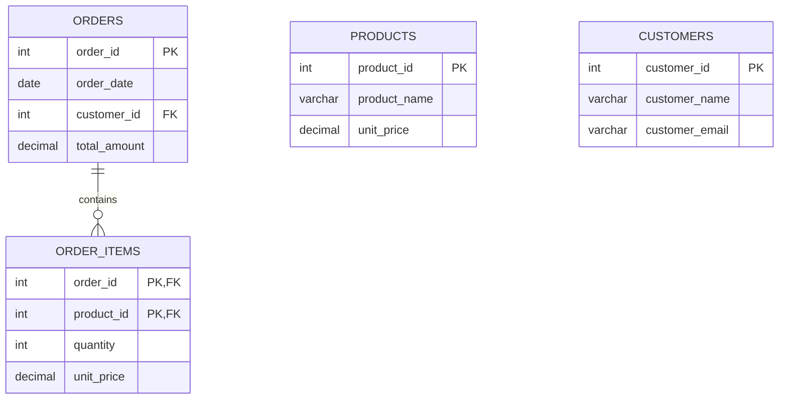

# Physical Data Modelling

## Introduction
Physical data modelling is the process of designing the actual implementation of a data model, taking into account the specific requirements and constraints of the underlying data storage technology. While the logical data model focuses on the conceptual representation of data entities, relationships, and attributes, the physical data model translates this logical design into a concrete, technology-specific implementation that can be deployed and optimized for performance, scalability, and reliability.

## Key Considerations in Physical Data Modelling

### Data Storage
The first step in physical data modelling is to determine the appropriate data storage technology for the given use case. This decision is influenced by factors such as the volume and velocity of data, the required data access patterns, the need for transactional integrity, and the overall system architecture. Common data storage options include relational databases, NoSQL databases, data lakes, and cloud-based storage services.

### Indexing
Indexing is a crucial aspect of physical data modelling, as it enables efficient data retrieval and query performance. The choice of indexing strategy depends on the data access patterns, the types of queries, and the characteristics of the data. Common indexing techniques include B-trees, hash indexes, and specialized indexes like spatial, full-text, and time-series indexes.

### Partitioning
Partitioning is a technique used to divide a large table or dataset into smaller, more manageable pieces, known as partitions. Partitioning can improve query performance, reduce storage requirements, and enable better data management and maintenance. Factors to consider when designing a partitioning strategy include the data access patterns, the volume of data, and the available storage resources.

### Performance Optimization
Physical data modelling also involves optimizing the data model for performance. This may include techniques such as denormalization, materialized views, data compression, and the use of specialized storage formats (e.g., Parquet, ORC) or columnar databases. The goal is to balance the trade-offs between storage efficiency, query performance, and data integrity.

## Relationship between Logical and Physical Data Models
The logical data model and the physical data model are closely related, but they serve different purposes. The logical data model represents the conceptual structure of the data, focusing on entities, relationships, and attributes. The physical data model, on the other hand, translates this logical design into a specific implementation that can be deployed and optimized for the chosen data storage technology.

The physical data model is derived from the logical data model, but it may involve additional design decisions and transformations to accommodate the constraints and capabilities of the underlying data storage system. For example, a logical data model designed for a relational database may be transformed into a physical data model that includes specific table structures, indexing strategies, and partitioning schemes.

## Examples of Physical Data Models

### Relational Database
In a relational database, the physical data model typically includes the following elements:
- Tables: Representing the entities in the logical data model
- Columns: Representing the attributes of the entities
- Primary and foreign keys: Defining the relationships between tables
- Indexes: Improving query performance for specific access patterns
- Partitioning: Dividing large tables into smaller, more manageable pieces
- Denormalization: Introducing redundant data to improve query performance



### NoSQL Database (e.g., MongoDB)
In a NoSQL database like MongoDB, the physical data model may include the following elements:
- Collections: Representing the entities in the logical data model
- Documents: Representing the instances of the entities, stored in a flexible, schema-less format
- Indexes: Improving query performance for specific access patterns
- Sharding: Dividing the data across multiple servers to improve scalability and performance

```mermaid
graph LR
    A[Orders Collection]
    B[Order Items Embedded Document]
    C[Products Collection]
    D[Customers Collection]

    A --> B
    A --> C
    A --> D

    B[Order Items Embedded Document] {
        product_id
        quantity
        unit_price
    }
```

### Data Lake (e.g., Apache Parquet)
In a data lake environment, the physical data model may include the following elements:
- Partitioned data files: Organizing data into smaller, more manageable partitions based on factors like time, geography, or other attributes
- Specialized storage formats: Using columnar storage formats like Apache Parquet or ORC to optimize for query performance and storage efficiency
- Metadata management: Maintaining detailed metadata about the data, including schema information, data lineage, and data quality metrics

```mermaid
graph LR
    A[Partitioned Data Files]
    B[Metadata Store]
    C[Query Engine]

    A --> B
    B --> C

    A[Partitioned Data Files] {
        partition_1/
        partition_2/
        partition_3/
    }
    B[Metadata Store] {
        schema_information
        data_lineage
        data_quality_metrics
    }
    C[Query Engine] {
        optimized_queries
        performance_metrics
    }
```

## Conclusion
Physical data modelling is a critical step in the data engineering process, as it translates the logical data model into a concrete, technology-specific implementation that can be deployed and optimized for performance, scalability, and reliability. By considering factors such as data storage, indexing, partitioning, and performance optimization, data engineers can design physical data models that meet the specific requirements of the application and the underlying data storage technology. Understanding the relationship between logical and physical data models, as well as the examples of physical data models for different data storage technologies, is essential for data engineers to effectively design and implement robust and efficient data systems.